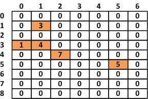
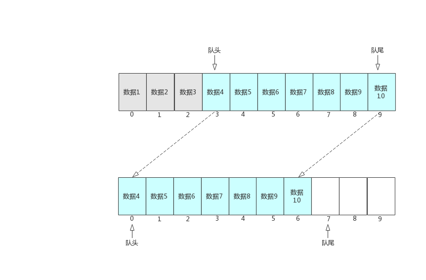

## 数据结构与算法

````text
如有错误之处，多多指教
````

PS : 部分的图片来源于网上，侵删

## 数据结构

### 线性数据结构


**线性数据结构**是一个有序数据元素的集合。 其中数据元素之间的关系是一对一的关系（a[0]=2），即除了第一个和最后一个数据元素之外，其它数据元素都是首尾相接的(存储元素是连续的)。

常用的线性结构有：**线性表，栈，队列，双队列，数组，串**。

#### 线性数据结构1 ---- 稀疏数组
当一个数组中大部分元素为0，或者为同一个值的数组时，可以使用稀疏数组来保存该数组。

处理方法：

1.记录数组有几行几列，有多少个不同的值。

2.把具有不同值的元素的行列及值记录在一个更小规模的数组中。实现程序的压缩。

如图所示: 有大部分的空间是无用的.



那么我们可以使用稀疏数组进行压缩,稀疏数组的第一部分所记录的是原数组的行数和列数

第二部分记录原数组中的有效值的位置和值,经过压缩后只需要声明n*3的数组,n表示有效值的个数


#### 线性数据结构2 ---- 队列

队列（queue）是一种采用先进先出(FIFO)策略的抽象数据结构，即最先进队列的数据元素，同样要最先出队列。队列跟我们排队买票一样，先来排队的肯定先买票，后来排队的的后买到票。队列如下图所示：


队列有两个重要的概念，一个叫队头，一个叫队尾，队头指向的是第一个元素，而队尾指向的是最后一个元素。队列跟栈一样也是访问受限制的，所以队列也只有两个主要的操作：入队(enqueue)操作 和 出队(dequeue)操作 。入队操作就是将一个元素添加到队尾，出队操作就是从队头取出一个元素。

队列的底层实现可以用数组和链表，基于数组实现的队列叫作顺序队列，基于链表实现的队列叫作链式队列

数组实现队列：
在数组中，采用循环增加元素的方式，并使用两个变量分别记录队首元素和队尾元素。

基于数组来存储队列中的元素，可能会出现数组被填满的情况。这时，再执行入队操作会抛出一个“**队列满异常**”，当然，如果对一个空的队列进行出队操作，会抛出一个“**队列空异常**”




### 非线性数据结构
**非线性数据结构**中各个数据元素不再保持在一个线性序列中，每个数据元素可能与零个或者多个其他数据元素发生联系。根据关系的不同，可分为层次结构和群结构。

常见的非线性数据结构有：**二维数组，多维数组，广义表，树(二叉树等)，图。（其中多维数组是由多个一维数组组成的，所以不再是线性结构）**

