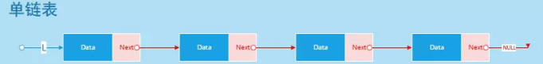
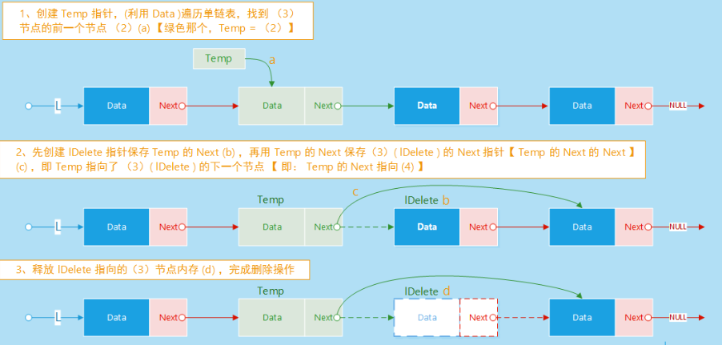
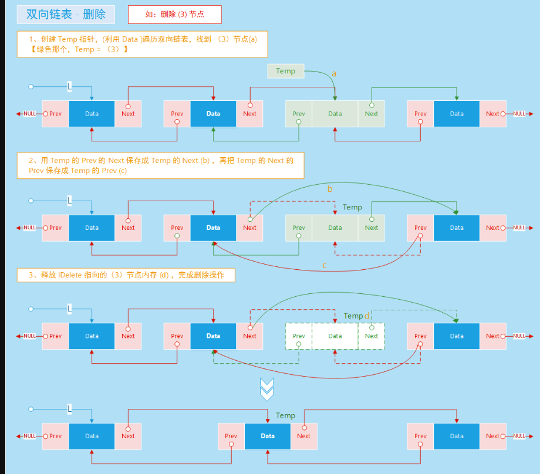

<!-- TOC -->

   * [数据结构与算法](#数据结构与算法)
   * [数据结构](#数据结构)
      * [线性数据结构](#线性数据结构)
         * [线性数据结构1 ---- 稀疏数组](#线性数据结构1------稀疏数组)
         * [线性数据结构2 ---- 队列](#线性数据结构2------队列)
      * [非线性数据结构](#非线性数据结构)

<!-- /TOC -->

## 数据结构与算法

````text
如有错误之处，多多指教
````

PS : 部分的图片来源于网上，侵删

## 数据结构

### 线性数据结构


**线性数据结构**是一个有序数据元素的集合。 其中数据元素之间的关系是一对一的关系（a[0]=2），即除了第一个和最后一个数据元素之外，其它数据元素都是首尾相接的(存储元素是连续的)。

常用的线性结构有：**线性表，栈，队列，双队列，数组，串**。

#### 线性数据结构1 ---- 稀疏数组
当一个数组中大部分元素为0，或者为同一个值的数组时，可以使用稀疏数组来保存该数组。

处理方法：

1.记录数组有几行几列，有多少个不同的值。

2.把具有不同值的元素的行列及值记录在一个更小规模的数组中。实现程序的压缩。

如图所示: 有大部分的空间是无用的.


那么我们可以使用稀疏数组进行压缩,稀疏数组的第一部分所记录的是原数组的行数和列数

第二部分记录原数组中的有效值的位置和值,经过压缩后只需要声明n*3的数组,n表示有效值的个数


#### 线性数据结构2 ---- 队列

队列（queue）是一种采用先进先出(FIFO)策略的抽象数据结构，即最先进队列的数据元素，同样要最先出队列。队列跟我们排队买票一样，先来排队的肯定先买票，后来排队的的后买到票。队列如下图所示：


队列有两个重要的概念，一个叫队头，一个叫队尾，队头指向的是第一个元素，而队尾指向的是最后一个元素。队列跟栈一样也是访问受限制的，所以队列也只有两个主要的操作：入队(enqueue)操作 和 出队(dequeue)操作 。入队操作就是将一个元素添加到队尾，出队操作就是从队头取出一个元素。

队列的底层实现可以用数组和链表，基于数组实现的队列叫作顺序队列，基于链表实现的队列叫作链式队列

数组实现队列：
在数组中，采用循环增加元素的方式，并使用两个变量分别记录队首元素和队尾元素。
```java
private static class Queue {
        int maxSize; // 队列的最大容量
        int head; // 队列的头指针
        int tail; // 队列的尾指针
        int[] array; // 存放数据的数组

        /**
         * @Method Description:
         * TODO 初始化
         * @Author weleness
         * @Return
         */
        public Queue(int maxSize) {
            this.maxSize = maxSize; // 创建队列，用户输入队列容量
            array = new int[maxSize];// 初始化数组
            head = -1; // 初始化头指针
            tail = -1; // 初始化尾指针
        }

        /**
         * @Method Description:
         * TODO 判空操作
         * 算法复杂度 : O(1)
         * @Author weleness
         * @Return
         */
        public boolean isEmpty() {
            return head == -1; // 当头指针为-1，那么表示队列为空
        }

        /**
         * @Method Description:
         * TODO 判满操作
         * 算法复杂度 : O(1)
         * @Author weleness
         * @Return
         */
        public boolean isFull() {
            return (tail + 1) % maxSize == head; // 因为队列是环形的，当尾指针的下一个位置与头指针的位置重合时，这个队列时满的
        }

        /**
         * @Method Description:
         * TODO 入队操作
         * 算法复杂度 : O(1)
         * @Author weleness
         * @Return
         */
        public void add(int data) {
            //    首先判断队列是否满了
            if (isFull())
                throw new RuntimeException("The array is full. No more elements can be added");
            tail = (tail + 1) % maxSize;// 首先尾指针往后移，然后插入到尾指针所在的位置,%最大值表示不会超过最大值，例如：3%3 = 0
            array[tail] = data;
            if (head == -1) head = tail;
        }

        /**
         * @Method Description:
         * TODO 查看队首元素
         * 算法复杂度 : O(1)
         * @Author weleness
         * @Return
         */
        public int peek() {
            //    首先判断队列是否为空
            if (isEmpty())
                throw new RuntimeException("Queue is empty and cannot be peeked");
            return array[head];
        }

        /**
         * @Method Description:
         * TODO 出队操作
         * 算法复杂度 : O(1)
         * @Author weleness
         * @Return
         */
        public int poll() {
            //    首先判断队列是否为空
            if (isEmpty())
                throw new RuntimeException("Queue is empty and cannot be polled");
            int data = array[head];
            if (head == tail) { // 如果队列中只有一个元素，头指针往前移动，队列置空
                head = tail - 1;
            } else {
                head = (head + 1) % maxSize; // 否则头指针往后移动
            }
            return data;
        }

        /**
         * @Method
         * Description:
         *  TODO 展示队列操作
         *  算法复杂度 : O(n)
         *
         * @Author weleness
         *
         * @Return
         */
        public String show() {
            if (isEmpty()) {
                return null;
            }
            StringBuilder sb = new StringBuilder("[");
            for (int i = 0; i <array.length; i++) {
                if (i != array.length - 1)
                    sb = sb.append(array[i]).append(",");
                else sb = sb.append(array[i]);
            }
            sb = sb.append("]");
            return sb.toString();
        }
    }

```
基于数组来存储队列中的元素，可能会出现数组被填满的情况。这时，再执行入队操作会抛出一个“**队列满异常**”，当然，如果对一个空的队列进行出队操作，会抛出一个“**队列空异常**”


#### 线性数据结构3 ---- 链表
链表是一种用于存储数据集合的数据结构。

有以下特性:

相邻元素之间通过指针连接
最后一个元素的后继指针值为null（单链表）
在执行过程中，链表的长度可以增加或减小
链表的空就按能够按需分配（直到内存耗尽）
没有内存空间的浪费
在单向链表中，每个节点中存储着下一个节点的地址，就像这样：


#####插入：
 假设我们有这么一个链表：
  

  我们需要将一个节点插入到链表的任意一个位置，我们需要创建一个指针，
  指向原来的链表，【不能直接操作原来链表】，然后进行遍历，
  到达指定位置，创建节点，原来位置上的节点的引用指向新的节点，
  然后新节点的引用指向原来节点的下一个节点【可能是null，考虑从尾部插入】
    
```text
class ListNode { // 创建一个类当作链表的节点
    int val; // 节点的值
    ListNode next; // 节点的下一个节点的引用

    public ListNode (int val){
        this.val = val;
    }
}

class LinkedList {

    int size ; // 链表的长度
    ListNode head; // 节点

    public LinkedList() {
        head = new ListNode(0); // 为链表节点初始化
        size = 0;
    }


    public int get(int index) {
        if(index < 0 || index >= size) return -1;
        ListNode cur = head;
        for(int i = 0; i <=index;i++) cur = cur.next;

        return cur.val;
    }

    public void addAtHead(int val) {
        addAtIndex(0,val);
    }


    public void addAtTail(int val) {
        addAtIndex(size,val);
    }


    public void addAtIndex(int index, int val) {
        if(index > size) return;
        if(index < 0) index = 0;
        ListNode cur = head;
        for(int i = 0 ; i < index ; i++) cur = cur.next;
        ListNode temp = cur.next;
        cur.next = new ListNode(val);
        cur.next.next = temp;
        size++;
    }


   
}
```
#####删除：
  基本上和删除差不多，都需要通过一个临时指针来遍历链表，
  到达指定位置对链表节点进行删除【指向null】
    
```text
 public void deleteAtIndex(int index) {
        if(index< 0 || index >= size) return;
        ListNode cur = head;
        for(int i = 0; i < index; i++) cur = cur.next;
        cur.next = cur.next.next;
        size--;
    }
```
####双向链表
双向链表 [Double Linked List]：由各个内存结构通过指针 Next 和指针 Prev 链接在一起组成，每一个内存结构都存在前驱内存结构和后继内存结构【链头没有前驱，链尾没有后继】，内存结构由数据域、Prev 指针域和 Next 指针域组成。
```text
 class ListNode {
        int val;
        ListNode pre;
        ListNode next;

        public ListNode(int val) {
            this.val = val;
        }
    }
```
##### 双向链表插入


    
```text
TODO 在双向链表的末尾插入一个元素
 ListNode temp = head;
            ListNode newNode = new ListNode(val);
            while (temp.next != null) {
            temp = temp.next;
         }
          temp.next = newNode;
          newNode.pre = temp;
 }
```
```text
TODO 在双向链表的头部插入一个元素
  newNode.next = temp;
  temp.pre = newNode;
  head = newNode;
```
##### 双向链表的删除



````text
void delete(){
            ListNode temp = head;
            while(temp.next != null){
                temp = temp.next;
            }
            ListNode pre = temp.pre; // 代表最后一个元素的前一个节点
            pre.next = null;  // 将前一个节点的next指针置空
            temp.pre = null; // 将要删除节点的pre指针置空
        }
````

#### 循环链表
单循环链表与双端循环链表其实原理差不多：

   单循环链表:
		将最末尾的链表的next指针指向头部，构成一个环

   双端循环链表：
       将最末尾的链表的next指针指向头部，头部的pre指针指向尾部
#### 线性数据结构4 ---- 栈
什么是栈:

   栈是一种用于存储数据的简单数据结构（与链表类似）。数据入栈的次序是栈的关键。

   定义：栈（Stack）是一个有序线性表哦，只能在表的一端（栈顶）进行数据的填入（入栈）与删除操作（出栈），最后填入的元素将被第一个删除，因此，栈也被称为后进先出（LIFO Last In First Out）或先进后出（First In Last Out）的线性表

每个改变栈的操作都有专有名词。

将元素插入到栈中称为入栈（push）

将元素从栈中删除称为出栈（pop）

对一个空的栈进行删除操作称为下溢（underflow）

对一个满的栈进行插入操作称为溢出（overflow）
##### 数组模拟栈：

```text
  private int top;
    private int capacity;
    private int[] array;

    public ArrayStack() {
        this.top = -1;
        this.capacity = 1;
        this.array = new int[capacity];
    }

```
##### 入栈操作：
```text
public void  push(int data){
        if(isFull()) { // 判断是否满栈了，满栈就扩容
            doubleStack();
        }
        array[++top] = data;
    }
```
##### 出栈操作
```text
 if(isEmpty()){ // 判断栈是否为空，不为空才出栈
            throw new RuntimeException("Stack isEmpty");
        }
        return array[top--];
```
完整代码 ：
```text
private int top;
    private int capacity;
    private int[] array;

    public ArrayStack() {
        this.top = -1;
        this.capacity = 1;
        this.array = new int[capacity];
    }

    /**
     * @Method
     * Description:
     *  判断栈是否为空
     * @Author weleness
     *
     * @Return
     */
    public  boolean isEmpty(){
        return top == -1;
    }

    /**
     * @Method
     * Description:
     *  判断栈是否满了
     * @Author weleness
     *
     * @Return
     */
    public boolean isFull(){
        return top == capacity-1;
    }

    public void  push(int data){
        if(isFull()) {
            doubleStack();
        }
        array[++top] = data;
    }
    /**
     * @Method
     * Description:
     *  扩容
     * @Author weleness
     *
     * @Return
     */
    public void  doubleStack(){
        int newArray[] = new int[capacity*2];
        System.arraycopy(array,0,newArray,0,capacity);
        capacity = capacity*2;
        array = newArray;
    }
    /**
     * @Method
     * Description:
     *  出栈
     * @Author weleness
     *
     * @Return
     */
    public int pop(){
        if(isEmpty()){
            throw new RuntimeException("Stack isEmpty");
        }
        return array[top--];
    }

    /**
     * @Method
     * Description:
     *  清空栈
     * @Author weleness
     *
     * @Return
     */
    public void clear(){
        top = -1;
        array = new int[1];
    }
```
#### 使用链表实现栈
  使用链表实现的优点就是，不用去刻意判断栈是否满了，因为每次都是动态的往链表的头部添加一个节点。
  当然也有缺点，需要花费额外的空间和时间开销来操作指针
  ```text
class ListNode { // 节点
    int val;
    ListNode next;

    public ListNode(int val) {
        this.val = val;
    }
}
class ListStack { // 栈
    private ListNode head; // 链表的表头
    }
```
#####入栈操作
```text
public void  push(int data){
        if(head == null ){ // 如果表头为空，直接生成表头
            head = new ListNode(data);
        }else { // 往表头插入一个元素，头指针指向新元素
            ListNode newNode = new ListNode(data);
            newNode.next = head;
            head = newNode;
        }
    }
```
##### 出栈操作
```text
 public int pop(){
        if(isEmpty()){ // 判断是否为空
            throw  new RuntimeException("Stack empty");
        }
        int top = head.val; // 将头顶元素返回
        head = head.next; // 头指针下移
        return top;
    }
```
完整代码：
```text
class ListNode {
    int val;
    ListNode next;

    public ListNode(int val) {
        this.val = val;
    }
}

class ListStack {
    private ListNode head;
    /**
     * @Method
     * Description:
     *  入栈操作
     * @Author weleness
     *
     * @Return
     */
    public void  push(int data){
        if(head == null ){
            head = new ListNode(data);
        }else {
            ListNode newNode = new ListNode(data);
            newNode.next = head;
            head = newNode;
        }
    }
    /**
     * @Method
     * Description:
     *  出栈操作
     * @Author weleness
     *
     * @Return
     */
    public int pop(){
        if(isEmpty()){
            throw  new RuntimeException("Stack empty");
        }
        int top = head.val;
        head = head.next;
        return top;
    }
    /**
     * @Method
     * Description:
     *  查看栈顶元素
     * @Author weleness
     *
     * @Return
     */
    public int peek(){
        if(isEmpty()) return -1;
        return head.val;
    }
    /**
     * @Method
     * Description:
     *  判空操作
     * @Author weleness
     *
     * @Return
     */
    public boolean isEmpty(){
        return head == null;
    }
    /**
     * @Method
     * Description:
     *  清空栈
     * @Author weleness
     *
     * @Return
     */
    public void  clear(){
        head = null;
    }
}
```

### 非线性数据结构
**非线性数据结构**中各个数据元素不再保持在一个线性序列中，每个数据元素可能与零个或者多个其他数据元素发生联系。根据关系的不同，可分为层次结构和群结构。

常见的非线性数据结构有：**二维数组，多维数组，广义表，树(二叉树等)，图。（其中多维数组是由多个一维数组组成的，所以不再是线性结构）**

## 算法

   #### 约瑟夫问题
   
 >Josephu 问题为： 设编号为1,2,...,n 的n个人围坐一圈，约定编号为   k(1<=k<=n)的人从1开始报数，数到m的那>个人出列，它的下一位又开始从   1开始报数，数到m的那个人又出列，以此类推，知道所有人出列位置。由此   >产生一个出队编号的序列
 
 PS : 使用环形队列实现，每当报数报道m的那个人，就从环形链表中删除，知道链表中只剩下一个人
 
 ```java
    public class Josepfu {
        public static void main(String[] args) {
            CircleSingleLinkedList circleSingleLinkedList = new CircleSingleLinkedList();
            circleSingleLinkedList.out(1, 10, 50);
        }
    
    
        static class CircleSingleLinkedList {
            Node head; // 链表的头节点
    
            /**
             * @param k        从哪个地方开始数
             * @param countNum 数几下
             * @param m        表示最初有多少个小孩
             * @Method Description:
             * @Author weleness
             * @Return
             */
            public void out(int k, int countNum, int m) {
                add(m);
                // 先对数据进行校验
                if (head == null || k < 0 || countNum > m) {
                    return;
                }
                //    创建辅助指针
                Node helper = head;
                while (helper.next != head) { // 指向链表尾部
                    helper = helper.next;
                }
                // 移动到报数位置
                for (int i = 0; i < k - 1; i++) {
                    head = head.next;
                    helper = helper.next;
                }
    
                //    开始报数
                boolean flag= true;
                int step = 0; // 计数器
                while(flag){
                    step++;
                    head = head.next;
                    helper = helper.next;
                    if(step == countNum-1){
                        //System.out.println(head.number);
                        head = head.next; // 让那个人出圈
                        helper.next = head; // 跟紧脚步
                        step = 0;
                    }
                    if(helper== head) { // 剩下最后一个人，退出
                        flag = false;
                    }
                }
                System.out.println(head.number);
            }
    
            public void add(int num) {
                if (num < 1) {
                    System.err.println("环不能小于1");
                    return;
                }
                Node cur = null; // 辅助指针，用来帮助构建环形链表
                for (int i = 1; i <= num; i++) {
                    // 创建节点
                    Node nn = new Node(i);
                    if (i == 1) {
                        head = nn;
                        head.next = head;// 如果只有一个节点，自生成环
                        cur = head; // 当前节点指向head
                    } else {
                        cur.next = nn; // 添加进环形链表
                        nn.next = head; // 新节点的下一个节点指向头部，成环
                        cur = nn; // 移动到新节点
                    }
                }
            }
            
        static class Node {
            int number; // 编号
            Node next; // 指向下一个节点
    
            public Node(int number) {
                this.number = number;
            }
        }
    }

```