<!-- TOC -->

 * [23种设计模式](#23种设计模式)
    * [工厂方法模式(Factory Method)](#工厂方法模式factory-method)
    * [抽象工厂模式(Abstract Factory)](#抽象工厂模式abstract-factory)
    * [单例模式(Singleton)](#单例模式singleton)
    * [建造者模式(Builder)](#建造者模式builder)
    * [原型模式(Prototype)](#原型模式prototype)
    * [代理模式(Proxy)](#代理模式proxy)
    * [适配器模式(Adapter)](#适配器模式adapter)
    * [装饰器模式(Decorator)](#装饰器模式decorator)
    * [桥接模式(Bridge)](#桥接模式bridge)
    * [组合模式(Composite)](#组合模式composite)
    * [外观模式(Facade)](#外观模式facade)
    * [享元模式(Flyweight)](#享元模式flyweight)
    * [观察者模式(Observer)](#观察者模式observer)
    * [模板方法模式(Template Method)](#模板方法模式template-method)
    * [策略模式(Strategy)](#策略模式strategy)
    * [责任链模式(Chain of Responsibility)](#责任链模式chain-of-responsibility)
    * [中介者模式(Mediator)](#中介者模式mediator)
    * [访问者模式(Visitor)](#访问者模式visitor)
    * [命令模式(Command)](#命令模式command)
    * [解释器模式(Interpreter)](#解释器模式interpreter)
    * [迭代器模式(Iterator)](#迭代器模式iterator)
    * [备忘录模式(Memento)](#备忘录模式memento)
    * [状态模式(State)](#状态模式state)

<!-- /TOC -->

# 23种设计模式

参考: 
- [菜鸟教程 - 设计模式](https://www.runoob.com/design-pattern/design-pattern-tutorial.html)

- [c语言中文网 - 设计模式](http://c.biancheng.net/view/1317.html) 


````text
如有错误之处，敬请指教。
````


#### 工厂方法模式(Factory Method)
工厂方法模式的意图是 定义一个创建产品对象的工厂接口，将产品对象的创建延迟到具体子工厂类中，这满足创建型模式中对象的创建和使用分离
的原则。
工厂方法模式由 抽象工厂，具体工厂，抽象产品，具体产品等要素组成，
我们把需要创建的对象叫作产品，创建产品的对象叫作工厂。

- 抽象工厂: 抽象工厂声明了创建产品的接口，用户/客户端 通过抽象工厂来创建和访问产品。

- 具体工厂: 具体工厂是抽象工厂的实现，包含了创建产品的过程。

- 抽象产品: 抽象产品定义了产品的规范，描述了产品的主要特性和功能。

- 具体产品: 具体产品实现了抽象产品，它与具体工厂一一对应。


工厂方法模式的优点有:

- 隐藏具体实现细节: 用户只需要具体工厂就可以创建对应的产品，无需关心具体工厂是如何创建产品的。
- 符合开闭原则:    在系统需要添加新的产品时，只需要添加其对应的具体工厂，无需修改原有的工厂和产品。  

工厂方法模式: 


工厂方法模式实例: [FactoryMethodTest](https://github.com/guang19/framework-learning/blob/dev/design_pattern/src/main/java/com/github/guang19/designpattern/factorymethod/FactoryMethodTest.java)


#### 抽象工厂模式(Abstract Factory)
工厂方法模式考虑的是同一类产品的生产，如汽车工厂只生产汽车，空调工厂只生产空调。
而在现实中许多工厂是综合性的工厂，一家工厂可能既生产空调，又生产冰箱，这也是抽象工厂与工厂方法的区别，
抽象工厂考虑多类产品的生产，同一个工厂生产的位于不同等级的一组产品称为这个工厂的产品族。

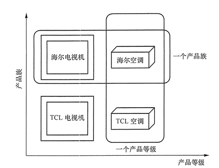

抽象工厂模式的意图是 定义一个创建一组相关或相互依赖的工厂接口，使得用户可以使用这一个工厂就可以获取到不同的产品。
抽象工厂是工厂方法的升级版本，工厂方法只生产一个等级的产品，抽象工厂可以生产多个等级的产品。

抽象工厂和工厂方法一样，也由 抽象工厂，具体工厂，抽象产品，具体产品等要素组成，但抽象工厂可以创建
多个等级的产品。

抽象工厂模式:

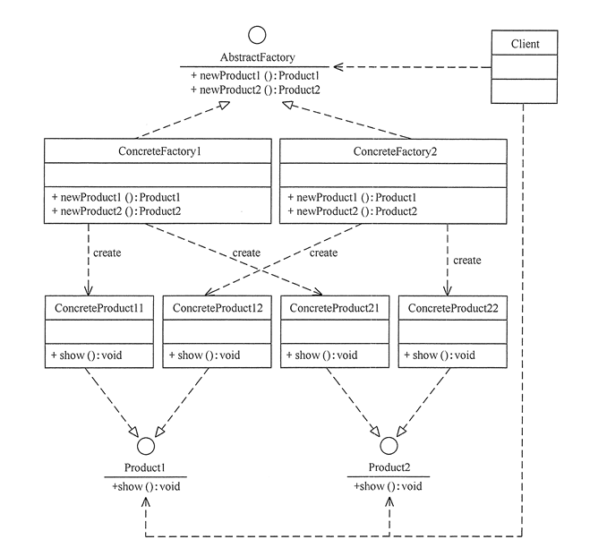

抽象工厂实例:[AbstractFactoryTest](https://github.com/guang19/framework-learning/blob/dev/design_pattern/src/main/java/com/github/guang19/designpattern/abstractfactory/AbstractFactoryTest.java)


#### 单例模式(Singleton)
单例模式确保一个类只有一个实例，且该类提供访问这个唯一实例的方式。
单例模式有三个特点:
1. 单例类只有一个实例。
2. 该单例类的唯一实例必需由其自身创建。
3. 该单例类必须提供访问其唯一实例的方式。

单例模式:

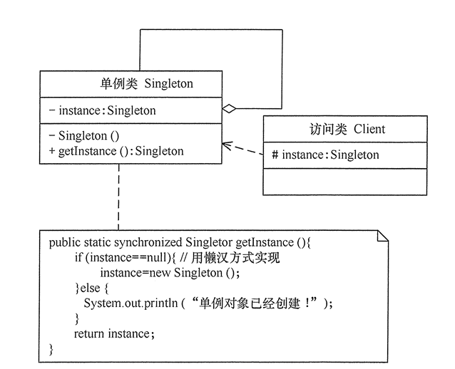

单例模式实例: [Singleton](https://github.com/guang19/framework-learning/blob/dev/design_pattern/src/main/java/com/github/guang19/designpattern/singleton)

单例模式主要有两种写法:懒汉式和饿汉式。
网上有的文章说 **"饿汉式的单实例在类加载阶段就实例化了，而懒汉式在第一次获取实例的时候才初始化。"**
这里我从Java/Jvm(其他语言暂且不论)的角度来反驳下这种观点，如果各位同学同意这种观点，且是从我写的[类的生命周期](https://qsjzwithguang19forever.gitee.io/framework-learning/gitbook_doc/jdk-jvm-juc/%E7%B1%BB%E7%9A%84%E7%94%9F%E5%91%BD%E5%91%A8%E6%9C%9F.html)
部分一直看过来的，那么请再好好思考下 "类加载" 三个字 ， 如果你对JVM有兴趣，也可分析下我的观点是对是错。

在JVM中，类的生命周期有5个阶段 : 加载 ， 连接 ， 初始化，使用和卸载。这几个阶段我已在[类的生命周期](https://qsjzwithguang19forever.gitee.io/framework-learning/gitbook_doc/jdk-jvm-juc/%E7%B1%BB%E7%9A%84%E7%94%9F%E5%91%BD%E5%91%A8%E6%9C%9F.html)
里详细讲解过了，这里再回顾下 加载，连接，初始化几个阶段，至于使用和卸载与本观点论述的内容不大，所以不做描述。 

- 加载: JVM类加载器将class字节码读取到内存，将其保存在方法区，并在堆区生成该类的唯一Class对象。

- 连接: 连接分为三个阶段:验证，准备，解析。
   
   - 验证: 在验证阶段，JVM会对class字节流进行验证，验证其是否符合JVM规范且是否会对JVM造成恶意损害。
   
   - 准备: 准备阶段会为类的静态变量初始化零值，基本数据类型如int会赋予0，**引用类型会赋予null。**

   - 解析: 解析阶段会将常量池中的符号引用解析为直接引用。
   
- 初始化: 初始化阶段是类加载阶段的最后一个阶段，**在初始化类后，就可以使用类做我们需要做的事情了，如创建对象实例。**

我们明白: 饿汉式的单例是属于类的静态变量的，只有当类初始化时，才会初始化其静态变量，
仅凭这点就可以推翻网上谣传的观点了，但还没有完。

**类在何种情况下会被初始化呢?**

解决了这个问题，就可以彻底明白饿汉式实例化的时间了，你也就不会跟着大众喊出 "饿汉式单例浪费内存空间。" 这种
毫无根据的话语了。

**只有当我们主动使用类时，这个类才会被初始化，也才会初始化单例了。**
根据我查阅的资料，我总结了类主要涉及8种情况会被主动使用: 

1. 当jvm执行new指令时会初始化类，即当程序创建一个类的实例对象。
2. 当jvm执行getstatic指令时会初始化类，即程序访问类的静态变量(不是静态常量，常量归属于运行时常量池)。
3. 当jvm执行putstatic指令时会初始化类，即程序给类的静态变量赋值。
4. 当jvm执行invokestatic指令时会初始化类，即程序调用类的静态方法。
5. 当使用反射主动访问这个类时,也会初始化类,如Class.forname("..."),newInstance()等等。
6. 当初始化一个子类的时候，会先初始化这个子类的所有父类，然后才会初始化这个子类。
7. 当一个类是启动类时，即这个类拥有main方法，那么jvm会首先初始化这个类。
8. MethodHandle和VarHandle可以看作是轻量级的反射调用机制，而要想使用这2个调用，
就必须先使用findStatic/findStaticVarHandle来初始化要调用的类。

综上所述，**只考虑正常使用时，初始化类的情况有: 创建类的实例对象；调用类的静态方法；给类的静态变量赋值；访问类的静态变量。
而当我们访问饿汉式单例的时候，几乎都是通过静态方法获取单例(不排除有人会用反射去获取单例)，所以大部分情况都是当我们获取单例的时候才会初始化单例，**
所以 "饿汉式的单实例在类加载阶段就实例化了"，"饿汉式单例浪费内存空间" 此类观点就不攻自破了。


#### 建造者模式(Builder)
创建者模式的定义是将一个复杂对象的构造与它的表示分离，使用同样的构建过程可以创建不同的表述。简单理解就是
创建者模式将一个复杂对象，分解为多个简单的对象，然后通过这些简单对象再构造成最终的目标对象。
比如一台计算机由很多部件组成，如cpu，gpu，主板等等，我们不可能从一家厂商那里购买到所有的部件(不考虑整机)，
所以我们需要根据我们自己事先计划好的计算机的配置，然后从各个不同的厂商那里购所需的部件，然后组装成我们理想的计算机。
建造者模式使得一个复杂对象被分解为多个简单对象，且可以对每个简单对象进行定制，客户端也无需关系创建对象的细节。

建造者模式由 指挥者，抽象建造者，具体建造者以及产品等要素组成:

- 产品: 产品是由多个部件组成的对象，它需要由具体建造者建造其各个组件。

- 抽象建造者: 抽象建造者声明了 创建产品各个组件以及获取最终复杂产品的接口。

- 具体建造者: 具体建造者实现了抽象建造者定义的接口，定义了创建复杂产品各个组件的逻辑。

- 指挥者: 指挥者负责调用建造者完成对复杂产品的创建。

建造者模式: 


建造者实例: [BuilderTest](https://github.com/guang19/framework-learning/blob/dev/design_pattern/src/main/java/com/github/guang19/designpattern/builder)


#### 原型模式(Prototype)
原型模式的定义是用一个已经创建的对象实例作为原型，通过复制该原型对象来创建一个和原型相同或相似的新对象。
在有的应用程序中，存在着一些相同或相似的对象，如果这些相同或相似的对象都使用构造函数来创建，可能会比较消耗资源，
而用原型模式就可以快速创建与原对象相同的对象。

原型模式由 抽象原型类以及具体原型类等要素组成:

- 抽象原型类: 定义了具体原型类必须实现的接口(在java中，抽象原型类就是Cloneable接口)。

- 具体原型类: 具体原型是抽象原型的实现，具体原型的实例是可以被复制的。

原型模式:


原型模式实例:[PrototypeTest](https://github.com/guang19/framework-learning/blob/dev/design_pattern/src/main/java/com/github/guang19/designpattern/prototype)

在java中，原型模式还涉及深拷贝与浅拷贝的问题，我推荐一篇写的非常好的文章建议各位同学学习:
[CSDN - Java中的clone方法 - 原型模式](https://blog.csdn.net/zhangjg_blog/article/details/18369201)


#### 代理模式(Proxy)
代理模式的意图是 为目标对象提供一种代理，用以控制客户端对于目标对象的访问。
举个栗子: 我(客户端)需要访问某个网站的服务器，但是目标网站的服务器的IP又不可能直接暴露在公网之上，
所以目标服务器通过提供代理服务器来解决这种问题。我们访问目标网站时，实际请求的是代理服务器，然后再由代理服务器
将请求转发到真正的处理任务的服务器(反向代理)，在这个过程中，代理服务器充当了保护或中介的角色，将真正的服务器隐藏了起来。

代理模式由 抽象主题，真实主题以及代理主题等要素组成:

- 抽象主题: 抽象主题声明了真实主题需要实现的接口。

- 真实主题: 真实主题就是目标对象，它需要实现抽象主题。

- 代理主题: 代理主题与真实主题一样，都需要实现抽象主题，但代理主题内部包含了真实主题，当访问代理主题的时候，
它会使用真实主题去处理，同时可以控制与扩展真实主题的功能。

  
代理模式:

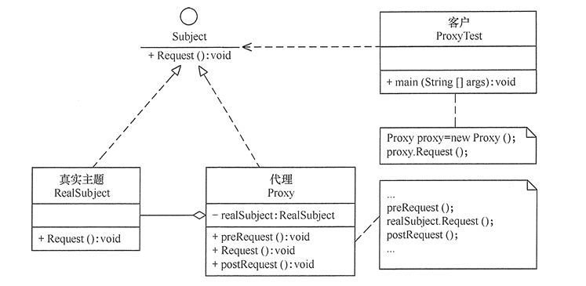

代理模式实例:
[ProxyTest](https://github.com/guang19/framework-learning/blob/dev/design_pattern/src/main/java/com/github/guang19/designpattern/proxy)


#### 适配器模式(Adapter)
适配器模式的意图是 将一个接口转换成客户希望或需要的另一个接口，使得原本由于接口不兼容而不能一起工作的那些类能一起工作。
比如一个播放器只能播放 .mp4 格式的视频，如果是 .flv 格式的视频这个播放器就不能播放了，此时我们就可以
创建一个视频适配器，将 .flv 格式的视频适配成播放器所需的格式的视频。

适配器模式实例: [AdapterTest](https://github.com/guang19/framework-learning/blob/dev/design_pattern/src/main/java/com/github/guang19/designpattern/adapter)


#### 装饰器模式(Decorator)
装饰器模式的意图是 在不改变原有系统结构的情况下，能够动态的给系统添加一些新的职责和功能。
比如我买了一辆车，我想给这辆车添加一个尾翼，添加尾翼后，并没有对原来的车身的其他地方做出修改。

装饰器模式主要由 抽象构件 ， 具体构件 ， 抽象装饰和具体装饰等要素组成:

- 抽象构件: 抽象构件定义了具体构件的职责。

- 具体构件: 具体构件实现了抽象构件，需要通过装饰器来为其拓展功能。

- 抽象装饰: 抽象装饰也实现了抽象构件，并包含了具体构件，可以通过具体装饰对其拓展功能。

- 具体装饰: 具体装饰继承了抽象装饰，并对具体构件做出扩展。

装饰器模式:


装饰器模式实例: [DecoratorTest](https://github.com/guang19/framework-learning/blob/dev/design_pattern/src/main/java/com/github/guang19/designpattern/decorator)


#### 桥接模式(Bridge)
桥接模式的意图是将抽象部分与实现部分分离，使得他们都可以独立的变化。桥接模式主要解决了在有多种变化的情况下，
泛滥使用继承的问题。某些对象具有多个方面的变化，如 有不同颜色和大小的字，有不同功率和品牌的小轿车等等。

桥接模式主要由: 抽象化角色，扩展抽象化角色，实现化角色和具体实现化角色组成：

- 抽象化角色： 抽象化角色即抽象类，它包含一个对实现化对象的引用 ，比如 字拥有对颜色的引用。

- 扩展抽象化角色： 扩展抽象化角色是对抽象化角色的扩展，比如 小字，大字，中等大小的字。

- 实现化角色： 实现化角色是定义了实现化的接口，供抽象化角色使用，如 颜色。

- 具体实现化角色： 具体实现化角色是实现化角色的实现，如 黑色，红色。

桥接模式:

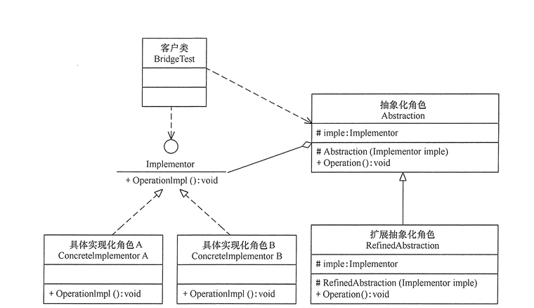

桥接模式实例: [BridgeTest](https://github.com/guang19/framework-learning/blob/dev/design_pattern/src/main/java/com/github/guang19/designpattern/bridge)


#### 组合模式(Composite)
组合模式又称为 部分-整体模式，它是一种将对象组合成树状的层次结构的模式，用来表示“部分-整体”的关系。
比如一棵树上有许多树枝，每枝树枝上又有许多树叶，这就属于层次结构，我个人倾向于把它理解为 “一对多的关系”，
如何把这种关系合理的表现出来呢？就可以使用到我们的组合模式了。

组合模式主要由： 抽象构件，树叶构件和树枝构件等要素组成：

- 抽象构件： 抽象构件声明了树叶构件和树枝构件的公共接口。

- 树枝构件： 树枝构件实现了抽象构件声明的接口，它的作用是管理和存储子部件。

- 树叶构件： 树叶构件也实现了抽象构件声明的接口，它是组合中的叶子构件，没有子部件。

组合模式实例: [CompositeTest](https://github.com/guang19/framework-learning/blob/dev/design_pattern/src/main/java/com/github/guang19/designpattern/composite)


#### 外观模式(Facade)
外观模式又被称为门面模式，外观模式的意图是通过为多个复杂的子系统提供一个一致的接口，使得这些子系统能够更容易的
被访问，客户端也不必关注内部子系统的实现细节，大大降低了应用程序的复杂度。 假设我们的某个系统有一个生成唯一ID
的接口，而生成唯一ID的方案有很多种，如雪花ID，UUID，自增ID等等，客户端只需要调用那一个生成ID的接口获取ID就行了，
无需关注这个接口到底使用的是哪种生成ID的方案。

外观模式实例：[FacadeTest](https://github.com/guang19/framework-learning/blob/dev/design_pattern/src/main/java/com/github/guang19/designpattern/facade)


#### 享元模式(Flyweight)
享元模式的意图是 运用共享技术来支持大量细粒度对象的复用，以此达到节约内存，提高系统性能的目的。
在我们的应用中，有时需要创建一些相同或具有共同部分的对象，比如拥有相同姓名的用户，具有相同分辨率的屏幕等等。

享元模式由 抽象享元角色，具体享元角色，非享元角色和享元工厂等要素组成:

- 抽象享元角色： 抽象享元角色是所有具体享元角色的基类，为具体享元角色定义公共属性和接口 ，如Person。

- 具体享元角色： 具体享元角色实现了抽象享元角色定义的规范，如Programmer,Writer，

- 非享元角色： 非享元角色是不可共享的外部状态，如Person的age，height都可能不同，就不能共享，这些可以归纳为
Person的基本信息BasicInfo

- 享元工厂：  享元工厂负责创建和管理享元角色。

享元模式：

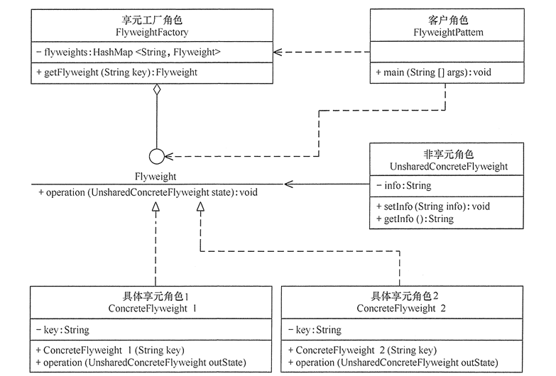

享元模式实例：[FlyweightTest](https://github.com/guang19/framework-learning/blob/dev/design_pattern/src/main/java/com/github/guang19/designpattern/flyweight)


#### 观察者模式(Observer)
观察者模式的意图是 当多个事物之间存在一种一对多关系时，如果一个事物的状态发生改变，使得依赖这个事物的其他事物也能得到
通知，并做出相应改变，观察者模式有时被称为 发布-订阅者模式 或 模型-视图模式。在我们的生活当中，一个事物影响其他事物的
例子数不胜数：我们过马路时，当交通指示灯改变颜色，我们收到这一信息，便会做出反馈，我们知道该停下还是可以过马路；
如果我们在手机上订阅了某个节目的专栏，当专栏有新的信息时，便会推送给我们；当我们按下灯的开关时，灯会被点亮或熄灭。

观察者模式由 抽象主题角色，具体主题角色，抽象观察者角色和具体观察者角色等要素组成：

- 抽象目标角色： 抽象目标角色是具体目标角色的规范，它提供了用于管理观察者角色的方法，以及定义了通知观察者的
抽象方法。

- 具体目标角色(发布者)： 具体目标角色是观察者观察的具体目标，它实现了抽象目标角色定义的规范，当具体目标发生变化时，
便会通知所有的观察者。

- 抽象观察角色： 抽象观察角色是具体观察角色的规范，声明了当目标角色发生变化时，更新自身的方法。

- 具体观察角色(订阅者)： 具体观察角色实现了抽象观察角色定义的规范，它决定了当具体目标角色发生变化时，自身需要完成的逻辑。

观察者模式:

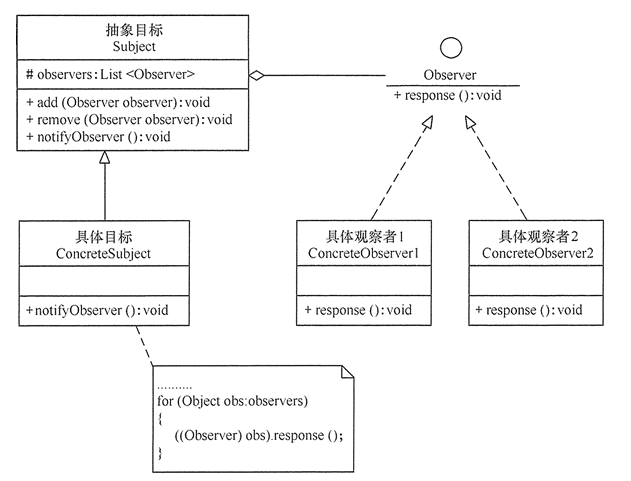

观察者模式实例：[ObserverTest](https://github.com/guang19/framework-learning/blob/dev/design_pattern/src/main/java/com/github/guang19/designpattern/observer)
   
   
#### 模板方法模式(Template Method)
模板方法模式的意图是 定义一个操作中的算法骨架，将算法的一些步骤延迟到子类中，使得子类可以在不改变整体算法框架的
前提下，重新实现该算法的某些逻辑。 比如我们的程序中有一个保存用户信息的服务，保存用户的信息假设分为两个步骤：1.校验用户信息(check)。
2.使用jdbc将用户信息存入数据库(save)。 其中将用户信息存入数据库这一步骤几乎不会发生改变，但校验用户的信息这一步就可能有不同的方案，
所以校验用户信息这一步骤可以延迟到这个服务的子类中去，由不同的子类实现不同的逻辑。

模板方法模式由 抽象模板和具体子类等要素组成：

- 抽象模板： 抽象模板定义了整个服务或者算法的整体框架，它由一个模板方法和若干基本方法组成。

  - 模板方法： 模板方法是抽象模板的核心，它定义了基本方法被调用的顺序。如保存用户信息的服务，是先check，还是先
  save，保存用户信息的模板方法就负责整合这两个方法。
  
  - 基本方法： 基本方法是整个服务或算法中的一个步骤，check和save都是基本方法，基本方法还可分为：
 
    - 抽象方法： 抽象方法在抽象模板中声明，由具体模板实现。
    
    - 具体方法： 具体方法在抽象模板中声明并实现，可以在具体模板中被重写。
    
    - 钩子方法： 钩子方法在抽象模板中声明并实现，它的方法体通常是空的，可以在具体模板中实现，
    所以钩子方法起到的是一个扩展的作用。
    
   
- 具体模板： 具体模板实现或重写了抽象模板中声明的抽象方法和钩子方法，具体的逻辑视这个具体模板的职责而定。

模板方法模式：

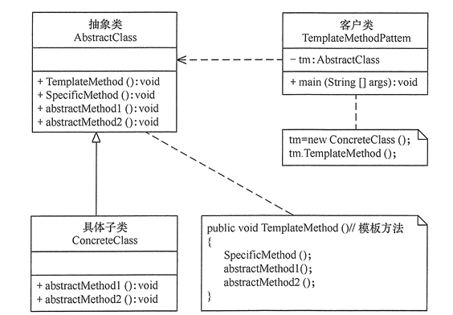

模板方法实例：[TemplateMethodTest](https://github.com/guang19/framework-learning/blob/dev/design_pattern/src/main/java/com/github/guang19/designpattern/templatemethod)

   

#### 策略模式(Strategy)
策略模式的意图是 定义一系列的算法，并将每个算法封装起来，使得它们可以相互替换，且算法的变化并不会影响到使用
该算法的客户端。 假设我要到一个地方去，有公交和地铁两种出行方式，无论选择何种方式出行，都可以使得我到目的地。
再假设我要将一个无序的序列排序成一个有序的序列，需要采用排序算法来解决问题，我可以在不同的环境下采用不同排序算法，
但无论何种排序算法其执行的结果最终肯定都是一致的。

策略模式由 抽象策略，具体策略和环境角色等要素组成：

- 抽象策略： 抽象策略声明了算法接口，各种不同的算法以不同的方式实现此接口。

- 具体策略： 具体策略实现了抽象策略，并提供了具体的算法逻辑。

- 环境角色： 环境角色持有一个策略的引用，最终客户端会使用环境角色来调用具体策略的算法。

策略模式：

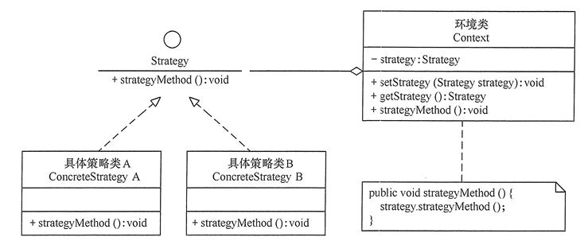

策略模式实例：[StrategyTest](https://github.com/guang19/framework-learning/blob/dev/design_pattern/src/main/java/com/github/guang19/designpattern/strategy)

   

#### 责任链模式(Chain of Responsibility)
责任链模式又被成为职责链模式，它的意图是 为了避免一个请求发送者与多个请求处理者耦合在一起， 
而将所有请求处理者连接成一条处理引用链，当有请求发送时，请求就会被这条请求处理引用链上的请求处理者处理。

责任链模式由 抽象处理者和具体处理者等要素组成：

- 抽象处理者： 抽象处理者声明了处理请求的接口， 且包含了当前处理者的下一个处理者。

- 具体处理者： 具体处理者实现了抽象处理者，当具体处理者处理完请求后，如果它还有后继处理者，那么就将请求
交予其后继处理者处理。

责任链模式：

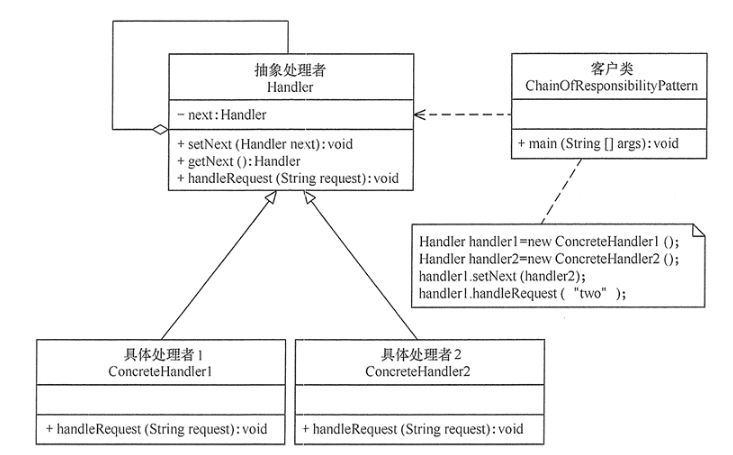

责任链请求处理流程:

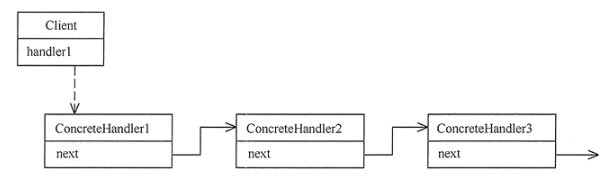

责任链模式实例: [ResponsibilityChainTest](https://github.com/guang19/framework-learning/blob/dev/design_pattern/src/main/java/com/github/guang19/designpattern/responsibilitychain)


#### 中介者模式(Mediator)
中介者模式遵循迪米特法则，它的意图是 使用一个中介者对象来封装一系列对象之间的交互，使原有对象之间不需要显示的调用彼此，
从而使其耦合松散。 中介者这个角色很好理解，比如在我们使用聊天应用程序进行通信的时候，
我们发送的消息是发送给了服务器，服务器收到消息后，再将消息发送给对方。

中介者模式由 抽象中介者，具体中介者，抽象同事角色和具体同事角色等要素组成：

- 抽象中介者： 抽象中介者声明了同事对象注册与转发同事对象信息的接口。

- 具体中介者： 具体中介者实现了抽象中介者，协调各个同事之间的交互关系。

- 抽象同事角色： 抽象同事角色声明了同事之间的交互接口。

- 具体同事角色： 具体同事角色实现了抽象同事角色声明的接口，当前同事角色与其他同事交互时，需要由中介者
负责协调。

中介者模式：

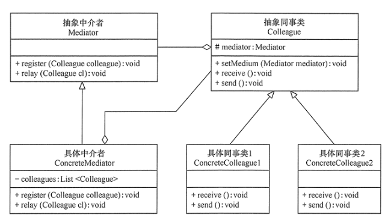


中介者模式实例： [MediatorTest](https://github.com/guang19/framework-learning/blob/dev/design_pattern/src/main/java/com/github/guang19/designpattern/mediator)


   
#### 访问者模式(Visitor)
访问者模式的意图是 将作用于某种数据结构中的各元素的操作分离出来封装成独立的类，使其在不改变数据结构的
前提下可以添加作用于这些元素的新操作，访问者模式将数据结构与操作分离，是行为模式中较为复杂的一种模式。
举个栗子： 公园(数据结构)中有多个景点(元素)，每个游客都可以访问这些景点，且对这些景点有各种不同的评价。

访问者模式由 抽象访问者，具体访问者，抽象元素，具体元素和对象结构等要素组成：

- 抽象访问者： 抽象访问者为每个具体元素都声明了访问具体它的接口。

- 具体访问者： 具体访问者实现了抽象访问者定义的接口，确定了访问一个元素时需要做的操作。

- 抽象元素： 抽象元素声明了被访问者访问的接口。

- 具体元素： 具体元素实现了抽象元素。

- 对象结构： 对象结构是包含了元素的容器，提供了让访问者访问容器中所有元素的方法，可以看作是 公园。

访问者模式：

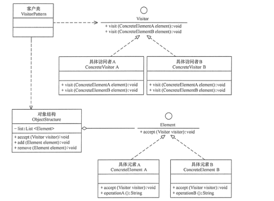

访问者模式实例： [VisitorTest](https://github.com/guang19/framework-learning/blob/dev/design_pattern/src/main/java/com/github/guang19/designpattern/visitor)


   
#### 命令模式(Command)
命令模式的意图是 将请求封装为一个对象，使发出请求的责任和执行请求的责任分离开来，请求的发送者和接受者通过命令进行
沟通。 比如当我们使用电视遥控器(命令发送者)按下某个按钮(具体命令)时，电视机(命令接受者)就会做出相应的反馈。

命令模式由抽象命令，具体命令，命令发送者和命令接受者等要素组成：

- 抽象命令： 抽象命令声明了执行命令的接口。

- 具体命令： 具体命令是抽象命令的实现，它通过调用命令接受者的功能完成命令要执行的操作。

- 命令接受者： 命令接受者不与命令发送者直接交互，而是被命令所调用执行。

- 命令发送者： 命令发送者也不直接与命令的执行者交互，而是通过调用命令来执行相关请求。 

命令模式：

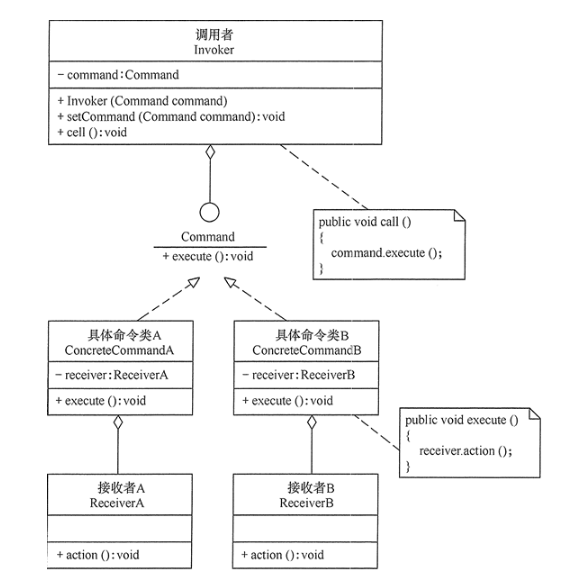

命令模式实例： [CommandTest](https://github.com/guang19/framework-learning/blob/dev/design_pattern/src/main/java/com/github/guang19/designpattern/command)


#### 解释器模式(Interpreter)
解释器模式定义了 评估某种语言的**文法**，并建立一个解释器解释该语言的句子。如我们常见的SQL的解析，某种语言
的代码在执行之前也需要被解析。

解释器模式实例： [InterpreterTest](https://github.com/guang19/framework-learning/blob/dev/design_pattern/src/main/java/com/github/guang19/designpattern/interpreter)

   
#### 迭代器模式(Iterator)
迭代器模式的意图是 提供一个对象来顺序访问聚合对象中的一系列数据，而不暴露聚合对象的内部表示。

迭代器模式实例： [IteratorTest](https://github.com/guang19/framework-learning/blob/dev/design_pattern/src/main/java/com/github/guang19/designpattern/iterator)

   
#### 备忘录模式(Memento)
备忘录模式的意图是 在不破坏封装性的前提下，捕获一个对象的内部状态，并在该对象之外保存这个状态，以便以后在需要的时候
能够恢复到之前保存的状态。假设我们在更改一篇文章后，发现更改后的文章还没有更改之前好，于是就想将文章恢复到更改之前的状态，
此时就可以借助备忘录完成此需求。

备忘录模式由 备忘录，发起人和管理者等要素组成：

- 发起人： 发起人记录当前时刻的内部状态，提供创建备忘录和恢复备忘录数据的功能。

- 备忘录： 备忘录负责存储发起人的内部状态，并在需要的时候将内部状态传递给发起人。

- 管理者： 管理者负责管理备忘录，提供获取与保存备忘录的功能。

备忘录模式：

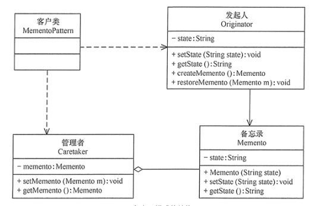

备忘录模式实例：[MementoTest](https://github.com/guang19/framework-learning/blob/dev/design_pattern/src/main/java/com/github/guang19/designpattern/memento)


#### 状态模式(State)
状态模式的意图是 使得 一个对象的状态发生改变时，这个对象的行为也随状态的变化而变化，这种对象被称为状态对象。 
举个栗子： 我们的服务器一般有start，active，destroy等状态，当服务器的状态发生改变时，其内部也需要做出相应的变化。

状态模式由 环境角色，抽象状态和具体状态等要素组成：

- 环境角色： 环境角色也被成为上下文，它维护一个当前状态，当状态发生改变时，其行为也将改变。

- 抽象状态： 抽象状态封装了环境角色在特定状态下的行为。

- 具体状态： 具体状态实现了抽象状态的行为。

状态模式：

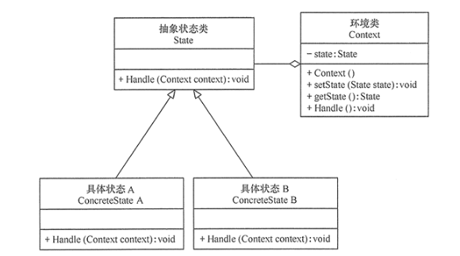


状态模式实例：[StateTest](https://github.com/guang19/framework-learning/blob/dev/design_pattern/src/main/java/com/github/guang19/designpattern/state)
