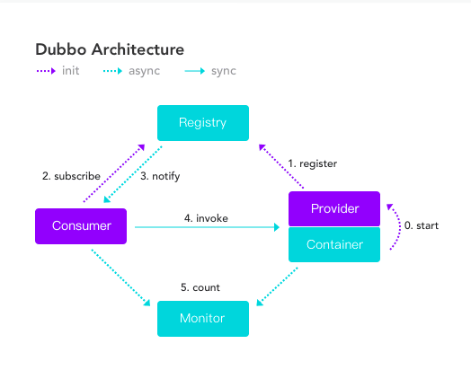
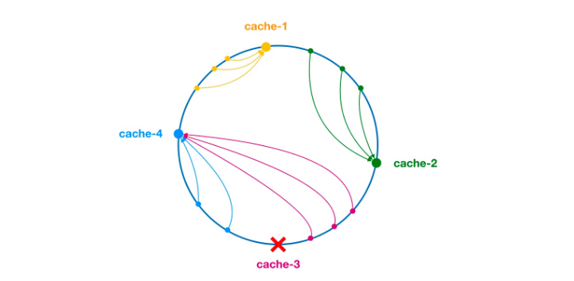
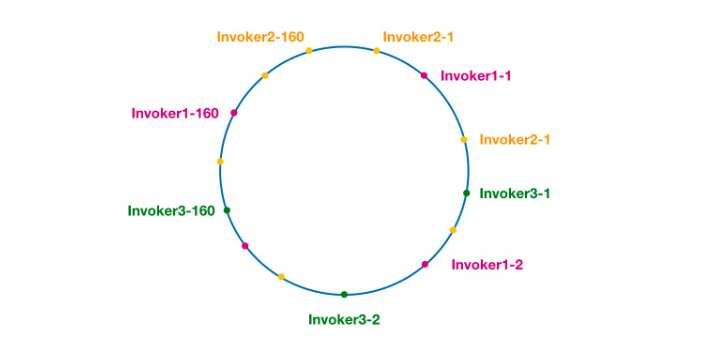

## Dubbo学习

学习Dubbo之前可以先了解下单体应用架构,SOA架构与微服务架构.

### 单体应用架构
>顾名思义,一个应用程序的所有的模块,功能,服务等等都包含在一个归档包(jar,war)之中,这是一种比较传统的架构方式.

#### 单体应用架构的缺点
##### 1.复杂度高
>>整个架构的模块,功能非常多,模块和功能之间的职责边界模糊,模块之间的耦合性很高,依赖混乱,还有可能代码的质量参差不齐,整个项目的复杂度很高,
>当需要修改其中某个功能代码块的时候,有可能牵一发动全身.

##### 2.扩展能力受限，无法按需伸缩
>> 单体应用只能整体进行扩展,不能进行模块的扩展

##### 3.阻碍技术创新
>> 单体应用一般使用统一平台的语言进行编写,所以如果想引进新技术较为困难.

##### 4.技术债务(难以维护)逐渐增加
>>随着时间的推移,技术迭代,需求变更,人员更迭,整个项目越来越难维护(越来越变得像坨xx),不断积压技术债务,已使用的技术难以修改.

### SOA架构(Service-Oriented Architecture 面向服务):
>所谓的面向服务,其实是面向接口.SOA是WebService技术的一种延伸,了解WebService的话就知道,WebService的通信方式是与平台无关的.
>比如一个提供实时天气查询的在线网站,那么都知道天气这种服务,普通网站是提供不了的,一般都是气象局(打个比方)发布的吧,那么不同的网站可以调用气象局提供的接口
>来提供数据给用户.这其中每个网站使用的技术平台可能不同,所以WebService只需要提供相应的规范(通信方式(http,rpc等)数据传输的格式(json,xml等)),然后平台发起请求获取相应的数据就行了.
>这样一来,无论你想提供什么服务,只要与真正提供数据的接口约定好通信方式和数据传输格式,就能完成请求.WebService是如此,那么SOA架构也类似.
>SOA架构把不同的服务进行拆分,服务之间使用接口进行通信,接口独立于平台,操作系统,这样一来,就实现了架构的松耦合,扩展性强等特点.

### 微服务架构(分布式)
>对于微服务和SOA的区别,由于我能力有限,暂时不能理解,不过我查阅相关资料时,大概确定,微服务是SOA衍生出来的一种概念,只不过由于2者还是有些细微区别,所以便叫他微服务了,这是关于这个问题的链接:
> [SOA和微服务架构的区别](https://www.zhihu.com/question/37808426).

>谈谈我对于微服务的理解,可能有错误之处,所以如果有缘看到这里的同学,还是请自行动手查阅相关资料.
如果对于微服务有过了解的同学可能已经知道,微服务系统的每个服务都可以独立运行.那么这些可以独立运行的服务究竟是什么?
微服务强调彻底的组件化和服务化.什么意思? 一个系统可能有登录和注册模块,如果不采用微服务架构,那么可能登录和注册是在一个应用里,两个服务可能有共同依赖的dao模块,
那么到了微服务这里就不一样了:登录和注册作为2个独立的应用程序,登录服务有相应的dao模块,注册服务也有自己dao模块.

>那么这还只是登录和注册2个服务就分离了,如果比较复杂的系统和较大的体量,几十上百这样的微服务应该也不算奇怪吧.一个系统由这些单独的服务组成,每个服务单独编写,开发,服务之间通过Http,Rpc等方式进行通信,
>这样就组成了以微服务为架构的系统.听说Netflix有几百个微服务,不知道是不是真的.总之在我看来,这样是真的分离的很彻底,每个服务的指责划分也很清楚,但是这样开发成本应该不小吧.

之前在没有接触这方面知识的时候,一度把Dubbo和SpringCloud搞混淆,纠结我该学哪个框架,Dubbo的功能还比SpringCloud的功能少,就该学新技术SpringCloud.当然不是这样的,
因为我潜意识里就把2者弄混了,以为二者都是微服务框架,准确来说Dubbo应该是SOA的落地实现,SpringCloud才是微服务的落地实现,所以这不再是你该学哪个框架的问题,而是你想更加深入了解哪种架构的问题.

#### 剩下补充2个常见的概念:集群和分布式.关于集群和分布式的区别,知乎上有大神已经回答了这个问题,我就不再详说:[集群和分布式的区别?](https://www.zhihu.com/question/20004877)

### RPC (Remote Procedure Call)协议
>RPC协议是Dubbo的底层支撑协议,所以学习Dubbo,必先了解RPC协议.
>
>RPC,远程过程调用.维基百科对于RPC的定义为:
>RPC是计算机的通信协议.RPC协议允许运行于一台计算机上的程序调用另一个地址空间(通常为另一台开放的计算机)的子程序,
>而程序员就像调用本地程序一样,无需额外的为这个交互作用编程(无需关注其细节).
>
>RPC是一种客户端(服务调用放)-服务端(服务提供方)的模式.就像上面介绍SOA时说的那样,客户端只需要调用服务端指定的接口,
>即可调用服务端提供的服务.RPC主要依赖于序列化,反序列化和通信传输协议等技术.

>>其实映射到Java中来说,可以理解为:一个程序运行在服务器A上,一个程序运行在服务器B上,那么程序A可以以RPC协议调用服务器B上正在运行程序的
>某个方法.

```
使用较多的RPC解决方案有:JAVA原生的RMI,Apache Dubbo,Thrift,Hessian,gRPC等.
```

### Dubbo概述
>Dubbo最早是阿里开源的一个高性能,轻量级的Java RPC框架,中间停止维护了一段时间,后又重新恢复更新,并捐献给Apache,现为Apache
>顶级项目.
>Dubbo提供了:面向接口的远程方法调用,智能容错与负载均衡以及服务注册与发现3大核心功能.

>Dubbo设计架构:

* Registry: 服务注册与发现的注册中心.允许服务提供者注册服务,当消费者(服务调用者)调用某个服务的时候,就到Registry中查询已注册的服务,从而实现服务调用.
* Consumer: 服务调用者.
* Provider: 服务提供者,向外暴露服务接口,并将服务注册到注册中心.
* Container: 服务提供者运行的容器.
* Monitor: 监控中心. 统计服务的调用次数和调用时间的监控中心(现在在Dubbo官方Github中,默认分支为develop，并且master被标注为重构,所以我目前所接触的监控工具为Dubbo提供的Dubbo admin开发版,也就是说有很多功能没有,不过我还是愿意尝试...)

其实我觉得Dubbo的官方文档写的已经非常好了,demo也非常齐全,关于Dubbo的学习,在这里也推荐Dubbo的官方文档:
[Dubbo官方文档](https://dubbo.apache.org/zh-cn/index.html)

#### Dubbo的负载均衡算法.

负载均衡对于分布式系统来说非常重要,它带来的好处包括但不限于:均衡分配请求,防止单台服务器过载;避免将请求分配给不可用服务器,提高可用性;
计算单点服务器的流量...熟知的负载均衡的服务器有:Nginx,Tengine等.

[Dubbo官方文档对于Dubbo负载均衡算法的描述](https://dubbo.apache.org/zh-cn/docs/source_code_guide/loadbalance.html)

#### RandomLoadBalance     加权随机负载均衡算法
>假设有一组提供相同服务的服务器:A,B,C.一般来说随机负载均衡算法就是在A,B,C中随机挑选一Server进行消费,但是
>加权随机就不一样了.给A,B,C赋予不同的权重:A:3; B:2; C:1. 三者权重之和为6. 其中A的权重值在[0,3)区间,B的权重值
>在[3,5)区间,C的权重值在[5,6)区间.每次需要挑选一台Server的时候,就生成一个在权重范围内的随机数,计算这个随机数在哪个Server
>的区间内,从而挑选对应的Server.由此可见,权重值越大的Server,就有较大几率被选中.

#### RoundRobinLoadBalance 加权轮询负载均衡算法
>假设有一组提供相同服务的服务器:A,B,C.轮询很好理解,就是每次请求都在A,B,C之中按顺序轮流挑选一台Server.
>但是现实情况是:每台服务器的性能可能不一致,有好有坏,于是给性能较好的服务器分配较大权重,给性能较差的服务器分配较小权重,
>如: A:3. B:2. C:1. 所以在6次请求中,A被挑选的次数为3,B为2,C为1.

#### LeastActiveLoadBalance 加权最小活跃数负载均衡算法
>假设有一组提供相同服务的服务器:A,B,C. 最小活跃数负载均衡就是:某台Server的活跃数(被调用次数越小),那么代表该Server越空闲,也就是
>服务提供效率更高,单位时间内可处理的请求次数更高.此时应该将请求优先分配给该Server.在实际情况中,每个Server对应一个active,初始情况下,
>每台Server的active都为0,每当一个Server被调用一次,那么该Server的active就加1,当该Server完成一次调用后,active就减1.在服务运行一段
>时间后,性能较好的Server可能处理请求的速度越快,active就越低,所以此时这样的Server能够优先被选中调用.LeastActiveLoadBalance
>还引用了权重的算法.所以LeastActiveLoadBalance应该被称为:加权最小活跃数负载均衡算法.
>举个例子:在A,B,C中,可能某一时刻它们的active是相同的,此时不能根据性能来选择,所以Dubbo就会根据它们的权重来选择,权重越大的
>Server,被选中的概率也就越大.那如果极端到权重也都是一样的,随机选一个就行了.

#### ConsistentHashLoadBalance 一致性Hash负载均衡算法.
>一致性Hash算法最初被提出是用于解决大规模缓存系统的负载均衡,也就是在一个大型的系统中,数据肯定不能缓存到一个缓存服务器或节点上,否则会发生
>一系列诸如:缓存雪崩,缓存穿透这样的问题.那么可以使用一致性Hash算法,使每次数据都合理的分配到缓存系统中的每个节点.
>
>一致性Hash算法的工作过程是:首先根据IP或其他信息为每个缓存节点生成一个Hash,将这个Hash投射到[0 - 2^32-1]的圆环上:

当有查询或写入请求时,则为缓存项的key生成一个Hash值,然后查询第一个大于或等于该Hash值的缓存节点,并到这个缓存节点中查询或写入缓存.如果缓存节点挂了,
>那么下一次请求查询或写入时,为缓存项查找另一个大于其Hash值的缓存节点.
>如本应到cache-3中查询或写入的缓存项,下一次就会到cache-4中进行操作.

>上面是一致性Hash算法在缓存中的应用,每个缓存节点就对应了在Dubbo中的Provider:



>相同的颜色的Invoker就是提供相同服务的Provider,比如:Invoker1-1,Invoker1-2...Invoker1-160,这样做的目的是为了
>引入虚拟节点,让Invoker在圆环上分布均匀,防止数据倾斜问题.数据倾斜问题是指:由于节点不够分散,导致大量的请求都
>落到一个节点上,其它节点只收到少量请求,然后产生连锁反应：


>由于Invoker-1和Invoker-2在圆环上分布不均,可能会导致75%的请求落到Invoker-1上,25%的请求落到Invoker-2上.解决数据倾斜问题
的办法就是上面所说的引入虚拟节点,通过虚拟节点均衡各个节点的请求.

