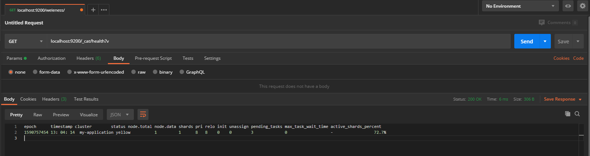

<!-- TOC -->

   * [ElasticSearch](#elasticsearch)
      * [什么是ElasticSearch?](#什么是elasticsearch)
         * [基本概念](#基本概念)
         * [ElasticSearch查询语法](#elasticsearch查询语法)
            * [_cat API](#_cat-api)
            * [Search API](#search-api)
            * [Query and filter context](#query-and-filter-context)
         * [ElasticSearch查询示例](#elasticsearch查询示例)
            * [_Cat API查询示例](#_cat-api查询示例)
            * [_Search API查询示例](#_search-api查询示例)

<!-- /TOC -->

# ElasticSearch

## 什么是ElasticSearch?

目前全文搜索引擎的首选。

它可以快速地储存、搜索和分析海量数据。维基百科、Stack Overflow、Github 都采用它。

Elastic 的底层是开源库 Lucene。但是，你没法直接用 Lucene，必须自己写代码去调用它的接口。Elastic 是 Lucene 的封装，提供了 REST API 的操作接口，开箱即用。


### 基本概念

- Index：一系列文档的集合，类似于mysql中的数据库
- Type：在Index里面可以定义不同的type，type的概念类似于mysql中的表。
- Document：文档的概念类似于mysql中的一条存储记录，并且为json格式，在Index下的不同type下，可以有许多的document
- Shards：在数据量很大的时候，进行水平的扩展，提高搜索性能
- Replicas：防止某个分片的数据丢失，可以并行在备份数据里及搜索提高性能


### ElasticSearch查询语法

#### _cat API

- cat：输出_cat api中所有支持的查询命令
- cat health：检查es集群运行的情况
- cat count：可以快速的查询集群或者index中文档的数量
- cat indices: 查询当前集群中所有index的数据，包括index的分片数、document的数量、存储所用的空间大小...
- 其他cat api参考官方文档: https://www.elastic.co/guide/en/elasticsearch/reference/5.5/cat.html


#### Search API

查询方式：

- **REST request URI**：轻便快速的URI查询语法。

- **REST request body**：可以有许多限制条件的json格式查询方法。

  - "query"：请求体中的`query`允许我们用`Query DSL`的方式查询。
  
  - "term"：查询时判断某个document是否包含某个具体的值，不会对被查询的值进行分词查询。

  - "match" : 将被查询值进行分词，然后用评分机制（TF/IDF）进行打分。

  - "match_phrase"：查询指定段落。
  
  - "Bool"：结合其他真值查询，通常和[`must should mustnot`]（与或非）一起组合出复杂的查询
  
  - "range"：查询时指定某个字段在某个特定的范围

```text
"range": {
      "FIELD": {# 指定具体过滤的字段
        "gte": 1,# gte: >=, gt: >
        "lte": 10
      }
    }
```

​	“from”：以一定的偏移量来查看我们检索的结果，默认从检索的第一条数据开始显示（0位置开始）

​	“size”：允许我们将检索的结果以指定的字段进行排序显示

​	“_source”：指定检索结果输出的字段

​	"script_fields"：该类型允许我们通过一个脚本来计算document中不存在的值，比如我们需要计算install/click得到cti之类的

```text
"script_fields": {
    "FIELD": {# 指定脚本计算之后值得名称
      "script": {# 脚本内的运算
      }
    }
  }
```

​	"aggs"：基于搜索查询，可以嵌套去和来组合复杂的需求

```text
"aggs": {
    "NAME": {# 指定结果的名称
      "AGG_TYPE": {# 指定具体的聚合方法，
        TODO: # 聚合体内制定具体的聚合字段
      }
    }
    TODO: # 该处可以嵌套聚合
  }
```


#### Query and filter context

 查询语句的性为取决于它是使用查询型上下文还是过滤型上下文

- Query context：在这种上下文环境中，查询语句的返回结果是**”结果和查询语句的匹配程序如何“**，返回的结果数据中都会带上`_score`值，象征匹配程度。
- Filter context：过滤型上下文环境中，查询语句则表面匹配与否（yes or no）。es内置式为`filter context`保存缓存用来提高查询性能，因此`filter context`比`query context`查询的速度快


### ElasticSearch查询示例

#### _Cat API查询示例

_Cat API查询集群的健康情况




#### _Search API查询示例

**创建索引:**

```text
PUT localhost:9200/test
```

Output

```text
{
    "acknowledged": true,
    "shards_acknowledged": true,
    "index": "test"
}
```


**插入数据:**

```
PUT localhost:9200/test/user/1
```

Body 

```json
{
	"username" : "张三",
	"password" : "123546",
	"age" : "18",
	"yyyymmdd" : "2017-08-07T16:00:00"
}
```

Output

```text
{
    "_index": "test", # 索引
    "_type": "user", # type类型
    "_id": "1", # 唯一id，如果不指定将自动生成一个自增的uuid，且这个uuid永不重复
    "_version": 1,# 版本，每提交一个重复的版本+1
    "result": "created",# 操作
    "_shards": { # 拓展
        "total": 2,
        "successful": 1,
        "failed": 0
    },
    "_seq_no": 0,
    "_primary_term": 1
}
```

**查询数据:**

- **查询所有:**


```
GET localhost:9200/test/user/_search?q=*
```

Request Body

```text
GET localhost:9200/test/user/_search
{
	"query":{
		"match_all":{}
	}
}
```

Output

```json
{
	"took": 1121,
	"timed_out": false,
	"_shards": {
		"total": 1,
		"successful": 1,
		"skipped": 0,
		"failed": 0
	},
	"hits": {
		"total": {
			"value": 1,
			"relation": "eq"
		},
		"max_score": 1.0,
		"hits": [
			{
				"_index": "test",
				"_type": "user",
				"_id": "1",
				"_score": 1.0,
				"_source": {
					"username": "张三",
					"password": "123546",
					"age": "18",
					"yyyymmdd": "2017-08-07T16:00:00"
				}
			}
		]
	}
}
```

- **查询特定字段，并按照某个字段进行排序:**

```
GET localhost:9200/test/user/_search?q=username:张三&&sort=yyyymmdd:asc
```

Request Body

```text
GET localhost:9200/test/user/_search
{
    "query": {
        "match": {
            "username": "张三"
        }
    },
    "sort": [
        {
            "yyyymmdd": {
                "order": "desc"
            }
        }
    ]
}
```

- **查询特定字段，并指定输出字段:**

RequestBody

```text
localhost:9200/test/user/_search
{
    "query": {
   {
                    "match": {
                        "username": "张三"
                    }
                }
        
    },
    "sort": [
        {
            "yyyymmdd": {
                "order": "desc"
            }
        }
    ],
    "_source": [
        "yyyymmdd",
        "username"
    ]
}
```

Output

```json
{
    "took": 4,
    "timed_out": false,
    "_shards": {
        "total": 1,
        "successful": 1,
        "skipped": 0,
        "failed": 0
    },
    "hits": {
        "total": {
            "value": 1,
            "relation": "eq"
        },
        "max_score": null,
        "hits": [
            {
                "_index": "test",
                "_type": "user",
                "_id": "1",
                "_score": null,
                "_source": {
                    "yyyymmdd": "2017-08-07T16:00:00",
                    "username": "张三"
                },
                "sort": [
                    1502121600000
                ]
            }
        ]
    }
}
```

- **bool组合复杂查询:**

Request Body

```text
GET localhost:9200/test/user/_search
{
    "query": {
        "bool": {
            "must": [
                {
                    "match": {
                        "username": "张三"
                    }
                }
            ],
            "must_not": [
                {
                    "range": {
                        "age": {
                        	"gt" : 18
                        }
                    }
                }
            ],"should" : [
            	{
            		"match" : {
            			"yyyymmdd" : "2017-08-07T16:00:00"
            		}
            	}]
        }
    },
    "sort": [
        {
            "yyyymmdd": {
                "order": "desc"
            }
        }
    ],
    "_source": [
        "yyyymmdd",
        "username"
    ],
    "highlight": {
        "fields": {
            "username": {}
        }
    }
}
```

Output

```text
{
    "took": 328,
    "timed_out": false,
    "_shards": {
        "total": 1,
        "successful": 1,
        "skipped": 0,
        "failed": 0
    },
    "hits": {
        "total": {
            "value": 1,
            "relation": "eq"
        },
        "max_score": null,
        "hits": [
            {
                "_index": "test",
                "_type": "user",
                "_id": "1",
                "_score": null,
                "_source": {
                    "yyyymmdd": "2017-08-07T16:00:00",
                    "username": "张三"
                },
                "highlight": {
                    "username": [ # 高亮的字段
                        "<em>张</em><em>三</em>"
                    ]
                },
                "sort": [
                    1502121600000
                ]
            }
        ]
    }
}
```

- **聚合查询:**

下例是类似于sql中的聚合查询，查询每天不同类型对应的intall总量

Requst Body

```text
PUT /rta_daily_report/campaign/164983850_rba_20170808?pretty
{
  "doc": {
    "cid": 164983850,
    "advertiser_id": 799,
    "trace_app_id": "com.zeptolab.cats.google",
    "network_cid": "6656665",
    "platform": 1,
    "direct": 2,
    "last_second_domain": "",
    "jump_type": 2,
    "direct_trace_app_id": "",
    "mode": 0,
    "third": "kuaptrk.com",
    "hops": 9,
    "yyyymmdd": "2017-08-07T16:00:00",
    "type": "rba",
    "click": 2
  }
}
```


```text
GET localhost:9200/test/user/_search
{
  "size": 0,
  "aggs": {
    "sum_install": {
      "date_histogram": {
        "field": "yyyymmdd",
        "interval": "day"
      },
      "aggs": {
        "types": {
          "terms": {
            "field": "type.keyword",
            "size": 10
          },
          "aggs": {
            "install": {
              "sum": {
                "field": "install"
              }
            }
          }
        }
      }
    }
  }
}
```

Output

```text
"aggregations": {
    "sum_install": {
      "buckets": [
        {
          "key_as_string": "2017-07-31T00:00:00.000Z",
          "key": 1501459200000,
          "doc_count": 659553,
          "types": {
            "doc_count_error_upper_bound": 0,
            "sum_other_doc_count": 0,
            "buckets": [
              {
                "key": "rba",
                "doc_count": 321811,
                "install": {
                  "value": 73835
                }
              },
              {
                "key": "m_normal",
                "doc_count": 321711,
                "install": {
                  "value": 18964
                }
              }
```

- **script查询:** 

下例通过document中的click,install字段，计算出文档中不存在的数据。

```text
GET /rta_daily_report/campaign/_search?pretty
{
    "query" : {
      "bool": {
        "must": [
          {
            "range": {
              "click": {
                "gt": 0
              }
            }
          },
          {
            "range": {
              "install": {
                "gt": 0
              }
            }
          }
        ]
    }},
    "size": 100, 
    "script_fields": {
      "cti": {
        "script": {
          "lang": "painless",
          "inline": "1.0 * doc['install'].value / doc['click'].value"
        }
      }
    }
}
```

Output

```text
"hits": {
    "total": 23036,
    "max_score": 2,
    "hits": [
      {
        "_index": "rta_daily_report",
        "_type": "campaign",
        "_id": "160647918_rta_20170801",
        "_score": 2,
        "fields": {
          "cti": [
            0.0005970149253731343
          ]
        }
      },
      {
        "_index": "rta_daily_report",
        "_type": "campaign",
        "_id": "162293741_rta_20170801",
        "_score": 2,
        "fields": {
          "cti": [
            0.00007796055196070789
          ]
        }
      },
```
