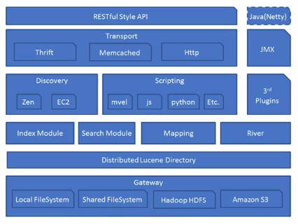

##  Elasticsearch

>  Elasticsearch是一个基于Lucence开源的分布式搜索引擎数据库.

### Elasticsearch 概念

与关系型数据库相比,Elasticsearch可以被看做NoSql型数据库.它有Node,Cluster,Document,Index,Type,Field,Shards,Replicas等概念.

####  Node(节点)

>  Node就是一台装有Elasticsearch服务并且提供故障转移和扩展的服务器.

#### Cluster (集群)

> 一个集群就是有一个或多个Node组织在一起,共同工作,共同分享整个数据具有负载均衡概念的集群.

#### Document(文档)

> 一个文档是一个可被索引的基础信息单元(数据).

#### Index(索引)

> 索引是一个拥有积分相似特征的文档的集合

Type(类型)

> 一个索引中,可以定义一种或多种类型

#### Field(列)

> Field是Elasticsearch的最小单位,相当于数据的某一列

#### Shards(分片)

> Elasticsearch将索引分为若干份,每个部分就是一个shard.

#### Replicas(复制)

> Replics是将索引一份或多份拷贝.

与关系型数据库相比:

|        | Mysql    | Elasticsearch |
| ------ | -------- | ------------- |
| 数据库 | DataBase | Index         |
| 数据表 | Table    | Type          |
| 数据行 | Row      | Document      |
| 数据列 | Column   | Field         |

### Elasticsearch 架构

#### Gateway

> Gateway模块 负责当集群 full restart时的元信息(state)数据恢复.

#### 3rd Plugins

> ES支持很多第三方插件,如:IK中文分词

#### Transport

> ES默认使用基于Http Restful风格的API进行通信,当然它还支持:Thrift,Memcached等协议.

#### Scripting

> 脚本是ES最强大的功能之一,可以使用脚本完成各种复杂的操作.

#### Discovery

> Discovery模块负责集群中节点的自动发现和Master节点的选举.

个人认为Elasticsearch的功能实在是很多,简单的增删改查确实不难,但是要想深入学习,只能是慢慢积累.

作为初学者,我会尽自己的努力来学习的...

#### Elasticsearch的版本控制

> ES的版本控制分为内部版本控制和外部版本控制

1. 内部版本控制: _version自增长. 也就是修改数据后,_version会自动加
2. 外部版本控制:为了_version与外部版本控制的数值一致,使用version_type=external,检查数据当前的version值是否小于请求中的version值.

#### Mapping映射

> 映射是在创建索引的时候,可以预先定义字段的类型以及相关属性.
>
> Mysql支持多种数据类型,如:Varchar,Int,BigInt...我们设计一张表的时候,就要给每个字段赋予相应的数据类型,
>
> 那么ES也不例外. 
>
> ES的Mapping映射分为静态映射和动态映射.ES可以自动识别我们传入数据的类型.

##### ES的数据类型

1. String
2. VarChar,Text
3. Integer
4. Long
5. Float
6. Double
7. Boolean
8. Date/Datetime
9. Bytes/Binary

>  除了可以定义字段的类型，ES还可以给字段添加相关属性.

1. store

   > 值为:yes或no.代表存储或不存储

2. index

   > 值为: analyzed,not_analyzed或者no
   >
   > analyzed: 索引且分析
   >
   > not_analyzed:索引但是不分析
   >
   > no: 不索引这个字段

3. null_value

   > 如果字段是空值,通过它可以设置一个默认值,比如 "null_value":"NA"

4. boost

   > 设置字段的权值,默认值是1.0

5.  index_analyzer

    > 设置一个索引时用的分析器

6. search_analyzer

    > 设置一个搜索时用放分析器

7. analyzer

   > 可以设置索引和搜索时用的分析器,默认下ES使用的是standard分析器.除此之外,还有:whitespace,simple或english这几种内置的分析器.

8. include_in_all

   > 默认下ES会为每个文档定义一个特殊的域:_all,它的作用是每个字段会被搜索到,如果你不想让每个字段被搜索到,那么将在这个字段里定义一个include_in_all=false.默认值是true

9. index_name
   > 定义字段的名称,默认值是字段本身的名字

10. norms
    > norms的作用是根据各种规范化因素去计算权值,这样方便查询;在analyzed定义字段里,值是true,not_analyzed是false.
   
###  倒排索引

> 倒排索引又被称为反向索引.
>
> 假设有一篇100行英文单词写成的文章,其中在第50行有一个叫json的单词.
>
> 普通的正向索引就是从文章的第一个单词开始遍历,花费一段时间后才能找到json这个单词,当数据量越来越大,这种索引方式就非常低了.
>
> 倒排索引是通过分词策略,形成了词和文章的映射关系表,这种词典+映射表即为倒排索引.
>
> 假设有3篇文章,三篇文章里肯定有不少的重复的单词,假设有一个单词叫 and,and在第一篇文章和第2篇文章里都出现过,就建立如下的关系:

>  再通俗一点的解释就是:从词出发,记录了这个词在哪些文档中出现过,由词典和倒排表组成.

