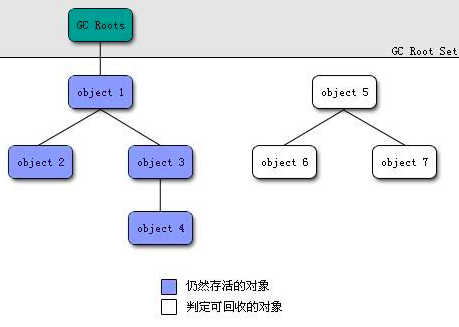
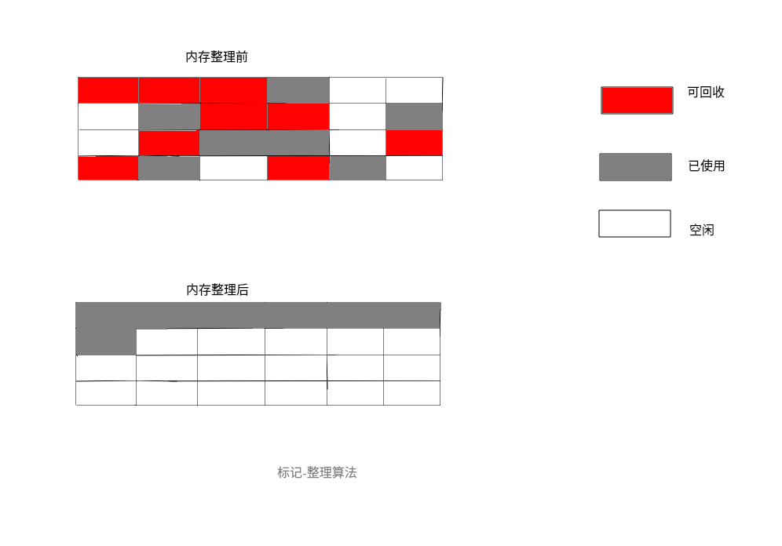
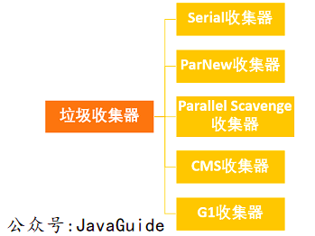
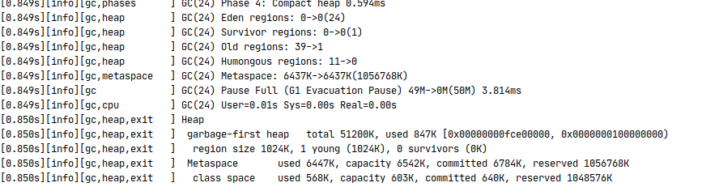

<!-- TOC -->

   * [GC](#gc)
        * [判断对象存活的方法](#判断对象存活的方法)
           * [引用计数法缺点](#引用计数法缺点)
           * [什么是GC Root ?](#什么是gc-root-)
        * [垃圾回收算法](#垃圾回收算法)
           * [复制算法(Copying)](#复制算法copying)
           * [标记-清除算法(Mark-Sweep)](#标记-清除算法mark-sweep)
           * [标记-整理算法(Mark-Compact)](#标记-整理算法mark-compact)
           * [分代收集算法](#分代收集算法)
           * [内存分配与垃圾回收策略](#内存分配与垃圾回收策略)
           * [一次GC的过程](#一次gc的过程)
           * [动态年龄阈值](#动态年龄阈值)
        * [垃圾回收器](#垃圾回收器)
           * [Serial串行收集器](#serial串行收集器)
           * [Serial Old 串行收集器(老年代版本)](#serial-old-串行收集器老年代版本)
           * [Parallel Scavenge 并行多线程收集器](#parallel-scavenge-并行多线程收集器)
           * [Parallel Old 并行收集器(老年代版本)](#parallel-old-并行收集器老年代版本)
           * [ParNew 多线程收集器](#parnew-多线程收集器)
           * [CMS 并发标记清除收集器](#cms-并发标记清除收集器)
           * [CMS收集器回收过程](#cms收集器回收过程)
           * [G1 收集器](#g1-收集器)
           * [G1回收器的特点](#g1回收器的特点)
           * [G1收集器回收过程](#g1收集器回收过程)

<!-- /TOC -->

# GC    
    
### 判断对象存活的方法
在垃圾回收器对堆内存回收前，需要判断对象是否存活。

- 引用计数算法: 给每个对象添加一个引用计数器,每当对象被引用,
对象的引用计数器就加1,当引用失效时,引用计数器就减1。
直到引用计数器为0,就代表对象不再被引用。

- 可达性算法: 通过GC ROOT的对象节点往下搜索,节点走过的路径被称为引用链。
如果一个对象不处于任何引用链,那么此对象是不可达的。
  
#### 引用计数法缺点

引用计数的主要缺陷是很难解决循环引用的问题:
也就是当2个对象互相引用的时候,除了彼此,
没有其他地方引用这2个对象,那么他们的引用计数都为1,就无法被回收。      
          
#### 什么是GC Root ?
上面说通过GC Root对象搜索引用链,那么GC Root对象是什么对象,
或者说什么样的对象是GC Root对象。
可以作为GC Root对象的有: 

1. 虚拟机栈和本地方法栈区(native)中的引用对象(common object)
2. 方法区中类的静态属性引用的对象(static)
3. 方法区中的常量引用的对象(final)   

      
        
### 垃圾回收算法
常见的垃圾回收算法主要有以下4种:
1. 复制算法
2. 标记-清除算法
3. 标记-整理算法
4. 分代收集算法

#### 复制算法(Copying)

将堆内存分为2块大小相等的内存空间，
每次只使用其中的一块内存，另一块则空闲。
当其中一块内存使用完后，
就将仍然存活的对象复制到另一块空闲内存空间，再清理已使用的内存。

**复制算法的优点是不会产生连续的内存碎片，速度也很高效。
但是缺点更明显:每次只使用内存的一半，就代表可使用的内存减少了1/2，代价很高昂。**

**复制算法一般用于新生代。
因为新生代的GC非常频繁，每次GC的对象较多，存活的对象较少。
所以采用复制算法效率更高，复制时只需要复制少量存活的对象。**
         
         
         
#### 标记-清除算法(Mark-Sweep)
标记-清除算法分为2个步骤：标记和清除。

首先标记出所有可达(存活)的对象，在标记完成后，
统一回收所有未被标记(不可达)的对象。

标记-清除算法的缺点主要有2个:

1. **标记和清除2个阶段的耗时都比较长，可以总结为效率较低。**
2. **对象在内存中的分布可能是不连续的，分散的，标记-清除后可能造成不连续的内存碎片。**
当内存碎片过多后，后续想要分配较大的对象时，无法找到足够大的内存碎片，
可能又需要触发GC。

**标记-清除算法一般用于老年代。**
因为老年代中的对象存活率较高，几乎很少被回收，
所以标记-清除和标记-整理算法GC的时间不会太长，
GC的对象相比新生代更少。


      
#### 标记-整理算法(Mark-Compact)
标记-整理算法是对标记-清除算法的一种改进。

标记-整理算法与标记-清除算法的在标记阶段是相同的，
都是首先标记出所有可达(存活)的对象。
但**标记之后并不直接清理未被标记(不可达)的对象，
而是使被标记(存活)的对象向内存一端移动，然后清理掉这一端外的内存。**
         
**标记-整理算法的优点是:
几乎不会如标记-清除算法那样产生不连续的内存碎片。
但，所谓慢工出细活,标记-整理的效率是比标记-清除要低的。**         

**标记-整理算法和标记-清除算法一样，一般用于老年代。**

         
         
#### 分代收集算法
**分代收集算法并不是指某一种具体的垃圾收集算法，
而是将复制，标记-清除，标记-整理等算法合理运用到堆区的不同空间。**
比如新生代使用复制算法，老年代使用标记清除或标记整理算法。

现代的几乎所有的JVM都使用分代收集，毕竟每种算法都有优缺点，
结合它们的特点，对不同的环境采用不同的算法是非常明智的选择。

#### 内存分配与垃圾回收策略
1. 对象优先在eden区域被分配
2. 大对象将直接进入老年代
(大对象是指需要大量连续的内存空间的对象，如长字符串，大数组等。)
3. 长期存活的对象将进入老年代

#### 一次GC的过程
对象优先在eden区被分配，当eden区内存不足时，
JVM发起Minor GC。Minor GC的范围包括eden和From Survivor:

首先JVM会根据可达性算法标记出所有存活的对象。

如果存活的对象中，有的对象的年龄已经达到晋升阈值
(阈值是动态计算的，可以通过-XX:MaxTenuringThreshold设置最大年龄阈值)，
那么将已经达到阈值的对象复制到老年代中。

如果To Survivor空间不足以存放剩余存活对象，
则直接将存活的对象提前复制到老年代。
如果老年代也没有足够的空间存放存活的对象，
那么将触发Full GC(GC整个堆，包括新生代和老年代)。

如果To Survivor可以存放存活的对象，
那么将对象复制到To Survivor空间，并清理eden和From Survivor。

此时From Survivor为空，
那么From Survivor就成为了下一次的To Survivor，
此时To Survivor存放着存活的对象，就成为了下一次的From Survivor。
这样From Survivor与To Survivor就是不断交替复制的使用。

**老年代的空间比新生代的空间要大，
所以老年代的Major GC要比Minor GC耗时更长。
根据垃圾回收器的不同，老年代的GC算法也不同。**

#### 动态年龄阈值
JVM并不要求对象年龄一定要达到 MaxTenuringThreshold 才会
晋升到老年代，晋升的年龄阈值是动态计算的。
如果在Survivor中，某个相同年龄阶段的所有对象大小的总和
大于Survivor区域的一半，则大于等于这个年龄的所有对象
可以直接进入老年代，无需等到MaxTenuringThreshold。
    
         
### 垃圾回收器

**如果说垃圾回收算法是JVM对GC算法的方法论，那么垃圾回收器就是对GC算法的实现。**

垃圾回收器主要分为以下几种收集器:



#### Serial串行收集器
Serial收集器为单线程环境设计,并只使用一个线程进行垃圾回收。
在回收时，会暂停用户线程,并不适用于并发环境。

Serial收集器在单线程环境中是很高效的,它没有多线程切换的消耗。     

**Serial收集器采用复制算法**
       
####  Serial Old 串行收集器(老年代版本)

它是 Serial收集器的老年代使用的GC收集器，同样是一个单线程的垃圾收集器。 

**Serial Old收集器采用的是标记-整理算法。**
   
````text
   
/** 开启串行收集器使用 -XX:+UseSerialGC , 
  * 这样默认新生代使用 Serial 收集器,
  * 老年代使用 Serial Old 收集器. 
  *
  * 设置VM参数:
  *
  * -XX:+Xlogs:gc* 打印gc信息
  * -XX:+PrintCommandLineFlags  打印java版本信息
  * -XX:+UseSerialGC 使用串行GC
  */                      

//如果程序正常运行,日志会显示 :
// 新生代的信息为:  def new generation.....
// 老年代的信息为:  tenured generation.....

````           
            
#### Parallel Scavenge 并行多线程收集器
Parallel Scavenge是并行收集器，它使用多个垃圾回收线程一起工作,
但是仍然会暂停用户线程。

Parallel Scavenge与其它垃圾回收器不同的是它**更关注于达到可控制的吞吐量。**

吞吐量是CPU运行用户应用程序代码的时间与CPU总消耗的时间的比值:

```text
吞吐量 = 应用程序代码运行时间 / (应用程序代码运行时间 + GC时间)
```

**Parallel Scavenge收集器采用复制算法**

   
#### Parallel Old 并行收集器(老年代版本)

它是 Parallel Scavenge 的老年代版本,同样是一个并行多线程的收集器。

**Parallel Old收集器采用标记-整理算法。**
  
````text
    /**
     * 
     * 设置 Parallel Scavenge 收集器的参数:
     *
     * -XX:+UseParallelGC
     * 
     * ParallelGC老年代默认使用的 Parallel Old GC 回收器
     * 
     * 并行收集器打印的新生代的信息为:
     *  PSYoungGen ....
     *  
     *  老年代的信息为:
     *  ParOldGen ....
     * 
     */
````        
        
        
#### ParNew 多线程收集器
它可以看做是多线程版的Serial收集器。
除了多线程外，ParNew收集器与Serial收集器几乎没啥区别。

**PS:目前只有Serial和ParNew能作为CMS收集器的新生代收集器。**
         
**ParNew收集器采用复制算法**

````text
     /**
       * 
       * 设置ParNewGC回收器的参数为:
       * -XX:+UseConcMarkSweepGC
       * 
       */
````           
        
#### CMS 并发标记清除收集器
Concurrent Mark Sweep,并发标记-清除垃圾回收器。
它是一款老年代的收集器，是**以达到最短回收停顿时间目标的收集器。**

**见名知意,CMS收集器使用的是标记-清除算法。
CMS在垃圾回收过程中，用户线程可以同时工作，无需暂停。**

**因为CMS收集器采用的是标记-清除算法，所以回收时可能会产生不连续的内存碎片。**

#### CMS收集器回收过程
 
- 初始标记(Stop The World，此阶段会暂停用户线程): 只标记与GC ROOT直接关联的对象。

- 并发标记: 对第一个阶段已经标记的对象进行Tracing，标记所有可达的对象。

- 重新标记(Stop The World,此阶段会暂停用户线程): 在第二个阶段，由于用户程序的运行，
可能有些对象之间的引用关系受到了影响，所以需要对这部分对象进行重新标记调整。

- 并发清除: 清除所有未被标记的对象。
      
 ````text
    /**
     *
     * 设置 CMS 收集器参数:
     * -XX:+UseConcMarkSweepGC
     *
     * 使用ConcMarkSweepGC收集器后,它的新生代使用的是:
     * ParNew收集器.
     *
     * 当ConcMarkSweepGC收集器出现异常时,会将CMS替换成Serial Old收集器
     *
     * CMS回收分为4个阶段:
     *
     * 初始标记:    (Stop the world 暂停用户线程)
     * 标记与GC Root直接可达的对象.      
     *
     * 并发标记:  
     * 从第一步标记的可达的对象开始,并发的标记所有可达的对象 
     *
     * 重新标记:    (Stop the world 暂停用户线程)
     * 在第二部的并发标记阶段,由于程序运行导致对象间引用的关系发生变化,
     * 就需要重新标记
     *
     * 并发清除:     
     * 这个阶段不暂停用户线程,并且并发的去清除未被标记的对象
     * 
     */
````
#### G1 收集器        
G1收集器可以说是目前最前沿的一款收集器，它是一款面向服务端的收集器。

G1收集器**无需配合其他收集器就可以管理整个堆内存。**
jdk9开始，G1成为jdk默认使用的垃圾回收器

#### G1回收器的特点

- 并行和并发: G1能够充分利用多核cpu的优势，使垃圾回收与用户线程同时运行。

- 可预测的停顿: 降低GC停顿时间是CMS与G1收集器的共同目标。但是除了降低GC停顿时间，
G1收集器还可以建立可预测的停顿时间模型。(...太np了 =_=)

- 空间整合: 个人认为这是G1收集器不同于其他收集器的最大亮点了。
在其他收集器中，堆区基本都分为新生代和老年代。
而在G1收集器中虽然仍然保留了新生代和老年代的概念，但已经不再是物理上的分隔了。
**在G1收集器的堆内存模型中，内存被分割成了一块一块大小相等的Region，
在这些Region中，Region的类型也不同，有eden，survivor，old，humongous之分。
当有大对象时，对象会被分配到Humongous Region之中。**



#### G1收集器回收过程
````text
G1收集器与CMS收集器的回收过程相似
````
-  初始标记(Stop The World,此阶段会暂停用户线程): 只标记与GC ROOT直接关联的对象。

- 并发标记: 对第一个阶段标记的对象Tracing，标记所有可达的对象。

- 最终标记(Stop The World,此阶段会暂停用户线程): 在并发标记阶段，由于用户线程执行，
可能导致被标记对象之间的引用关系发生影响，需要对这些对象进行重新标记调整。

- 筛选回收: 不同于CMS的并发清除，G1收集器首先会对所有Region的回收价值和回收成本进行排序,
然后再进行回收。这样可以在有限的时间内获得最大的回收率。

````text
    /**
     *
     * 因为我的机器的jdk版本是11,所以无需指定垃圾回收器
     * 指定G1回收器的参数是: -XX:+UseG1GC
     *
     * 1:初始标记:(Stop the world 暂停用户线程)
     *   标记所有与GC Root直接可达的对象
     *
     * 2:并发标记
     *  从第一个阶段标记的对象开始,trace标记
     *
     * 4:最终标记:(Stop the world 暂停用户线程)
     *  在第二步并发标记的阶段,由于程序执行,
     *  导致被标记对象之间的引用关系发生变化,所以需要重新调整标记
     *
     * 5:筛选回收:
     *  和CMS的并发回收不一样,
     *  G1收集器首先会对所有Region的回收价值和回收成本进行排序,
     *  然后再进行回收。
     *  这样可以保证在有限的时间内获得最大的回收率.
     *
     */
```` 