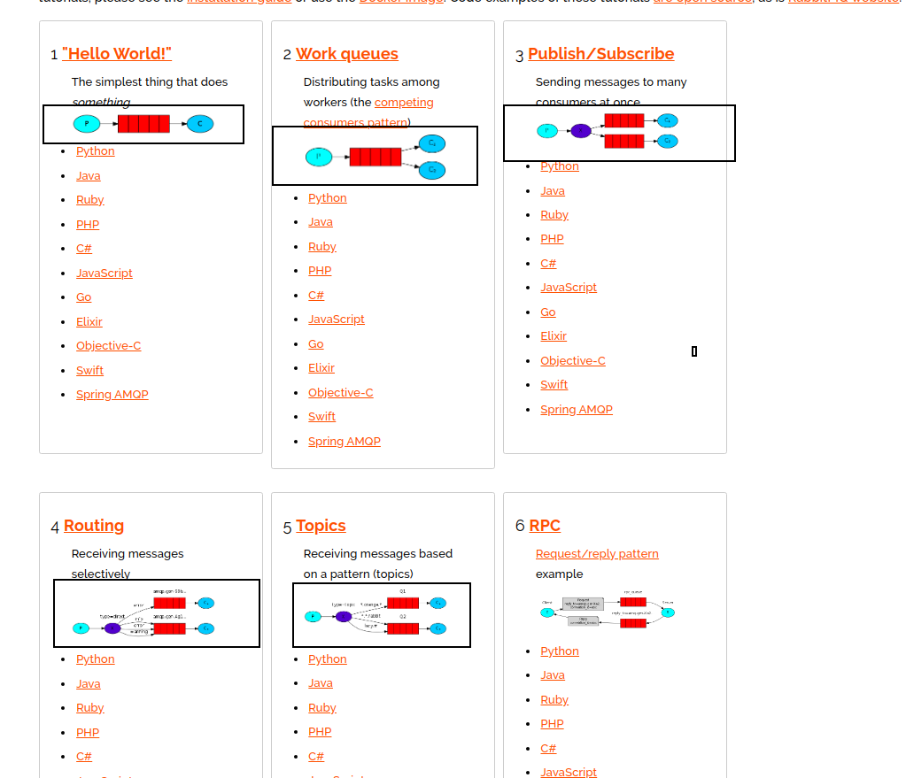
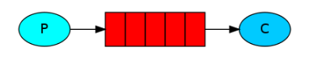
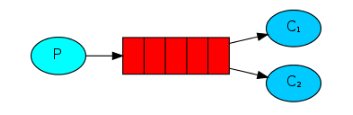
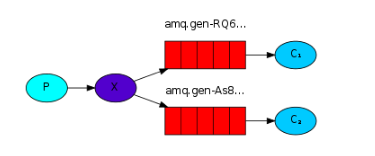
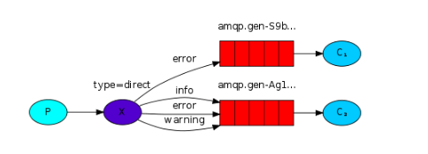
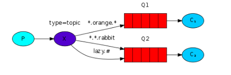
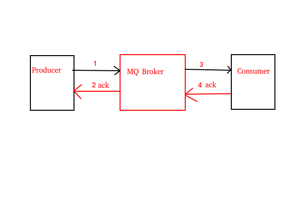

<!-- TOC -->

 * [RabbitMQ](#rabbitmq)
    * [什么是RabbitMQ?](#什么是rabbitmq)
       * [RabbitMQ基本概念](#rabbitmq基本概念)
          * [RabbitMQ工作模型](#rabbitmq工作模型)
          * [RabbitMQ Exchange的类型](#rabbitmq-exchange的类型)
       * [如何避免消息被重复消费?](#如何避免消息被重复消费)
          * [Broker重复消费消息](#broker重复消费消息)
          * [Consumer重复消费消息](#consumer重复消费消息)
          * [解决消息的重复消费](#解决消息的重复消费)
       * [如何保证消息传递的可靠性?](#如何保证消息传递的可靠性)
          * [Producer消息丢失](#producer消息丢失)
          * [Broker消息丢失](#broker消息丢失)
          * [Consumer消息丢失](#consumer消息丢失)

<!-- /TOC -->

# RabbitMQ

## 什么是RabbitMQ?
RabbitMQ是使用Erlang语言编写的支持AMQP协议的高性能消息队列,
目前由Pivotal(维护Spring项目的公司)公司在维护。
RabbitMQ最初起源于金融系统,被用于在分布式系统种存储和转发消息,
具有较好的易用性,可扩展性和并发性等优点。

### RabbitMQ基本概念
先来看一张RabbitMQ的结构图: 

RabbitMQ主要设计以下概念:

- Message消息: 消息即需要发送的数据,由消息体和消息头组成。
消息体是消息的内容,消息头则是对消息体的描述,由许多Property属性组成,
如路由键,优先级,持久化等等组成。

- Producer生产者: 生产者即发布者,它是发布消息的一方,可以是一个RabbitMQ客户端应用程序。

- Consumer消费者: 消费者即订阅者,他是接受消息的一方,也可以是一个RabbitMQ客户端应用程序。

- Exchange交换机: 交换机用于接受 生产者发布的消息,并按消息的路由规则将消息发送到指定的消息队列。

- Binding绑定: 绑定一种规则,它将Exchange交换机与Queue消息队列 按照路由规则绑定起来。

- Routing-Key路由键: 路由键即路由规则, Exchange交换机根据Routing Key将消息投递到指定的消息队列。

- Queue消息队列: 消息队列是消息容器,用于存储和收发消息。一个消息可以投递到一个或多个消息队列中,直到Consumer将消息消费。

- Connection网络连接: 无论是发布消息还是订阅消息,都需要通过TCP连接来完成。 

- Channel信道: 对于计算机服务器来说,网络是非常宝贵的资源,如果每次发布消息或订阅消息都需要建立连接,
那就太耗费Connection资源了,所以引入了Channel信道的概念。
发布消息和订阅消息通过Channel信道来完成,而多个Channel可以共享一条Connection
,这样就节约了很多Connection资源。

- Virtual Host 虚拟主机: 虚拟主机是一个虚拟概念。 
在Redis中,一个Redis服务器实例可以被分为16个库,但不是说这16个库的大小就是相等的,
比如1个库也可以占9g内存,其他15个库可以共占1g内存。
虚拟主机也是如此,它可以看做是一个独立的rabbitmq服务器实例,
它包含了属于他的一系列的Exchange,Queue等内容。

- Broker: Broker即RabbitMQ服务实例。

#### RabbitMQ工作模型

PS:个人觉得RabbitMQ官网的文档实例写得挺好的,各位同学可以直接参照官网学习。

RabbitMQ主要有5种工作模型:

- Simple Queue: 简单模式。它是最简单的消息收发模型,生产者和消费者直接通过Queue进行消息的收发。

- Work Queue: 工作模式 。工作模式与简单模式非常相似,但工作模式允许多个消费者争抢的消费同一个队列的消息。

- Publisher / Subscriber (fanout): 发布者 / 订阅者模式 。
发布者/订阅者模式可以说是真正意义上的RabbitMQ的工作模型。 
发布者不直接将消息发布到Queue,而是将消息发送到Exchange交换机,再由交换机将消息广播到与此交换机绑定的每个队列中,订阅者也只需要监听它自己的队列就行了。

- Routing (direct): 路由模式。 发布者在发布消息的时候可以指定一个Routing Key路由键,接受者也会与其消息队列绑定一个路由键。
当消息被发送到Exchange后,Exchange根据路由键,将消息发送到拥有相同路由键的消息队列。

- Topic (topic): 主题模式。主题模式是一种特殊的路由模式,
与路由模式不同的是: 主题模式的路由键支持通配符,可以做到更加多样化的路由键匹配。

#### RabbitMQ Exchange的类型
RabbitMQ共有3种Exchange类型:

1. fanout: fanout即发布者 / 订阅者模式,发布者将消息发送到fanout类型的Exchange,Exchange再将消息广播给与此交换机绑定的Queue。

2. direct: direct即路由模式,Exchange根据Routing Key,将消息发送到匹配的队列中。

3. topic: topic也属于路由模式,不过它支持"*","#"等通配符进行路由。

### 如何避免消息被重复消费?

消息被重复消费即消息的发送者发送了多次相同的消息给接受者,从而导致接受者出现业务上的问题。
这是一个非幂等的问题。我们知道在Http协议中,GET请求是幂等的,即多次相同的GET请求并不会对服务器的资源造成影响。
而POST请求或PUT请求(在POST和PUT请求的语义为"添加"的情况下)是非幂等的,多次相同的POST请求或PUT请求可能在服务器上创建多个资源。

先看一张图(请原谅我的画图技术 0_0):

#### Broker重复消费消息

对于发布者来说,在它发送消息给MQ服务器后,
MQ服务器收到消息后响应一个ACK给发布者代表它收到了发布者的消息,即图中的 1 - 2。
如果MQ响应的ACK由于网络原因丢失了,那么发布者会再次发送消息给服务器,这就造成了服务器收到了多次相同的消息的问题。 

#### Consumer重复消费消息
对于 MQ服务器来说,当它发送消息给 Consumer客户端时,
Consumer收到消息后响应ACK给MQ服务器代表它接收到了MQ服务器的消息,即图中的 3 - 4。
如果Consumer响应的ACK由于网络原因丢失了,那么MQ会再次发送消息给Consumer客户端,这也造成了Consumer多次消费相同的消息的问题。

#### 解决消息的重复消费
无论是MQ服务器还是Consumer消费端,它们都需要判断消息的唯一性,
如果判断消息已经接受过了,那么可以选择不再处理相同的消息。
解决办法是可以给消息添加全局唯一的标识,如唯一ID,用于保证消息的全局唯一性。

### 如何保证消息传递的可靠性?

还是上面的那张图:

消息传递不可靠的情况主要有: 

- Producer丢失消息: 即 1 - 2。

- Broker丢失消息: 即消息存储在MQ Broker时丢失。

- Consumer丢失消息: 即 3 - 4。

#### Producer消息丢失
Producer丢失消息有2种解决方案: 

1. transaction: 如果消息发送成功,则提交事务。如果在发送消息的过程中出现了异常,那么事务就会回滚。
虽然事务可以保证Producer发送消息的可靠性,但是会降低吞吐量,
所以更推荐使用confirm机制保证Producer发送消息的可靠性。

2. confirm: 当消息被发送给消息队列后,Broker会响应一个ACK给Producer。
如果Broker无法处理该消息,则返回一个NACK给Producer,Producer可以根据返回的NACK再做处理。

#### Broker消息丢失
Broker丢失消息一般是MQ服务器宕机或出现其它较为严重的问题,
所以Broker丢失消息的问题,可以通过持久化解决。

#### Consumer消息丢失
Consumer接受到消息队列的数据后,会自动回复Broker,Broker就会删除这条消息,
但如果Consumer在此时处理消息的过程中,发生了意外,消息就丢失了。
Consumer可以在处理完消息后再手动回复Broker,这样即使发生了意外,Broker也能重新发送消息给Consumer。