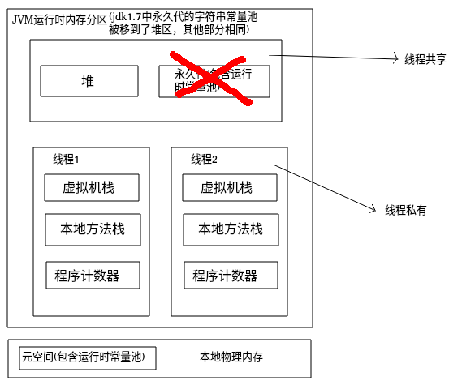
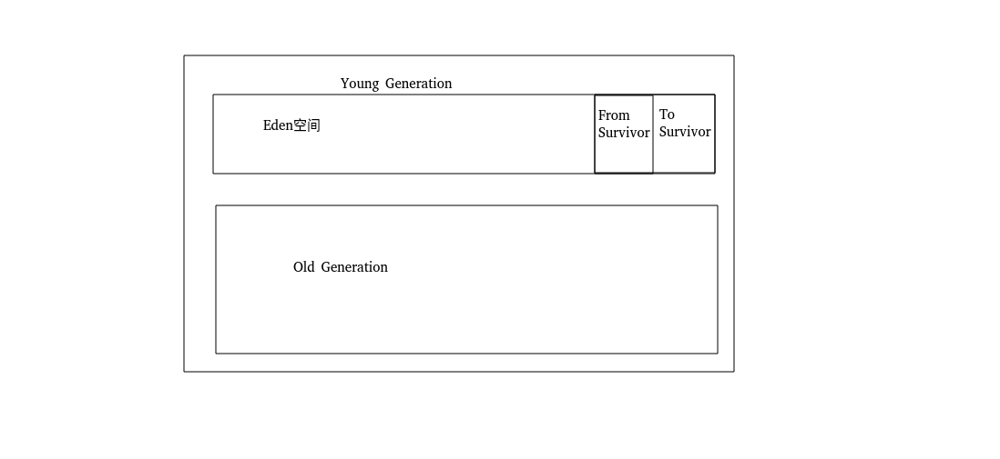

<!-- TOC -->

 * [JVM](#jvm)
     * [JVM运行时内存分区](#jvm运行时内存分区)
        * [程序计数器](#程序计数器)
        * [程序计数器的特点](#程序计数器的特点)
        * [Java虚拟机栈](#java虚拟机栈)
        * [栈帧](#栈帧)
        * [局部变量表](#局部变量表)
        * [操作数栈](#操作数栈)
        * [动态连接](#动态连接)
        * [方法出口](#方法出口)
        * [本地方法栈](#本地方法栈)
        * [堆](#堆)
        * [方法区](#方法区)
     * [JavaVirtualMachineError](#javavirtualmachineerror)
        * [StackOverflowError](#stackoverflowerror)
        * [OutOfMemoryError](#outofmemoryerror)

<!-- /TOC -->

# JVM

**JVM部分参考了《深入理解Java虚拟机》(周志明)**

```text
个人认为《深入理解Java虚拟机》上的部分内容已经过时
有些知识请各位同学明鉴
```

### JVM运行时内存分区
>以HotSpot为例:

- JDK8之前: 
 
  - 线程私有的部分有:程序计数器(PC寄存器),JAVA虚拟机栈,本地方法栈(native)。
 
  - 线程共享部分有: GC堆,永久代(是方法区的一种实现)。


- JDK8之后:
 
  -线程私有的部分不变, 线程共享部分的永久代改为了元空间(MetaSpace)
   (永久代和元空间都是方法区的实现),字符串常量池也移动到了heap空间
    
     
    
#### 程序计数器
程序计数器是一块较小的内存空间，**它的作用是作为当前线程执行的字节码的行号计数器。
当字节码解释器工作时，通过改变行号计数器的值来选取下一条要执行的字节码指令。**
分支，循环，跳转，异常处理，线程恢复等功能都需要依赖程序计数器完成。

**程序计数器是属于线程私有的部分。
当cpu在多个线程之间切换执行时，需要记录下当前线程执行的字节码的位置，
以便下次切换回当前线程时，能够继续执行字节码指令，
所以每个线程都需要有自己的程序计数器。**

#### 程序计数器的特点
1. 如果当前线程执行的是java方法，那么程序计数器记录的是字节码指令的地址。
2. 如果当前线程执行的native方法，那么程序计数器记录的值为空(undefined)。
3. 程序计数器这部分内存区域是JVM中唯一不会出现OOM错误的区域
4. 程序计数器的生命周期与线程相同,即程序计数器随着线程创建而创建，
   随着线程的销毁而销毁。
   
```text
使用 javap -c 反编译class文件后的代码如下,
红框里的就是字节码的偏移地址:
```


      
#### Java虚拟机栈
Java虚拟机栈与程序计数器一样，都是线程私有的部分，生命周期也跟线程一样。

**Java虚拟机栈描述的是Java方法运行时的内存模型，它由一个一个的栈帧组成。**

#### 栈帧

**栈帧是用于支持Java方法运行时的数据结构。
栈帧包含了局部变量表，操作数栈，动态连接，方法出口等信息。
每个方法执行时，都会在java虚拟机栈中创建一个栈帧。
对方法的调用和返回，就对应着栈帧的入栈和出栈的过程。**

Java虚拟机栈:

    
           
#### 局部变量表
**局部变量表用于存储方法参数和方法内定义的局部变量。
局部变量表存放了各种已知的数据类型的变量。**
一个局部变量的类型可以是基本数据类型
(int,short,float,double,boolean,long,byte,char)或引用类型(reference)。
在Java代码被编译成class字节码后，方法Code属性的locals就确定了方法的局部变量表的大小。
局部变量表以slot为最小单位，一个slot代表4个字节，也就是32位长度的大小。

  
#### 操作数栈
操作数栈是一个后进先出(LIFO)的数据结构。
**它存储的是方法在进行数据运算时的元素。**
和局部变量表一样，操作数栈的每个元素的类型也可以是基本数据类型和引用类型。
操作数栈的深度不会超过 Code属性的stack值。

使用javap -c 反编译class文件后可以得到的字节码指令如下:


#### 动态连接

````text
了解动态连接首先需要了解符号引用和直接引用
````

- 符号引用: 符号引用存于Class文件常量池。分为类的全限定名，方法名和描述符，字段名和描述符。

- 直接引用: 指向目标的指针，可以简单理解为目标的内存地址(如指向类的字段的内存地址)。

Class文件常量池如下(javap -c 反编译class文件后的字节码):


**在虚拟机栈中，每个栈帧都包含了一个该栈帧所属方法的符号引用，
持有这个符号引用的目的是为了支持方法调用过程中的动态连接。
这些符号引用有的一部分会在JVM类解析阶段就会转为直接引用，这部分转换成为静态解析。
还有一部分会在运行时转为直接引用，这部分称为动态连接。**

#### 方法出口
当方法执行时，有2种方式可以退出该方法。

1. 正常退出: 当方法执行时，执行到return指令，该方法就会正常退出。
一般来说，方法正常退出时，调用线程的程序计数器的值可以作为方法返回的地址，
栈帧中可能会保存这个计数器的值。

2. 异常退出: 在方法执行过程中遇到了异常，并且方法内部没有处理这个异常，就会导致方法退出。
方法异常退出时，返回地址需要通过异常处理器表来确定的，栈帧中不会保存这部分值。

**无论何种退出方式，在方法退出后，都需要回到方法被调用的位置，程序才能继续执行。**

#### 本地方法栈
本地方法栈与虚拟机栈的作用是相似的，
不过**虚拟机栈是为执行Java方法提供服务的，
本地方法栈视为执行native方法提供服务的。**
在本地方法执行的时候，也会在本地方法栈中创建栈帧，
用于存放该本地方法的局部变量表，操作数栈，动态连接和方法返回地址等信息。
   
#### 堆

**堆是JVM中内存占用最大的一块区域，它是所有线程共享的一块区域。
堆的作用是为对象分配内存并存储和回收它们。
堆是垃圾回收的主要区域，所以堆区也被成为GC堆。**

堆区可以划分为 **新生代(Young Generation),老年代(Old Generation)** 和
永久代(Permanent Generation),但永久代已被元空间代替,
**元空间存储的是类的元信息，几乎不可能发生GC。**

新生代再细分可以分为: **Eden空间，From Survivor空间和To Survivor空间。**

缺省状态下新生代占堆区的 1/3,老年代占堆区的2/3，
eden空间占新生代的80%,2个Survivor空间栈新生代的20%,
FromSurvivor和ToSurvivor的空间占比为1:1。

(通过-XX:NewRatio参数可以调整新生代和老年代的空间占比)
(通过-XX:SurvivorRatio参数可以调整eden和survivor的空间占比)

**发生在新生代的GC叫做Young GC或Minor GC,
发生在老年代的GC叫做Old GC或Major GC**


堆:


**PS:
FromSurvivor和ToSurvivor这两块内存空间并不是固定的，
在进行GC的时候，这两块内存会轮流替换使用。这部分内容参考GC部分。**


**PS:
有的文章说 Full GC与Major GC一样是属于对老年代的GC，
也有的文章说 Full GC 是对整个堆区的GC，所以这点需要各位同学自行分辨Full GC语义。
见: [知乎讨论](https://www.zhihu.com/question/41922036)**


#### 方法区

方法区在JVM规范里也是各个**线程共享的一部分区域，
它用于存储已被jvm加载的类的元信息，运行时常量池等数据。**

HotSpot虚拟机对于方法区的实现在jdk8之前为永久代，在jdk8之后，
HotSpot移除了永久代，新增了元空间。

元空间使用的是本地内存，所以元空间仅受本地物理内存的限制。
元空间存储着已被加载的类的方法描述，字段描述，运行时常量池等信息。

**字符串常量池在jdk7已经从永久代转移到了堆内存之中。**

**方法区在逻辑上是属于堆区的。在jdk8之前，堆区在GC时会回收永久代。
但jdk8之后的元空间归属于物理内存，存储的都是常量，几乎不会发生GC。**

**无论是永久代还是元空间，都有可能发生OOM。**</u>

### JavaVirtualMachineError
  
#### StackOverflowError
当前线程执行或请求的栈的大小超过了Java
虚拟机栈的最大空间(比如递归嵌套调用太深),就可能出现StackOverflowError错误
           
#### OutOfMemoryError
             
发生OOM的情况: 
             
* java heap space 
>当需要为对象分配内存时，堆空间占用已经达到最大值，
>无法继续为对象分配内存，可能会出现OOM: java heap space错误。 
   
* GC overhead limit exceed
>垃圾回收器花费了很长时间GC,但是GC回收的内存非常少,
>就可能抛出OOM:GC overhead limit exceed 错误。
>
>但是这点在我的机器上测试不出来,可能与jdk版本或gc收集器或Xmx分配内存的大小有关,
>一直抛出的是java heap space

* Direct buffer memory
>当程序分配了超额的本地物理内存(native memory/ direct buffer)，
>minor gc(young gc)并不会回收这部分内存，
>只有 full gc才会回收直接内存，如果不发生full  gc，
>但直接内存却被使用完了，那么可能会发生 OOM: Direct buffer memory。
     
* unable to create new native thread 
>操作系统的线程资源是有限的，
>如果程序创建的线程资源太多(无需超过平台限制的线程资源上限)，
>就可能发生 OOM: unable to create new native thread 错误。 
   
* Metaspace
>当加载到元空间中的类的信息太多，就有可能导致 OOM : Metaspace。

**PS:
使用cglib的库，可以动态生成class，
所以可以使用cglib测试此错误(Metaspace)**