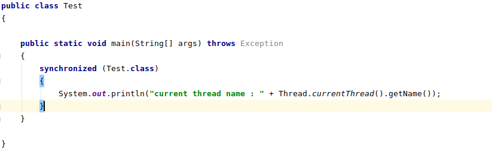
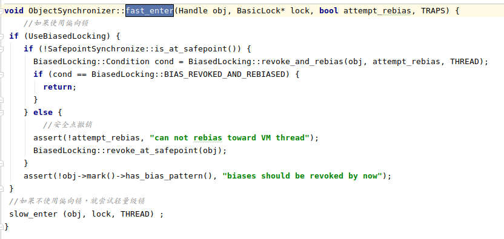

<!-- TOC -->

   * [并发](#并发)
       * [synchronized](#synchronized)
          * [synchronized底层原理](#synchronized底层原理)
          * [synchronized 使用方法](#synchronized-使用方法)
          * [Synchronized和ReentrantLock的区别](#synchronized和reentrantlock的区别)
          * [乐观锁](#乐观锁)
          * [悲观锁](#悲观锁)
          * [独占锁](#独占锁)
          * [共享锁](#共享锁)
          * [公平锁](#公平锁)
          * [非公平锁](#非公平锁)
          * [可重入锁(递归锁)](#可重入锁递归锁)
          * [偏向锁](#偏向锁)
          * [轻量级锁](#轻量级锁)
          * [自旋锁](#自旋锁)
          * [自适应自旋锁](#自适应自旋锁)
          * [锁消除](#锁消除)
          * [锁粗化](#锁粗化)
          * [死锁](#死锁)
          * [如何避免死锁?](#如何避免死锁)
       * [volatile](#volatile)
          * [volatile保证内存的可见性](#volatile保证内存的可见性)
          * [volatile禁止指令重排序](#volatile禁止指令重排序)
          * [volatile如何禁止指令重排序的?](#volatile如何禁止指令重排序的)
          * [volatile不保证原子性](#volatile不保证原子性)
       * [CAS](#cas)
          * [CAS在JAVA中的底层实现(Atomic原子类实现)](#cas在java中的底层实现atomic原子类实现)
          * [CAS的缺点](#cas的缺点)
          * [解决ABA问题](#解决aba问题)
          * [ThreadLocal](#threadlocal)
          * [ThreadLocal引发的内存泄露:](#threadlocal引发的内存泄露)
          * [线程池的好处](#线程池的好处)
          * [线程池构造参数](#线程池构造参数)
          * [阿里巴巴开发者手册不建议开发者使用Executors创建线程池](#阿里巴巴开发者手册不建议开发者使用executors创建线程池)

<!-- /TOC -->

# 并发

### synchronized
synchronized是jdk提供的jvm层面的同步机制。
**它解决的是多线程之间访问共享资源的同步问题,它保证了
在被它修饰的方法或代码块同一时间只有一个线程执行。**

java6之前的synchronized属于重量锁,性能较差,
它的原理是基于操作系统的Mutex Lock互斥量实现的。

**因为java线程是映射到操作系统的线程之上的,
所以暂停或唤醒线程都需要Java程序从用户态转换为内核态,这段转换时间消耗较长。**

>java6之后jvm团队对synchronized做出了非常大的优化。

#### synchronized底层原理
先看我编写的一段测试代码:



使用 javap -c -v -l 指令反编译 class文件后的 **字节码指令** 如下


可以清楚的看到,在进入synchronized的时候，底层字节码编译出来的指令为
**monitorenter**,在执行完同步代码块后又有一个**monitorexit**指令.

想了解synchronized究竟是如何实现的,可以直接进入openjdk:src/share/vm/runtime 目录,
这个目录存放的是hotspot虚拟机在运行时所需的代码。

可以直接锁定其中的 objectMonitor.cpp源文件和objectMonitor.hpp头文件.
看到这2个文件，相信各位同学应该就知道，这个就是synchronized锁对象的monitor，它也是
一个对象,不过它是一个c++对象(见:objectMonitor.hpp头文件):

 

**其实真正的锁应该是这个monitor,synchronized锁的那个对象起到的只是关联monitor的作用。
只不过我们身在java层面，无法感知到monitor的作用，所以才称synchronized的锁对象为锁。**

以下是monitorenter指令执行过程(见 InterpreterRuntime.cpp):


PS:本来想真正弄清楚fast_enter(偏向锁的实现),slow_enter(轻量级锁实现)和inflate(膨胀锁实现)
的,无奈暂时看不太懂cpp源码，但是有的地方是可以根据语义来推断的。

这里做一个总结吧,这个总结可能不太准确，但大致是这样的:
**每次执行monitorenter指令的时候,是将当前synchronized锁对象
关联的**monitor**的_recursions加1,
执行monitorexit指令的时候,将当前object对象关联的**monitor**的_recursions减1,
当_recursions为0的时候，就说明线程不再持有锁对象。**

**如果熟悉AQS原理的同学就知道在AQS内部，
有一个被volatile修饰state变量，
这个state变量就是AQS的核心，
state变量的作用类比到此处就是monitor计数器的作用。**

#### synchronized 使用方法
1. 修饰静态方法: 修饰静态方法是给类加锁,会作用于所有对象,因为静态方法属于类,
而不属于对象,不管有多少个对象,static方法都是共享的。
       
2. 修饰实例方法: 修饰实例方法是给对象加锁,会作用于当前类的实例对象。

3. 修饰代码块: 修饰代码块,根据代码块给定的对象加锁,线程想要进入代码块,只能获取指定的对象的锁。

#### Synchronized和ReentrantLock的区别

- Synchronized是基于JVM层面的同步机制;而ReentrantLock是基于Java API层面提供的同步机制。

- Synchronized和Reentrantlock都属于可重入锁。

- ReentrantLock提供了比Synchronized更高级的功能:

   - 公平锁
   
   - 更方便的线程间的通信(Condition)
   
   - 等待可中断(在线程等待获取锁的时候可以被中断) 

#### 乐观锁
乐观锁对共享的数据很乐观，认为不会发生线程安全的问题，从而不给数据加锁。
乐观锁适用于读多写少的环境。常见的例子就是mysql的更新使用version控制。

**CAS属于乐观锁。**

#### 悲观锁
悲观锁对共享的数据很悲观，认为无论什么时候都有可能发生线程安全的问题，
所以在每次读写数据的时候都会加锁。

**Synchronized属于悲观锁。**

#### 独占锁
锁一次只能被一个线程占有使用。

Synchronized和ReetrantLock都是独占锁。
    
#### 共享锁
锁可以被多个线程持有。

对于ReentrantReadWriteLock而言,它的读锁是共享锁,写锁是独占锁。

#### 公平锁
公平锁指根据线程在队列中的优先级获取锁,比如线程优先加入阻塞队列,那么线程就优先获取锁。

#### 非公平锁
非公平锁指在获取锁的时候,每个线程都会去争抢,并且都有机会获取到锁,无关线程的优先级。

#### 可重入锁(递归锁)
一个线程获取到锁后,如果继续遇到被相同锁修饰的资源,那么可以继续获取该锁。

Synchronized和Reentrantlock都是可重入锁。

#### 偏向锁
在线程获取偏向锁的时候,
jvm会判断锁对象MarkWord里偏向线程的ID是否为当前线程ID。

如果是,则说明当前锁对象处于偏向状态。

如果不是,则jvm尝试CAS把对象的MarkWord的偏向线程ID设置为当前线程ID,

如果设置成功,那么对象偏向当前线程，并将当对象的锁标志位改为01。

如果设置失败，则说明多线程竞争，将撤销偏向锁，升级为轻量级锁。

**偏向锁适用于单线程无锁竞争环境(单线程环境)。**

hotspot偏向锁实现(faster_enter):

   
#### 轻量级锁
在线程获取对象锁时，jvm首先会判断对象是否为无锁状态(无锁状态标志位为01)。

如果对象是无锁状态，那么将在线程的栈帧中开辟一块空间用于存储对象的MarkWord，
然后将对象的MarkWord复制到栈帧空间去，并使用CAS更新对象的MarkWord为指向
线程栈帧的指针。

如果更新成功，那么当前线程获取锁成功，并修改对象的MarkWord标志位
为 00 。

如果更新失败，那么jvm会判断对象的MarkWord是否已经指向线程的栈帧。

如果已经指向，那么线程直接执行同步代码。否则，说明多个线程竞争，将inflate为重量级锁。

**轻量级锁适用于多线程无锁竞争环境(多线程轮流执行,并不会发生冲突)。**

hotspot轻量级锁实现(slow_enter):
   
     
     
#### 自旋锁

在争夺锁的过程中，线程不会停止获取锁，而是通过CAS不断的判断线程是否符合获取锁的条件。

**AQS获取锁的核心就是CAS。**

#### 自适应自旋锁
自旋锁意味着线程会不断的消耗cpu资源，短时间还行，长时间就意味着而资源的浪费。
所以自适应自旋锁会有一个自旋的生命周期,过了这个生命周期,线程将不再自旋。

网上有文章说这个生命周期依据前一个线程的自旋时间来决定，但是我暂且没有找到相关资料，不敢妄自揣测。

#### 锁消除
**锁消除属于Java编译器对程序的一种优化机制。**
锁消除是指当JVM的JIT编译器检测出一些已经加锁的代码不可能出现共享的数据存在竞争的问题，
会消除这样的锁。**锁消除的依据来源于逃逸分析算法。**
如果判断到一段代码，在堆上的数据不会逃逸出去被其他线程访问到，
那么就把它们当做栈上的数据，为线程私有的，自然无需同步加锁。

````text

    //每次线程进入此方法，创建的都是不同的StringBuffer临时对象,
    //也就是说 StringBuffer 临时对象不会逃出方法t,作用于外部,
    //所以根本不存在线程之间的竞争，那么JIT在编译时就会消除append方法的锁
    public String t(String s1, String s2,String s3)
    {
        return new StringBuffer().append(s1).append(s2)
                    .append(s3).toString();
    }

````       
       
       
#### 锁粗化 
当虚拟机检测出一系列连续的操作都对同一个连续加锁，
那么它会把加锁的返回扩大至整个操作的序列的外部，保证只加锁一次。

````text

    public String t()
    { 
        StringBuffer stringBuffer = new StringBuffer();
        for (int i = 0 ; i < 100 ; ++i)
        {
            //append方法执行一百次,难道加100次锁?
           stringBuffer.append(i);
        }
        return stringBuffer.toString();
    }
    
    //t方法经过优化后可能如下:
    public String t()
    { 
        StringBuffer stringBuffer = new StringBuffer();
        //把synchronized方法提升到for循环面，这样就避免了每次
        //append方法的同步
        synchronized (stringBuffer)
        {
           for (int i = 0 ; i < 100 ; ++i)
           {
               stringBuffer.append(i);
           }
        }
        return stringBuffer.toString();
    }

````

#### 死锁
**死锁是指多个进程在执行过程中,循环等待彼此占有的资源而导致程序的无限期的阻塞的情况。**

产生死锁的条件:
1. 互斥条件: 一个资源在一段时间内只能被一个进程所持有。
2. 不可抢占条件: 进程所持有的资源只能由进程自己主动释放,其他资源的申请者不能向进程持有者抢夺资源。
3. 占有且申请条件: 进程已经持有一个资源后,又申请其他资源,但是其他资源已被其他线程所占有。
4. 循环等待条件: 在条件3之上,进程1有进程2需要申请的资源,进程2有进程1需要申请的资源。那么这2个线程
  不停等待彼此持有的资源,又不能释放已拥有的资源,陷入循环等待。

死锁:


#### 如何避免死锁?
只要打破死锁产生的4个条件之一就行,但是真正能够被打破的条件只有第3和第4个条件。
因为第1和第2个条件都是锁的必要条件。

所以有如下解决死锁的方案:

- 可以打破第3个条件: **实现资源的有序分配。** 

- 可以打破第4个条件: **设置等待超时时间。**

      
### volatile
volatile是JVM提供的轻量级的线程同步机制。它可以保证内存的可见性，禁止指令重排序。
但是volatile，并不能保证数据的原子性，所以它不合适作为线程同步的工具。

#### volatile保证内存的可见性
可见性是指一个线程的对于共享数据的修改对其他线程是可见的。
jvm的内存模型是: **线程总是从主内存读取变量到工作内存，然后在工作内存中进行修改，
在修改完后再把数据同步到主内存中。**
如果多个线程同时读取了一个变量到各自的内存中，其中一个线程对变量进行了修改，并同步回了主内存，
但其它线程仍然使用的是原来的旧值，这就造成了数据的不一致。


解决这个问题的办法就是给变量加上volatile关键字修饰。
volatile使得被它修饰的变量在被线程修改后，那么线程就需要把修改后的变量重新同步到主内存，
且其他线程每次使用这个变量，都需要从主内存读取。


#### volatile禁止指令重排序
指令重排序是编译器和cpu为了程序的高效运行的一种优化手段,
**指令重排序只能保证程序执行的结果是正确的，但是无法保证程序指令运行的顺序是否与代码的顺序一致,
volatile就禁止了这种重排序。**

比如: 

````text
1. int a = 1;
2. int b = 3;
3. int c = a + b;
````
上面的代码在编译后,指令执行的顺序可能有:
1,2,3和2,1,3
这样程序实际执行的顺序可能与代码的顺序不符,但并不会影响程序最终的结果。


#### volatile如何禁止指令重排序的?

**volatile通过提供内存屏障来防止指令重排序。
java内存模型会在每个volatile写操作前后都会插入store指令，将工作内存中的变量同步回主内存。
在每个volatile读操作前后都会插入load指令，从主内存中读取变量。**

#### volatile不保证原子性
>比如: i++

如果是多线程环境下，一个线程读取到i的值到工作内存，然后对i做出自增操作，
然后写回主内存，其它内存才知道i的值被修改了，这个过程本身就不是原子的。
所以不能拿volatile来带替synchronized,如果是多线程环境，仍然需要使用synchronized保证线程同步。
  
### CAS
CAS: Compare And Swap 比较成功并交换。
CAS体现的是一种乐观锁的机制。
**CAS涉及到3个元素: 指定的内存地址,期盼值和目标值。**
它将指定内存地址的值与期盼值相比较，如果比较成功就将内存地址的值修改为目标值。

#### CAS在JAVA中的底层实现(Atomic原子类实现)  
      
CAS在Java中的实现是 juc的atomic包下的Atomicxx原子类。

而这些Atomic原子类的核心是: <Unsafe>类
Unsafe类是个final类，它的核心方法都是native的，
因为Java无法像C/C++一样使用指针来操作内存,
Unsafe类就解决了这个问题。

>拿incrementAndGet方法来说，
>Unsafe首先调用getAndAddInt方法,
>它会根据当前Atomic的value在内存中地址获取到当前对象的值,
>然后再重复一遍此操作，把之前获得的值与第二遍获得的值进行比较，
>如果成功，就把内存地址的值更新为新值，否则就do while循环.

**并且有个重要的细节就是,Atomic原子类内部的value值都是由volatile修饰的,
这就使得Atomic的值是对其他线程可见的。**
 
#### CAS的缺点
 
* 循环时间开销大: 我在看源码的时候，发现Atomic的CAS操作并没有进行CAS失败的退出处理，
只是单纯的循环比较并交换，这就让我很担心它的性能问题，
如果长时间不成功，那会是很可怕的一件事请，至少cpu的负荷会很大。
           
* 只能保证一个共享变量的原子操作: Atomic原子类只能保证一个变量的原子操作，
如果是多数据的话，还是考虑用互斥锁来实现数据的同步吧
          
* ABA问题: ABA问题是指如果一个线程进行CAS操作并成功了，却不代表这个过程就是没有问题的。

>>假设2个线程读取了同一份数据，线程1修改了这个值并把它改回了原值，并同步到主内存中，
>>另一个线程准备进行CAS操作,当它发现原值和期盼的值是一样的，那么CAS仍然成功。
           
#### 解决ABA问题
在juc的atomic包中提供了 AtomicStampedReference 类,
这个类较普通的原子类新增了一个stamp字段，它的作用相当于version。
每次修改这个引用的值，也都会修改stamp的值，
当发现stamp的值与期盼的stamp不一样，也会修改失败.
这就类似于以version实现乐观锁一样。             
         
#### ThreadLocal
ThreadLocal为每个线程都提供了一份相同的变量的副本，
每个线程都可以修改这个副本，但不用担心与其他线程发生数据冲突，
实现了线程之间的数据隔离。

ThreadLocal的原理还得从Thread线程类说起，
**每个Thread类内部都有一个ThreadLocalMap，当使用ThreadLocal的get和remove操作的时候，
就是使用每个线程的ThreadLocalMap的get和remove。**

#### ThreadLocal引发的内存泄露:
**在ThreadLocalMap中，key是使用弱引用的ThreadLocal存储的。**
弱引用是只要垃圾回收器开始回收，无论内存是否充足，都会回收掉弱引用对象，如此一来，
当ThreadLocal被回收掉,那么ThreadLocalMap将可能出现Null Key 的 value。但是也不必太过担心，
因为设计者已经想到了这点，所以ThreadLocal会自动处理key 为 null的 value。

#### 线程池的好处
>http连接池，数据库连接池，线程池等都是利用了池化技术。
>如果一个资源需要多次使用并且很昂贵，那么使用new创建的对象或资源，可能会带来较大的消耗。


池化技术的好处在于
1. 方便资源的管理，无需显示的使用new创建。
2. 降低了资源的消耗，在池子里的资源可以重复利用
2. 提供了任务的响应速度，任务可以很快的被分配资源进行处理。

#### 线程池构造参数
````text
 new ThreadPoolExecutor
(int corePoolSize,

 int maximumPoolSize, 

 long keepAliveTime,

 TimeUnit unit,

 BlockingQueue<Runnable> workQueue,

 ThreadFactory threadFactory,

 RejectedExecutionHandler handler)
````

1. corePoolSize: 线程池的核心线程数(常驻线程数),也就是线程池的最小线程数,这部分线程不会被回收.
      
2. maximumPoolSize: 线程池最大线程数,线程池中允许同时执行的最大线程数量
      
3. keepAliveTime: 当线程池中的线程数量超过corePoolSize，但此时没有任务执行，
那么空闲的线程会保持keepAliveTime才会被回收，corePoolSize的线程不会被回收。
      
4. unit: KeepAliveTime的时间单位
  
5. workQueue: 当线程池中的线程达到了corePoolSize的线程数量，
并仍然有新任务，那么新任务就会被放入workQueue。          

6. threadFactory: 创建工作线程的工厂,也就是如何创建线程的,一般采用默认的

7. handler: 拒绝策略，当线程池中的工作线程达到了最大数量，
并且阻塞队列也已经满了，那么拒绝策略会决定如何处理新的任务。ThreadPoolExecutor 提供了四种策略:

   - AbortPolicy(是线程池的默认拒绝策略): 如果使用此拒绝策略，那么将对新的任务抛出RejectedExecutionException异常，来拒绝任务。
   
   - DiscardPolicy: 如果使用此策略，那么会拒绝执行新的任务，但不会抛出异常。

   - DiscardOldestPolicy: 如果使用此策略，那么不会拒绝新的任务，但会抛弃阻塞队列中等待最久的那个线程。     

   - CallerRunsPolicy: 如果使用此策略，不会拒绝新的任务，但会让调用者执行线程。
     也就是说哪个线程发出的任务，哪个线程执行。

 
#### 阿里巴巴开发者手册不建议开发者使用Executors创建线程池
**newFixedThreadPool和newSingleThreadPoolExecutor都是创建固定线程的线程池,
尽管它们的线程数是固定的，但是它们的阻塞队列的长度却是Integer.MAX_VALUE的,所以，
队列的任务很可能过多，导致OOM。**

**newCacheThreadPool和newScheduledThreadPool创建出来的线程池的线程数量却是Integer.MAX_VALUE的，
如果任务数量过多,也很可能发生OOM。**          