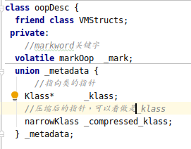
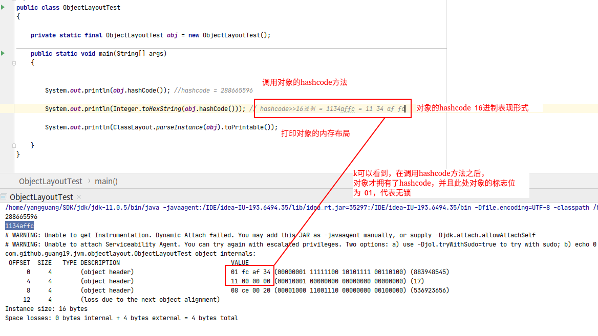

<!-- TOC -->

   * [对象在内存中的布局(64位)](#对象在内存中的布局64位)
      * [对象头](#对象头)
         * [markword和metadata](#markword和metadata)
         * [实例数据](#实例数据)
         * [对齐填充](#对齐填充)
      * [jol工具查看对象布局](#jol工具查看对象布局)
         * [查看对象内存布局](#查看对象内存布局)
         * [hashcode](#hashcode)
         * [对象的hashcode返回的是对象的内存地址吗?](#对象的hashcode返回的是对象的内存地址吗)

<!-- /TOC -->

# 对象在内存中的布局(64位)

对象在内存中的布局,在32位和64位上的实现也是不同的，以我的机器为例(64位)

**对象在内存中由 对象头,实例数据,对齐填充三部分组成。**

其中**实例数据和对齐填充是不固定的**，下面会讲到。


**可以使用openjdk-jol工具查看对象的内存布局**
    
### 对象头
在hotspot虚拟机中的对象头由2部分组成(**如果是数组,对象头还会保存数组长度**):
mark 和 metadata(包括klass* , compressed_klass)(见oop.hpp文件)



下面是mark/markword的组成(见:markOop.hpp头文件):


对象处于每种状态时的锁标志位都不同(见:markOop.hpp头文件):


#### markword和metadata

Mark Word(mark)组成:

   | 锁状态   | 锁标志  |   markword组成      |
   | :---:   | :---:  |     :---:    |
   |无锁     |  01    |  由hashcode,分代年龄,是否偏向锁(1位),锁标志位组成 |
   |偏向锁   |  01    |  由偏向线程的ID,偏向时间戳(epoch),是否偏向锁(1位),分代年龄,锁标志位组成 |
   |轻量级锁 |  00    |  由指向栈中锁的记录和锁标志位组成 |
   |膨胀锁  |  10    |   由指向锁的指针和锁标志位组成   |
   | GC    |  11    |   无数据  |                        
           
Klass Pointer /  Compressed Klass: **Klass Pointer是指向对象类型的指针，指针指向对象的类元数据。**
jvm通过klass pointer判断对象属于哪个类。
在64位的jvm实现中，Klass Pointer的长度为64bit(32位系统,
指针为32bit)，也就意味着,64位系统比32位的系统占用更多内存。

所以**jvm提供了压缩指针(Compressed Klass)来节省空间，在64位系统下，压缩指针是默认开启的，
可以使用-XX:-UseCompressedOops来关闭指针压缩。**
           
#### 实例数据
实例数据存储着对象在程序中被定义的各个字段的数据,也就是对象的字段的
数据。**如果一个类没有字段，也就不存在实例数据，所以这是它不固定的原因。**
        
#### 对齐填充
**Java对象的小必须是8字节的倍数**,像13,15这种非8的倍数的对象的大小,
不足或多余的部分就要使用对齐填充数据补齐。
如果Java对象大小正好是8的倍数,那么就无需对齐填充数据。

### jol工具查看对象布局

````xml
<!--可用此工具查看对象内存布局-->
 <dependency>
     <groupId>org.openjdk.jol</groupId>
     <artifactId>jol-core</artifactId>
     <version>0.10</version>
 </dependency>
````

相信各位同学可能还是对上面的概念优点迷糊，那就可以使用jol工具来查看一下
对象的真实布局，在实践之前，请各位同学带着几个问题看下面的内容:
 
- hashCode方法返回的真是对象内存地址吗?

- hashcode真实存在吗?

#### 查看对象内存布局
一下是我自己的一个测试demo，详解了jol的使用:


以上可以看到jol工具很直观的给我们展现了对象的内存布局，
但是在对象的markword之中，我们并没有看到hashcode的值，
难道对象不存在hashcode吗？

#### hashcode

上一个测试在打印对象内存布局之前，我并没有调用对象的hashcode方法，
相信各位同学也注意到了，我把那2行代码注释掉了。

打开那2行注释再运行看看:



我们发现，在调用hashcode方法后，对象的hashcode的值与打印结果完全一致，
到这里可以初步猜想:

**hashcode的值也是不固定存在的。**

**在没有调用对象的hashcode方法之前，对象不存在hashcode。**

**当调用完对象的hashcode之后，jvm就把生成的hashcode值赋予了对象的markword之中。**

#### 对象的hashcode返回的是对象的内存地址吗?

**在hotspot中，hashcode返回的不完全是地址**
(见：hotspot的/src/share/vm/runtime/synchronizer.cpp):


可以看到hashcode有多种返回策略:随机数，自增长序列，关联地址等多种方式。