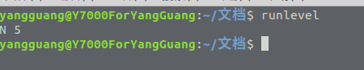

# Linux运行级别

Linux总共有0-6这7种运行级别，使用runlevel可以查看当前系统运行级别。

- 0: 代表系统处于关机状态。

- 1: 代表系统处于单用户无网络连接状态，此时只允许超级管理员进行系统操作，不允许非root用户进行登录。

- 2: 代表系统处于多用户无网络连接状态。

- 3: 代表系统处于多用户正常状态。

- 4: 代表系统处于用户自定义状态。

- 5: 代表系统处于多用户GUI图形化界面。

- 6: 代表系统处于重启状态。