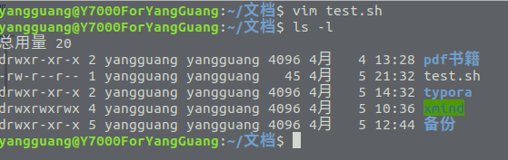
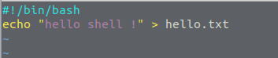
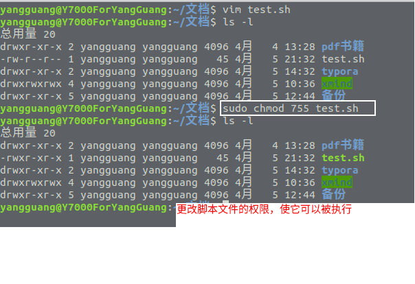
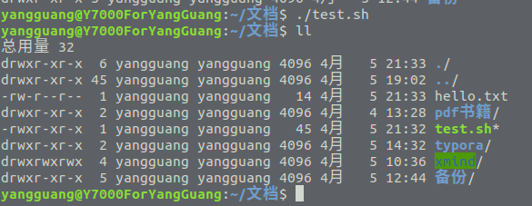

## shell

### 什么是shell?
shell是一个命令解释器，它是用户使用linux的桥梁，它将用户输入的命令解释后传递给linux内核。同时shell也是一种解释型的程序设计语言(shell脚本)，可以直接被执行，这个是它非常强大的一个特性，我们可以使用shell来编写一些小程序替我们完成那些重复的工作。

#### shell种类
一般在linux系统下的shell默认为bash, 当然还有其他的 c shell(csh), k shell(ksh)等等，在windows系统下有cmd，还有powershell这种跨平台的shell，总之shell的种类是非常多的。我当前的系统是ubuntu18.xx, 默认的shell是bash。

#### 第一个shell脚本
我们先创建一个名叫 test.sh 的文件，文件并不一定要以.sh结尾，只是便于判断他是一个脚本文件。

这是 test.sh 脚本的内容:

第一行的 **#!/bin/bash** 是作为一个通用的标记,他告诉系统使用什么命令解释器执行脚本，即使用什么shell执行脚本，
此处的 **/bin/bash** 代表的就是 bash。

第二行的 **echo "hello shell !" > hello.txt** 的作用是输出 "hello shell !" 
这段文本到 hello.txt 文件中去，hello.txt如果不存在，则会自动被创建。

在文件被创建后并不能立即执行，因为它对拥有者的权限默认为 rw, 所以我们需要把文件的权限更改为可执行，
或者增加可执行权限，这样文件才能被执行:

现在就可以执行shell脚本了: 

可以看到在目录下多了一个 hello.txt文件，它的内容正是: "hello shell !" 。

**此外关于shell的其他知识，建议学习: [菜鸟教程](https://www.runoob.com/linux/linux-shell-basic-operators.html)**
