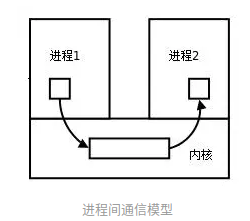
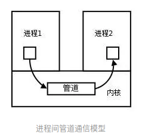
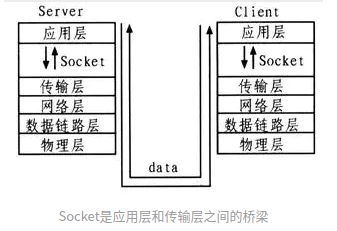

<!-- TOC -->

  * [进程间通信](#进程间通信)
     * [什么是进程间通信(InterProcess Communication)?](#什么是进程间通信interprocess-communication)
     * [进程间通信的方式](#进程间通信的方式)
        * [管道/匿名管道](#管道匿名管道)
        * [命名管道](#命名管道)
        * [信号](#信号)
        * [信号量](#信号量)
        * [消息队列](#消息队列)
        * [共享内存](#共享内存)
        * [Socket套接字](#socket套接字)

<!-- /TOC -->

## 进程间通信

### 什么是进程间通信(InterProcess Communication)?
每个进程都有自己的地址空间，所以一个进程内的数据对其他进程来说是独立的。
要想在进程间交换数据就需要通过内核完成。
在内核中开辟一块缓冲区，一个进程把数据拷贝到内核缓冲区，另一个进程再把数据从缓冲区读取出来。
内核提供的这种进程间交换数据的机制就叫进程间通信。

### 进程间通信的方式

#### 管道/匿名管道
管道/匿名管道有如下特点:

- 管道是半双工的，数据只能向一个方向流动。因此当双方互相通信时，需要建立2个通道。

- 匿名管道由于没有命名，所以只能用于具有亲缘关系的父子进程或兄弟进程之间。

- 管道的实质是内核缓冲区，它可以被看做一个FIFOF先进先出的队列，
管道一端的进程将数据写入队列尾部，另一端进程从头部读取数据。

- 管道发送的是无数据格式的字节流，这就要求进行管道通信的2端进程需要预先定义好数据格式。

管道通信模型:

#### 命名管道
命民管道提供一个路径名与之关联，并以文件的形式存于文件系统中。
这样即使进程之间不存在亲缘关系，只要进程可以访问到该路径，就可以通过命名管道进行通信。

#### 信号
信号是用于进程间互相通信，通知进程某个事件已经发生的一种机制。
比如在Linux 信号驱动IO模型中，当内核准备好数据后，便发送信号通知用户应用进程数据已准备好。

#### 信号量
信号量是一个计数器，通常作为多进程访问共享数据的同步机制。

#### 消息队列
消息队列有如下特点:

- 消息队列是消息链表，具有特定的格式，它存放在内核中并由消息队列标识符标识。

- 消息队列也是队列，也遵循FIFO先进先出的原则。

#### 共享内存
为了进程间的数据交换，内核在内存中分了一块内存，并允许多个进程操作这一块内存空间，它的效率非常高。
但由于多个进程共享一份内存，所以需要依靠某种同步机制来实现进程间的同步与互斥,如:信号量等。

#### Socket套接字
套接字是一种通信机制，客户端进程与服务端进程可以通过套接字进行双向通信。
即可以使2台机器的进程完成通信。

Socket通信模型:

