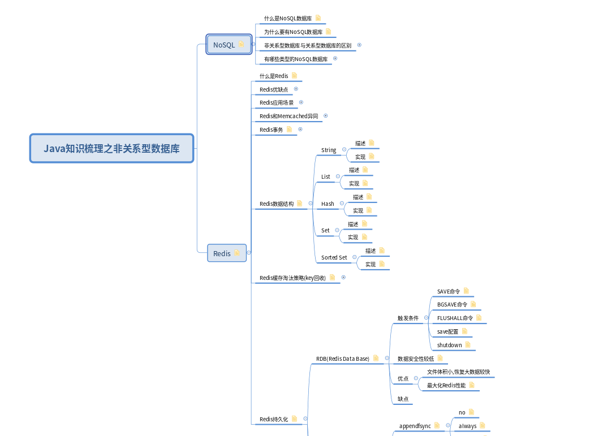

# 关于本部分

nosql-learning部分是对[nosql-learning](https://github.com/guang19/framework-learning/blob/dev/nosql-learning/NoSQL.md)
模块更细分的讲解。

#### 非关系型数据库

#### XMind下载

[非关系型数据库 - XMind](https://github.com/guang19/framework-learning/blob/dev/xmind_file/非关系型数据库.xmind)