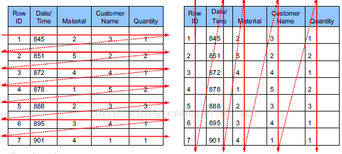

<!-- TOC -->

  * [NoSQL(Not-only SQL)](#nosqlnot-only-sql)
       * [什么是NoSQL数据库?](#什么是nosql数据库)
          * [为什么要有NoSQL数据库?](#为什么要有nosql数据库)
          * [非关系型数据库与关系型数据库的区别](#非关系型数据库与关系型数据库的区别)
          * [有哪些类型的NoSQL数据库?](#有哪些类型的nosql数据库)

<!-- /TOC -->

# NoSQL(Not-only SQL)

### 什么是NoSQL数据库?
**NoSQL数据库泛指非关系型数据库**，与关系型数据库不同，非关系型数据库并没有一种固定的存储数据的结构，
相对来说比较灵活。

#### 为什么要有NoSQL数据库?
非关系型数据库与关系型数据库是一种相辅相成的关系，起到了互补的作用。

关系型数据库的数据看上去很直观且支持事务，保证了数据的一致性。

非关系型数据库读写速度块，在高并发的压力下仍有不俗的表现且数据结构丰富，
更多的是对关系型数据库的一种补充。

#### 非关系型数据库与关系型数据库的区别
- 存储结构
>关系型数据库按照结构化的方式存储数据，需要先定义好数据库表的字段，
>再存储数据。这样做的好处就是可靠性比较高，但是如果后期应用扩展功能，
>需要扩展表的话，会有些受限。
>
>非关系型数据库存储的结构则不像关系型数据库那样固定，相对来说较为灵活，
>可以根据数据调整数据库的结构。

- 存储方式
>关系型数据库大多采用行和列这样的表格关系存储数据。
>
>非关系型数据库存储数据的方式则不固定，有的采用K-V键值对存储，
>有的采用文档存储，还有的图数据库使用图结构存储。

- SQL标准
>关系型数据库采用结构化的语言SQL来对数据库进行操作，并且SQL已成为大多数数据库的标准规范。
>
>非关系型数据库则各自为战，一直没有一个统一的标准，每种厂商提供的数据库规范都不一样。

- 读写速度
>关系型数据库强调数据的一致性，所以在遇到高并发读写操作时，会显得力不从心。
>
>非关系型数据库强调BASE理论:
>**Basically Available(基本可用),Soft-state(软状态),Eventual Consistency(最终一致性)。**
>它允许一定程度的数据不一致，但保证数据的最终一致性。
>因此，面对高并发读写操作时，表现的会比关系型数据库好的多，
>这也是redis,memcached这类高性能的NoSQL数据库被用于缓存的主要原因。

#### 有哪些类型的NoSQL数据库?

- K-V键值对: K-V键值对类型的NoSQL数据库类似于Hash表，将数据存储在内存中，
操作速度非常的快，因此常被用于缓存数据库。K-V键值对类型的NoSQL数据库主要有:Memcached,Redis等。

- 文档: 文档类型的NoSQL数据库结构则不固定，无需像关系型数据库一样预先定义字段，它存储数据的方式类似于JSON，
可以清晰的描述数据之间的复杂关系。文档类型的NoSQL数据库主要有:MongoDB,CouchDB等。

- 列式存储: 列式存储的NoSQL数据库以列簇形式存储数据，将同一列的数据存储在一起，
这样可以分割为多列，查询速度是很快的，但是列式存储的数据库功能也会收到限制。
列式NoSQL数据库主要有:HBase等;

- 图结构: 图数据库主要用于构建节点的关系图谱，以图算法和图结构进行计算和存储。
 图数据库主要有:Neo4j等。