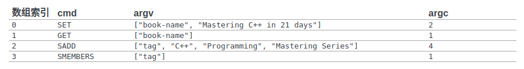
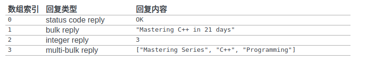
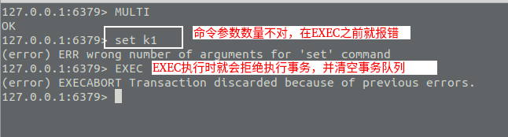

<!-- TOC -->

<!-- /TOC -->

# Redis事务

>Redis的事务主要依赖于WATCH ,UNWATCH,MULTI , EXEC, DISCARD等命令。
>其中 MULTI , EXEC , DISCARD 分别对应关系型数据库的 BEGIN,COMMIT,ROLLBACK操作。

#### Redis事务执行过程

客户端使用MULTI命令开启事务，此时用户就可以开始发出要执行的命令。
**如果命令为WATCH/MULTI/EXEC/DISCARD这四个中的任意一个，
那么会被直接执行，**因为它们属于事务操作。

当执行DISCARD的时候，会清空事务队列并退出事务。
如果是普通命令，就将命令加入事务队列，然后**当EXEC命令执行时，
事务中的队列将会被一一执行，最后执行的结果也是一个数组。**

参考: [Redis事务的设计与实现](https://redisbook.readthedocs.io/en/latest/feature/transaction.html)

#### Redis事务队列

在开启事务后，用户命令并不会被立刻执行，而是被添加到事务队列中，
这个队列其实是一个数组，每个数组元素由3部分组成:

1. 要执行的命令(cmd)
2. 命令的参数(argv)
3. 参数的数量(argc)

命令被添加到队列中的结构大致如下:

命令被执行后，也会生成一个结果数组，Redis就将这个结果数组返回:

#### Redis事务错误

Redis事务有两个错误时机。

- EXEC执行命令之前出现错误: 在EXEC命令之前的错误，也就是开启事务后，用户发出了错误的命令，
参数数量不对或其他原因，服务端会累积这些错误。
当EXEC命令执行时，将拒绝执行事务，并返回错误原因，清空事务队列。

- EXEC执行命令时出现错误: EXEC执行命令时出现错误，也就是用户发出的命令没有错，
但是在执行命令的时候出现了错误(可能是参数类型不对)，这时候仍然返回结果数组,
也就是说错误的命令并不影响其他命令的执行。

