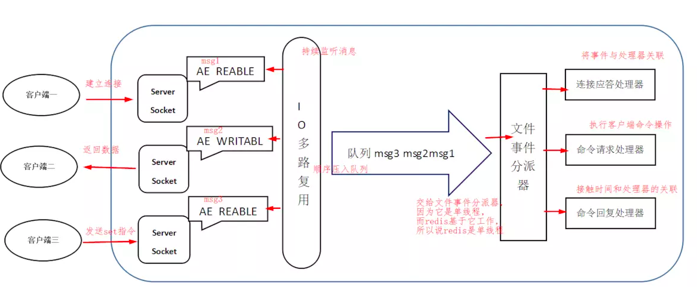
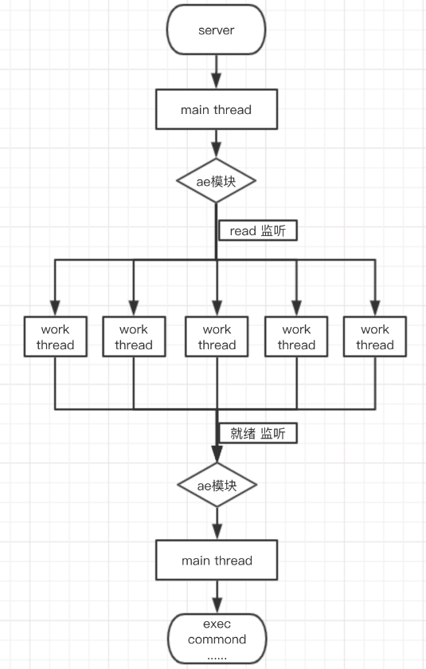

<!-- TOC -->

   * [Redis常见知识点](#redis常见知识点)
       * [Redis优缺点](#redis优缺点)
       * [Redis为什么这么快?](#redis为什么这么快)
       * [Redis应用场景](#redis应用场景)
       * [为什么不用Map或Guava做缓存?](#为什么不用map或guava做缓存)
       * [Redis和Memcached异同](#redis和memcached异同)
       * [Redis IO模型](#redis-io模型)
       * [Redis 6 之前](#redis-6-之前)
       * [Redis 6 之后](#redis-6-之后)
               
<!-- TOC -->

# Redis常见知识点

#### Redis优缺点

- Redis的优点:
  
  - 性能高: 用c语言编写的应用我就没见过慢的~_~。
  
  - 丰富的数据结构: 总体上来说Redis是以K-V形式存储数据，但是细分来说，
    它支持STRING，HASH，LIST，SET，SORTED_SET，HyperLogLog等多种数据结构。 

  - 支持Lua脚本: Redis使用Lua脚本解释器来执行脚本，所以它支持Lua脚本。
  
  - 支持事务: Redis是为数不多的支持事务的NoSQL数据库之一。
  
  - 支持数据持久化: Redis支持rdb和aof两种数据持久化方式。
  
  - 支持发布者/订阅者功能
  
  - 支持主从模式: Redis支持Sentinel哨兵模式搭建高可用集群配置。

- Redis的缺点:

  - 受限于物理内存: Redis属于内存数据库，它在内存中存储数据的大小是受物理内存限制的，
    所以它不适合存储海量数据。

#### Redis为什么这么快?

- 内存操作: Redis绝大部分操作都是基于内存的，想不快都难。

- 优秀的数据结构: Redis虽然支持的数据结构众多，但是它的每种数据结构都是专门设计和优化过的。

- 多路复用IO: Redis整体采用多路复用IO模型，核心操作使用单线程处理。

#### Redis应用场景     

- 缓存: 缓存可能是Redis用的最多的场景了。由于Redis的高性能，
高并发场景下作为缓存服务数据库，再适合不过了。
并且Redis支持的key自动过期功能，更是可以定制热点数据的过期时间。

- 多功能业务场景: Redis支持多种丰富的数据结构，不仅可以存储简单的K-V数据，还可以使用Hash存储用户，商品等信息，
List存储有序的数据，Set还有交集，并集，差集等功能。

- 分布式锁: Redis的操作具有原子性的，可以利用这点来完成分布式锁。

#### 为什么不用Map或Guava做缓存?

因为无论是Map还是Guava，都属于本地缓存，数据都存在一个JVM进程内的。
如果是单机模式，这样做尚可。但如果是分布式或者Java应用有多个实例，那就不能保证每个JVM进程内的缓存是一致的，
所以需要使用Redis这种第三方数据库作为缓存容器。
   
   
#### Redis和Memcached异同   

- 都属于内存数据库

- 持久化支持: Redis支持RDB和AOF两种持久化机制；
  Memcached只在内存中存储数据，不支持持久化机制。

- 数据结构: Redis从整体上来说是以K-V类型的为存储结构，
  但它细分可以支持String，Hash，List，Set，Sorted Set等数据类型；
  Memcached只支持K-V类型的存储结构。

- IO模型: Redis是以多路复用IO为模型的设计；
  Memached是以非阻塞IO为模型的设计。

- 事件库: Redis采用自制的AeEven事件库处理Socket事件;
  Memcached采用的是LibEvent事件库。

- 使用场景: 不考虑性能，Redis更适用于需要复杂数据结构，需要持久化的应用，
  如果你的应用以后需要扩展，那么也可以选择Redis；
  Memcached则适用于高并发和只需要K-V数据结构的应用。  
  
---

#### Redis IO模型
Redis IO模型按Redis的版本可以分为Redis 6之前和Redis 6之后。

#### Redis 6 之前
Redis是基于多路复用IO模型处理Socket请求的，关于多路复用的知识，我在
[Linux五种IO模型中](https://github.com/guang19/framework-learning/blob/dev/jdk_jvm_juc-learning/Jdk&Jvm&Juc.md#%E5%A4%9A%E8%B7%AF%E5%A4%8D%E7%94%A8io%E7%BD%91%E7%BB%9Cio%E6%A8%A1%E5%9E%8B)
已经说过了:
多路复用IO模型依赖于操作系统的select/poll/epoll函数，
epoll函数使得内核不断轮询客户端socket，
用户进程(线程)也需要阻塞在对epoll函数的调用上，当Socket有事件时，
用户线程便发起系统调用，处理Socket事件。

多路复用IO模型简单理解就是一个线程处理多个Socket连接。
所以**可以把Redis看成是单线程模型，但并不是说Redis只有一个线程，
而是说它执行核心操作的线程只有一个，它还有其他辅助线程完成其它功能。
Redis这样设计就避免了多线程切换的开销和简化了Redis的设计。**

Redis IO模型:

#### Redis 6 之后
Redis 6 之前一个线程处理所有的Socket和核心操作，
这样做的好处就是单线程无需考虑像多线程切换带来的困扰，
简化了Redis的模型，但随之而来的也有性能上的瓶颈。

**虽然Redis确实够快，但它的数据是在内存中操作的，会受到内存的限制。
且一个线程处理所有的Socket会带来网络IO的限制，并不能发挥多核CPU的优势。**

那有什么办法既能够发挥多核cpu的优势，又不会复杂化Redis的架构呢？

Redis 6 之前的瓶颈主要在于内存和网络IO。

关于内存这块，只得靠Redis自身的优化和机器条件了。
但是网络IO这块就可以通过新增多线程来处理大量Socket连接来优化了。
Redis 6 正是通过新增监听线程来解决网络IO的瓶颈，线程监听到Socket事件后，
再交由main线程处理。
所以**整体来说，Redis 6 在处理Socket事件上由单线程优化成了多线程，但核心操作还是由单线程执行。**

Redis 6 IO模型：

