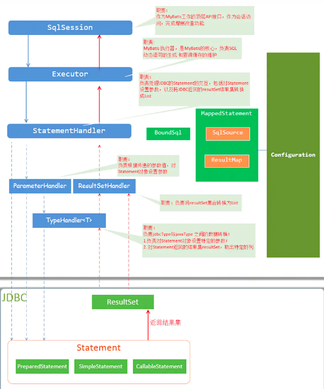
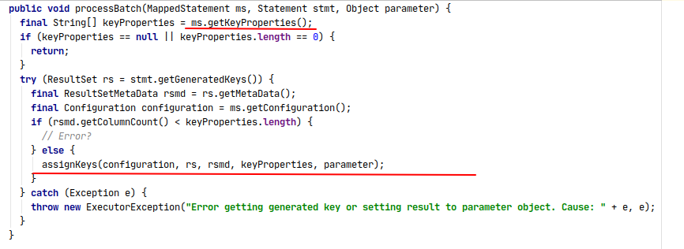
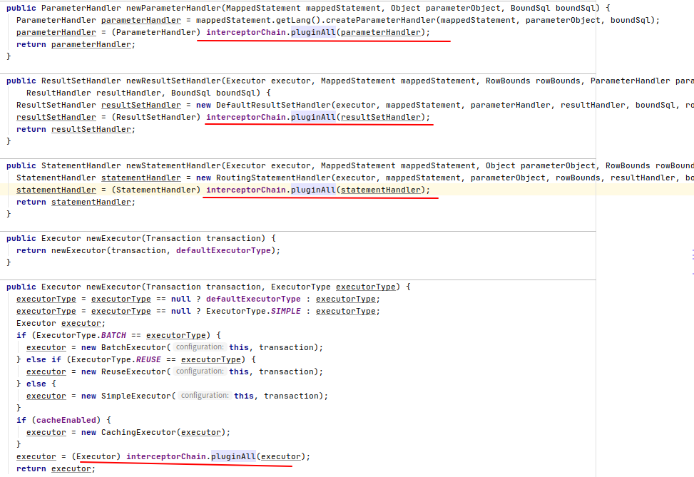
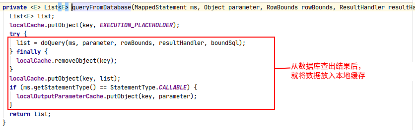
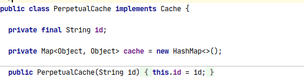
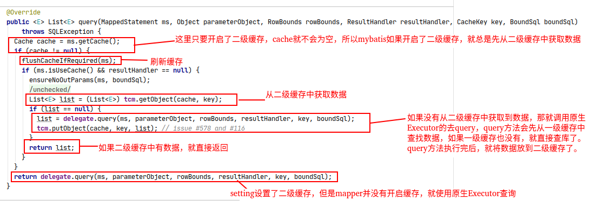

<!-- TOC -->

  * [Mybatis常见知识点](#mybatis常见知识点)
      * [Mybatis优点](#mybatis优点)
      * [Mybatis缺点](#mybatis缺点)
      * [Mybatis适用场景](#mybatis适用场景)
      * [Mybatis架构](#mybatis架构)
      * [Mybatis SQL执行流程](#mybatis-sql执行流程)
      * [Executor的类型](#executor的类型)
      * [什么是延迟加载?](#什么是延迟加载)
      * [延迟加载原理](#延迟加载原理)
      * [${} 和 #{}的区别](#-和-的区别)
      * [Mybatis 模糊查询LIKE怎么写](#mybatis-模糊查询like怎么写)
      * [Mybatis是如何获取生成的主键的?](#mybatis是如何获取生成的主键的)
      * [Mybatis动态SQL是什么?](#mybatis动态sql是什么)
      * [Mybatis插件原理](#mybatis插件原理)
      * [Mybatis一级缓存](#mybatis一级缓存)
      * [一级缓存的原理](#一级缓存的原理)
      * [使得Mybatis一级缓存失效的方法](#使得mybatis一级缓存失效的方法)
      * [Mybatis二级缓存](#mybatis二级缓存)
      * [Mybatis二级缓存的原理](#mybatis二级缓存的原理)
      * [Mybatis缓存的缺点](#mybatis缓存的缺点)

<!-- /TOC -->


# Mybatis常见知识点

#### Mybatis优点

- 消除了JDBC硬编码，提高了应用的扩展性

- 自定义SQL和对象持久化关系，带来了灵活性

- SQL和对象持久化关系都在配置里，解除了SQL与程序之间的耦合性

#### Mybatis缺点

- 配置繁琐

#### Mybatis适用场景

- 功能复杂的应用: Mybatis足够的灵活，这保证了它能够面对较为复杂的应用场景。

- 考虑SQL优化的应用: SQL优化是一个很常见的问题，Mybatis允许我们自己编写SQL，这样一来就可以轻松的更新和优化SQL了。

#### Mybatis架构

Mybatis架构图:



- Configuration: Configuration可以说是贯穿整个Mybatis生命周期的一个核心配置组件,
它存储着Mybatis所有需要的属性和组件。
从解析阶段开始，到获取Mapper，都需要Configuration。

Configuration内部属性一览：


- SQLSession: SQLSession是Mybatis最顶级的API接口，
它封装了SQL的增删查改功能，但最终还是交由Executor去执行逻辑。

- Executor: Executor执行器，是Mybatis的核心组件之一，
它负责调度StatementHandler来维护和执行SQL。

- StatementHandler: StatementHandler负责JDBC的statement的操作，如SQL入参，执行SQL，封装结果集。

- ParameterHandler: ParameterHandler负责将用户传递的参数转换成statement所需的参数。

- TypeHandler: TypeHandler负责Java数据类型与JDBC数据类型的转换。

- ResultSetHandler: ResultSetHandler负责处理statement执行后返回的结果集。

#### Mybatis SQL执行流程

- 配置解析: 由XML解析器解析配置文件(总配置文件，mapper文件),并将解析的结果保存到Configuration中。

- 使用配置环境信息构建SQLSessionFactory工厂: SQLSessionFactory提供了构建SQLSession的多种方式，可以指定Executor的类型和事务隔离级别等。

- 使用SQLSessionFactory创建SQLSession会话: SQLSessionFactory创建SQLSession后，其实是创建的DefaultSQLSession，它包含了Mybatis的环境配置Configuration和Executor执行器。

- 使用SQLSession获取用户需要的Mapper类: Mybatis底层是使用了jdk动态代理来实现目标Mapper的执行的，获取Mapper实际上是获取Mapper的代理类。

- 使用MapperProxy执行目标方法: 实际上最终是Executor调度StatementHandler执行statement。

- Executor调用StatementHandler对Statement做出处理(包括参数处理，执行，结果集处理)。

- StatementHandler调用ParameterHandler装配SQL参数并执行,最后使用ResultSetHandler封装结果集返回。

#### Executor的类型

1. SimpleExecutor: 简单执行器。 每次执行SQL就开启一个statement，用完后就关闭掉。

2. ReuseExecutor: 可重用的执行器。每次执行SQL先去缓存(Map)中找SQL对应的statement，
如果不存在就新创建statement，用完后并不关闭，而是放入Map缓存中，以待下次使用。

3. BatchExecutor: 批处理执行器。执行SQL时，会将statement添加到批处理中，等到最终executeBatch时，一起执行。

#### 什么是延迟加载?
延迟加载又称按需加载，即在关联查询中(一对一或一对多)，
**如果指定了延迟加载，那么并不会一次就把对象关联的数据查出来，
而是等到对象需要使用关联的数据时才会进行查询**。


#### 延迟加载原理
Mybatis的底层原理是ResultSetHandler在封装结果时，
**判断对象的属性是否有关联查询(嵌套查询)，如果有，则使用动态代理创建该对象作为结果。**

当对象需要使用它的某个属性时，比如a调用getB方法，
那么getB方法就会进入代理方法，如果getB为空，就查询B，并setB，这样就可以获取到a的B属性了。


#### ${} 和 #{}的区别

- ${} 是将传入的参数直接显示在SQL中;#{} 把传入的参数当做字符串，会给参数加上引号

>假设有2条SQL如下:

```text
1. SELECT * FROM table WHERE id =${id};
2. SELECT * FROM table WHERE id = #{id};
```

>如果传入的参数为 1 , 那么第一条SQL会被拼接成:

````text
SELECT * FROM table WHERE id = 1;
````

>第二条SQL会被编译成:

````text
SELECT * FROM table WHERE id = "1";
````

- ${}属于拼接符，需要进行字符串拼接;#{} 属于占位符，需要预编译

- ${} 则不能防止SQL注入;#{} 可以在很大程度上预防SQL注入

>假如有一条SQL:

````text
SELECT * FROM table WHERE id = ${id}
````

>假设传入的id为: 1 OR 1 = 1 ,那么字符串拼接后,SQL为:

````text
SELECT * FROM table WHERE id = 1 OR 1 = 1;
````

>这条SQL无论如何都会执行成功。

>如果将 ${id} 改为 #{id},那么经过预编译后，SQL为:

````text
SELECT * FROM table WHERE id = "1 OR 1 = 1";
````

>可以看到: #{} 是将参数作为一个字符串为条件的，这样就可以避免 OR 生效，防止SQL注入。

#### Mybatis 模糊查询LIKE怎么写

- SELECT * FROM table WHERE name LIKE '%${name}%' (有注入风险)

- SELECT * FROM table WHERE name LIKE "%"#{name}"%"

- SELECT * FROM table WHERE name LIKE CONCAT('%',#{name},'%')

- Bind标签:
````xml
<select id="listProduct" resultType="Product">
     <bind name="fuzzyName" value="'%' + name + '%'" />
    select * from  table  where name like #{fuzzyName}
</select>
````

#### Mybatis是如何获取生成的主键的?
Mybatis有一个KeyGenerator接口，这个接口专门用于获取数据库生成的主键。
但其核心原理还是使用的JDBC 的 API : Statement的 getGeneratedKeys 方法获取的。




#### Mybatis动态SQL是什么?
Mybatis允许我们在mapper文件内，**以标签的形式编写动态SQL，用于逻辑判断和SQL拼接等功能。**
Mybatis动态标签有:

 trim  / where  / set / if /  choose / otherwise / bind / foreach 等。

实际上**Mybatis的动态标签是依赖于OGNL的。**

#### Mybatis插件原理
Mybatis允许我们编写插件对它核心的组件：
Executor , StatementHandler, ParameterHandler, ResultSetHandler
这些核心组件的扩展

**Mybatis底层实际上是使用jdk动态代理包装后的组件带替它原生的组件。
当执行这些组件的方法时，就会执行Interceptor的intercept方法。
当然，只是当执行我们指定要拦截的方法时，才会执行intercept方法。**

见:Configuration:




#### Mybatis一级缓存

**一级缓存又称本地缓存，它属于SqlSession级别的缓存，默认是开启的。每个SqlSession都有自己的缓存。
同一个SqlSession查询到的数据都会放入它自己的缓存中，如果之后需要获取相同的数据，
那么会先从缓存中查找，如果没有才会去查询数据库，这样就降低了数据库的压力。**

Mybatis一级缓存流程:


Mybatis一级缓存源码:





#### 一级缓存的原理
对于BaseExecutor来说，它内部维护了一个叫localCache的PerpetualCache对象。
PerpetualCache实现了Cache接口，它内部使用HashMap进行缓存。
**所以可以简单理解为Mybatis的一级缓存是由HashMap存储的。**
  
Mybatis一级存实现:
   



#### 使得Mybatis一级缓存失效的方法

- 如果SQL相同，但是SQL的条件或参数不同，缓存会失效

- 在两次查询操作中间，如果进行了增删改操作，会清空本地缓存

- 不同的SqlSession，缓存会失效

- 手动清空SqlSession的缓存

#### Mybatis二级缓存
**二级缓存又称全局缓存，它属于mapper级别的缓存,默认是关闭的，需要指定配置和标签才会开启。
多个SqlSession操作同一个Mapper是可以共享一个二级缓存的，但是要求Sql会话必须属于同一个Mapper。**

Mybatis二级缓存流程:


#### Mybatis二级缓存的原理

Mybatis二级缓存的Executor使用的是CachingExecutor，
在原生的Executor执行查询操作之前，它会先从二级缓存中查询，如果查询不到才会从一级缓存或数据库中查询。

Configuration创建CachingExecutor:


Mybatis二级缓存源码:




#### Mybatis缓存的缺点

- Mybatis缓存设计缺陷: Mybatis的一级缓存是使用HashMap实现的，并没有指定容量限制，
虽然可以提高查询效率，但是设计上还有所欠缺。

- 容易引起脏读: Mybatis的缓存是属于Java进程内的缓存，在分布式环境下，缓存的不一致，
很容易引起数据的脏读。建议还是使用第三方容器，如Redis和Memcached等中间件存储缓存数据。