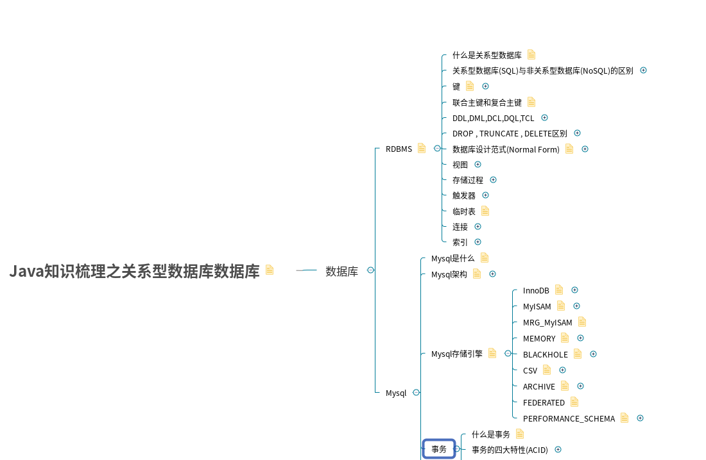

# 关于本部分

rdbms-learning部分是对[rdbms-learning](https://github.com/guang19/framework-learning/blob/dev/rdbms-learning/RDBMS.md)
模块更细分的讲解。

#### 关系型数据库常见知识点

#### XMind下载

[关系型数据库 - XMind](https://github.com/guang19/framework-learning/blob/dev/xmind_file/关系型数据库.xmind)