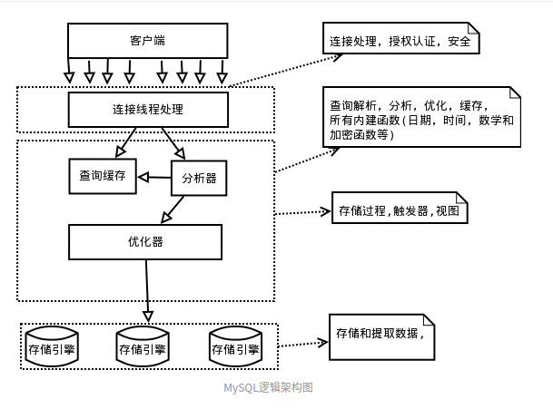

# Mysql

### Mysql是什么?
>Mysql是一个关系型数据库管理系统，由瑞典Mysql公司开发，现属于Oracle旗下产品。
>Mysql是最流行的关系型数据库之一，与它同类型的数据库还有SQL Server，Oracle，DB2等。

[Mysql官方文档](https://dev.mysql.com/doc/)

#### Mysql架构

Mysql总体架构可分为三层:应用层,服务层，存储引擎层:

- 应用层: 应用层是Mysql体系最上面的一层，接受客户端的连接请求。
应用层包含:连接处理，用户认证，安全管理等内容。
 
  - 连接处理: 当客户端向Mysql服务端发送一个请求后，Mysql 服务会从线程池中分配一个线程来对客户端连接进行处理。 
  
  - 用户认证: 当客户端请求连接后，服务端会根据用户名，密码等信息判断用户身份。
  
  - 安全管理(权限): 当客户端连接到Mysql服务端后，Mysql服务会验证用户的权限，以便限制用户的操作。

- 服务层: 服务层用于处理客户端的操作，是Mysql的核心模块，主要包括:SQL解析器，优化器和缓存等。

  - SQL解析器: sql解析器用于解析SQL语句，如果SQL有错误，则会提示相应的错误信息，如果没有错，则执行SQL优化。
             如果SQL是查询语句，那么首先会去缓存里查询，如果查询成功，就直接返回结果，
             不进行接下来的SQL优化。
  
  - 优化器: 优化器用于优化SQL语句，使得SQL的执行更加高效率。
  
  - 缓存: 缓存SQL查询的结果，提高SQL查询的效率。

- 存储引擎层: 存储引擎是Mysql数据持久化的核心。
Mysql是数据库肯定要存储数据，存储数据就要与磁盘文件交互了。
并且Mysql是关系型数据库，核心由表和索引组成，存储引擎还要负责表与索引的创建与持久化。