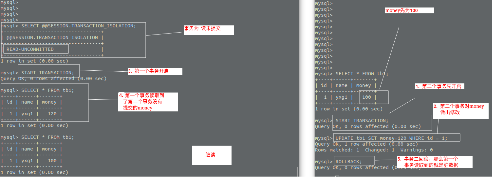
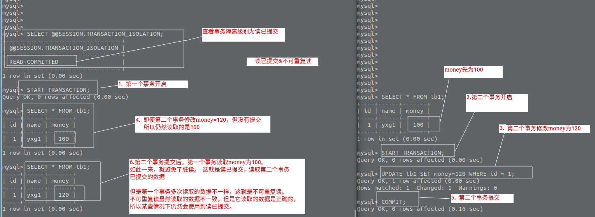
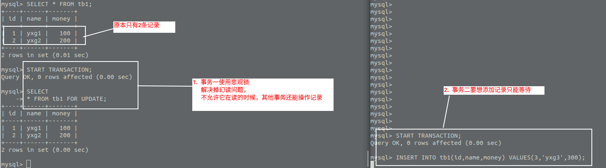

<!-- TOC -->

   * [事务](#事务)
       * [什么是事务?](#什么是事务)
       * [事务的四大特性(ACID)](#事务的四大特性acid)
       * [事务的隔离级别](#事务的隔离级别)
       * [事务隔离级别引发的问题](#事务隔离级别引发的问题)
       * [快照读](#快照读)

<!-- /TOC -->


# 事务

```text
事务并不是Mysql独有的，只是因为某些知识点以Mysql为示例，
所以便把它放在了Mysql之后。
```

#### 什么是事务?
**事务是一组原子性的操作序列，操作执行成功的结果使数据库从一种状态变成另一种状态，
且状态是持久的。**

#### 事务的四大特性(ACID)


- **原子性(Atomicity)**: 原子性指事务是一组不可分割的操作，要么全部成功，
要么全部失败，不会出现一个操作成功，一个操作失败的情况。

- **一致性(Consistency)**: 一致性指事务对数据库操作前后，数据的完整性没有被破坏。

>如用户A给用户B转账，无论转账是否成功，A和B的财产总和是不变的。

- **隔离性(Isolation)**: 隔离性指事务与事务之间是相互独立的，互不干扰的，
一个事务的失败，不会影响另一个事务。

- **持久性(Durability)**: 持久性指事务对数据库的操作产生的影响应该是持久的，不会因为外部原因而发生改变。

#### 事务的隔离级别

1. 读未提交(READ UNCOMMITTED): 一个事务读取另一个事务未提交的数据。
**如果事务的隔离级别处于读未提交，那么可能产生脏读，换读和不可重复读等现象。**

2. 读已提交(READ COMMITTED): 一个事务读取另一个事务已提交的数据，**可以避免脏读，
但是又可能会出现不可重复读和幻读。**

3. 可重复读(REPEATABLE READ): 一个事务没有结束时，它对表中的同一条记录读取的结果都是相同的，
也就避免了不可重复读，**但还有可能发生幻读问题**。

4. 串行化(SERIALIZABLE): 串行化是最高的事务隔离级别，完全满足ACID四个特性。
**同一时间，数据库只能执行一个事务，事务之间完全互不干扰，这样就防止了脏读，幻读和不可重复读等问题。**

**PS:但是串行化相当于串行模式，效率是很低的，所以请慎用。**

| 事务的隔离级别 | 能否解决:脏读 | 能否解决:不可重复读 |  能否解决:幻读 |
| :----:       | :----:     | :----:           | :----: |
|   RU         |    ×       |    ×             |   ×    |
|   RC         |    √       |    ×             |   ×    |
|   RR         |    √       |    √             |   ×    |
|   S          |    √       |    √             |   √    |

#### 事务隔离级别引发的问题
- **脏读**: 脏读在事务隔离级别为读未提交的时候会出现。**脏读指读取到了一个事务还没有提交的数据。** 

>假设某张表的一个字段为money，有一条记录money的值为100。
>一个事务A对数据做了修改: money=120，但没有提交。
>此时，另一个事务B读取到了A修改但没有提交的数据 money=120，然后事务A回滚了，
>使得money仍然为原值100，那么事务B读到的money=120就是脏数据。

使用2个mysql客户端窗口模拟多线程事务导致的脏读:



**设置事务隔离级别为读已提交可以避免脏读发生。**
````text
 SET SESSION TRANSACTION ISOLATION LEVEL READ COMMITTED;  
````

读已提交:



可以看到，虽然读已提交解决了脏读，但是又出现了不可重复读问题。


- **不可重复读**: 不可重复读在事务隔离级别为读已提交时会出现。
**不可重复读指一个事务还没有结束时，多次读取同一条数据，可能读取的结果不一样。**

>假设某张表的一个字段为money，有一条记录money值为100。
>一个事务A读取了这条记录为100，此时，
>另一个事务B对这条记录做出了修改money=120,并提交了。
>当A再次读取money的时候，money为120 。

**设置事务隔离级别为可重复读可以避免不可重复读的问题发生。**

````text
SET SESSION TRANSACTION ISOLATION LEVEL REPEATABLE READ;
````

可重复读:


**虽然可重复读避免了不可重复读问题，但幻读问题也随之而来。**

在说幻读之前,得先讲讲MVCC(Multi-Versioned Concurrency Control)机制。

**简单理解:这个机制保证了在某个时间，多个事务读取的是数据库的一个快照版本。**

关于MVCC机制可以看这篇文章:[MVCC](https://juejin.im/post/5c68a4056fb9a049e063e0ab)

再来说幻读:

- **幻读**: 了解了MVCC机制之后，再看幻读会觉得豁然开朗。
幻读在隔离级别为可重复读的时候会出现。
**可重复读虽然避免了不可重复读的问题，但是它也使得当前事务无法感知其他事务的操作。**

>假设事务A查询了一张表为空表，此时，另一个事务B插入了一条记录并提交了，
>当事务A也要插入记录的时候，却发生了主键冲突的错误，可当事务A再次查询的时候，仍然是空表呀。

幻读:


#### 快照读
解决幻读之前先看看快照读：
**快照读就是幻读。**

个人理解幻读(快照读)是MVCC机制出现的一种问题。

先来看看另一种情况: 当前读
  


为什么上面处于可重复读级别的第一个事务在第一次读取之后，感知不到第二个事务的修改操作。
因为**在事务一开启后，事务会选择第一次SELECT(事务开启后的第一次SELECT)的结果作为快照，
此后的读取，都是读取的这个快照版本，即使其他事务更新了数据，
当前事务也认为这个快照是最新版本，所以读取的仍然是快照版本，数据当然一致。
这就揭露了，可重复读实际上是快照读。**

**那为什么会发生上面当前读的情况?**

**因为第一个事务开启后，并没有立刻SELECT，也就是在事务一内并不存在快照版本，
那么事务一就会选择记录的最新版本作为结果。**
最新的版本是什么时候?
是第二个事务修改数据并提交后，记录的版本也随之修改了，所以第一个事务能够感知到第二个事务的修改操作。

关于 <记录的最新版本>，还是和MVCC机制有关，这部分内容比较复杂，所以建议各位同学仔细阅读。

**避免幻读的有2种方式:串行化和加锁。**

看看加锁是如何解决幻读的:

