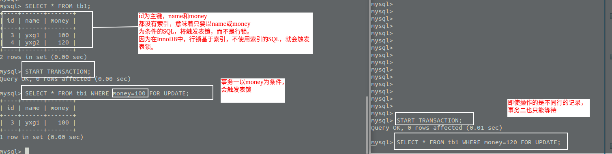

<!-- TOC -->

   * [数据库锁](#数据库锁)
       * [数据库锁机制是什么](#数据库锁机制是什么)
       * [乐观锁和悲观锁](#乐观锁和悲观锁)
       * [共享锁和独占锁(排他锁)](#共享锁和独占锁排他锁)
       * [行锁，表锁，页锁](#行锁表锁页锁)
       * [行锁基于索引](#行锁基于索引)

<!-- /TOC -->


# 数据库锁

#### 数据库锁机制是什么
在编程语言中，有线程同步机制保证多线程对共享资源进行访问时的安全问题。

**在数据库中，也有事务锁同步机制，保证事务的一致性。**

#### 乐观锁和悲观锁

````text
锁从宏观上分为乐观锁和悲观锁。
````

- 乐观锁: 乐观锁一般是用户实现的一种锁机制。乐观锁机制对与共享数据很乐观，
认为任何时候都不会发生线程安全或事务一致性问题，所以不会给数据加锁。乐观锁适用于读多写少的应用。

- 悲观锁: 数据库锁基本都属于悲观锁。悲观锁认为在任何环境下，数据都有可能发生共享一致性问题，
所以每次读写数据的时候都会加锁。

#### 共享锁和独占锁(排他锁)
````text
按锁的操作可划分为共享锁和独占锁。
````

- 共享锁: 共享锁允许多个事务同时访问同一份共享数据。
**读锁就属于共享锁，多个事务可以同时对一份数据进行读操作。**

- 独占锁: 独占锁保证了在任何时候，只能有一个事务获取锁，其他事务只能等待获取锁的事务释放锁。
**写锁属于独占锁,一份数据同时只能被一个事务增删改。**

#### 行锁，表锁，页锁
```text
锁按粒度来划分，还可以分成行锁，表锁，页锁。
```

- 行锁: **行锁是最小粒度的一种锁，只针对当前事务操作的行加锁，即在当前事务范围内，
其他事务无法对当前事务操作的行进行修改，事务产生冲突的概率很小。**
行锁的加锁粒度最小，并发性高，但它的开销大，加锁慢，而且可能会出现死锁。

- 表锁:**表锁是粒度最大的一种锁，它对整张表加锁，即当在当前事务范围内，
其他事务无法对表做出修改，所以事务产生冲突的概率较大。**
表锁的粒度最大，并发性低，但它的实现较为简单，加锁很快，不会发生死锁。

- 页锁: 页锁是锁定粒度介于行锁和表锁中间的一种锁,并发性一般，可能会出现死锁。

#### 行锁基于索引
**在InnoDB中，行锁是基于索引实现的。
如果当前事务的操作没有基于索引，那么InnoDB将使用表锁。
这就意味着如果你使用一个SQL操作一条记录，但是这个条SQL的条件列并没有建立索引，
那么这条SQL即使操作一条记录，使用的也是表锁。**

行锁升级为表锁的一种情况:

