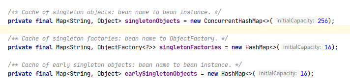

<!-- TOC -->

* [Spring常见知识点](#spring常见知识点)
    * [什么是Spring Framework?](#什么是spring-framework)
    * [Spring的优缺点](#spring的优缺点)
    * [Spring的优点:](#spring的优点)
    * [Spring的缺点:](#spring的缺点)
    * [Spring 主要提供了哪些模块?](#spring-主要提供了哪些模块)
    * [Spring主要使用了哪些设计模式?](#spring主要使用了哪些设计模式)
    * [Spring IOC容器的配置方式有哪些？](#spring-ioc容器的配置方式有哪些)
    * [BeanFactory和ApplicationContext的区别是什么?](#beanfactory和applicationcontext的区别是什么)
    * [什么是IOC容器和DI依赖注入?](#什么是ioc容器和di依赖注入)
    * [Spring依赖注入的方式有几种?](#spring依赖注入的方式有几种)
    * [一个bean的定义包含了什么?(BeanDefinition)](#一个bean的定义包含了什么beandefinition)
    * [bean的作用域有哪些?](#bean的作用域有哪些)
    * [Spring 的扩展点主要有哪些?](#spring-的扩展点主要有哪些)
    * [Spring如何解决循环依赖?](#spring如何解决循环依赖)
    * [事务的传播行为是什么?有哪些?](#事务的传播行为是什么有哪些)
    * [什么是AOP?](#什么是aop)
    * [AOP的组成元素和概念有哪些?](#aop的组成元素和概念有哪些)
    * [AOP实现方式有哪些?](#aop实现方式有哪些)
    * [AspectJ AOP 和 Spring AOP的区别?](#aspectj-aop-和-spring-aop的区别)
    * [cglib动态代理和jdk动态代理的区别?](#cglib动态代理和jdk动态代理的区别)

<!-- /TOC -->

# Spring常见知识点


#### 什么是Spring Framework?
Spring是一个轻量级的，开源的Java应用程序开发框架。它提供的IOC和AOP等核心功能，能够使开发者很方便的开发出松耦合的应用。
 
#### Spring的优缺点

#### Spring的优点:
- 方便解耦，简化开发
>对象统一交由容器管理，实现了资源的可配置和易管理。
>并且不再需要显示的编写管理对象的代码，降低了应用的代码量。

- AOP支持
>Spring 提供 AOP模块，能够很方便的编写出AOP程序.

- 声明式事务
>只需要通过配置或注解就可以完成对事务的支持，而不需要手动的编写事务代码

- 第三方框架无缝集成
>Spring可以很方便的将第三方框架继承到系统中，很灵活。

...

#### Spring的缺点:
- 复杂
>Spring发展到现在，确认有些复杂了，但是对于它解决的问题来说，复杂已经不算什么了。

- 效率
>Spring内部依赖反射，而反射会带来一定的效率损耗。
 

#### Spring 主要提供了哪些模块?
1. core模块提供IOC和DI等核心功能

2. aop模块提供面向切面编程的实现

3. web模块提供对web应用的支持

4. dao模块提供数据库方面的支持

5. test模块提供测试方面的支持
 
#### Spring主要使用了哪些设计模式?

```text
Spring使用的设计模式有很多，此处只列举几个常见的
```

1. 工厂模式
BeanFactory 就是简单工厂的实现，用来创建和获取Bean

2. 单例模式
Spring容器的Bean默认是单例的

3. 代理模式
aop使用的就是代理模式

4. 模板方法模式
jdbcTemplate等就使用模板方法模式

5. 观察者模式
当有事件触发时，该事件的监听者(观察者)就会做出相应的动作。

...
 
#### Spring IOC容器的配置方式有哪些？
1. xml (不再推荐使用)
2. 注解(推荐使用)
3. Java API(和注解一起使用)

 
#### BeanFactory和ApplicationContext的区别是什么?

**BeanFactory是最底层，最顶级的IOC容器接口，它提供了对bean的基本操作，属于低级容器。
而ApplicationContext是BeanFactory的应用扩展接口，
提供了比BeanFactory更多高级的功能和扩展接口，属于高级容器。**

 
#### 什么是IOC容器和DI依赖注入?
IOC(Inversion Of Control): 控制反转.

DI(Dependencies Inject): 依赖注入.

Spring IOC容器是Spring框架的核心功能，
它负责管理用户定义好的bean以及bean的生命周期，包括(创建，初始化,使用和销毁)，

而依赖注入是处理bean与bean之间的依赖关系。

控制反转是指原本由用户来管理对象，现在交由容器管理，
不再需要我们手动去处理对象之间的依赖关系了。
 
#### Spring依赖注入的方式有几种?

1. setter方法注入: 通过构造器或工厂方法(静态工厂方法或实例bean工厂方法)构造bean所需要的依赖后，
使用setter方法设置bean的依赖。

2. 构造器注入: 构造器的每个参数都可以代表对其他bean的依赖。
  

#### 一个bean的定义包含了什么?(BeanDefinition)  
BeanDefinition 是对Bean的定义，它定义了Bean的元数据，
如Bean的Scope，Class，beanName，bean的实例化方式等等。
 

#### bean的作用域有哪些?
* singleton(单例bean): singleton作用域表示在容器中，一个bean只存在一个实例。
每次获取这个bean，都是获取它唯一的实例。

* prototype(原型bean): prototype作用域表示如果有一个bean是prototype scope,
那么每次获取该作用域的bean时，容器都会新创建该bean的实例。

* request(请求域): 作用于Web应用。request作用域表示如果一个bean是request scope，
那每次HTTP请求，容器都会创建一个该bean的实例。
 
* session(会话域): 作用于Web应用。session作用域表示如果一个bean是session scope，
那么容器为每个session创建一个该bean的实例，当session销毁时，该session内的bean也就销毁了。

* application(web应用作用域): 作用于web应用。
application作用域表示如果一个bean是 application scope的，
那么容器会为整个Web应用上下文创建一个该bean的实例，这个实例属于ServletContext级别的。
不同于singleton，singleton是Spring的每个ApplicationContext唯一，
而application是每个ServletContext唯一，对于Web应用来说，
ServletContext也只有一个，所以application可以理解为web应用唯一。

* websocket(websocket作用域): 应用于web应用。
websocket作用域表示如果一个bean是websocket scope的，
那么该bean作用域整个WebSocket作用域内，也是唯一的。
 
#### Spring 的扩展点主要有哪些?

>这里列举的并不是很全，因为Spring的扩展点实在是太多了，
>但究其根本，还是在bean实例化/初始化前后的扩展。

1. 如果容器中有BeanFactoryPostProcessor,那么执行它的postProcessBeanFactory方法。
该接口是对ConfigurableListableBeanFactory的一个扩展。

2. 实例化bean

3. 注入bean的属性

4. 如果容器中有Aware的实现，那么执行各种Aware扩展实现方法,如BeanNameAware,
BeanFactoryAware,ApplicationContextAware等扩展的setXXX方法

5. 如果容器中有BeanPostProcessor，那么执行BeanPostProcessor的postProcessBeforeInitialization方法

6. 执行bean指定的init方法,如果bean还实现了InitializingBean接口,
那么继续执行InitializingBean的afterPropertiesSet方法

7. 如果容器中有BeanPostProcessor，那么执行BeanPostProcessor的postProcessAfterInitialization方法

8. bean可以被使用了

9. 容器销毁后，执行bean指定的destroy方法，如果bean还实现了DisposableBean接口，
那么继续执行DisposableBean的destroy方法
 
#### Spring如何解决循环依赖?
循环依赖是指:A依赖B，并且B依赖A的情况。或者 A依赖B，B依赖C，C依赖A的情况。

- 构造器注入的循环依赖无法解决，直接抛出BeanCurrentlyInCreationException异常。
>容器在创建Bean的时候，会将Bean添加到正在创建的Bean池中，如果在创建Bean的时候，
>发现自己已经在创建的Bean池中，就说明Bean陷入循环依赖了，
>直接抛出BeanCurrentlyInCreationException异常。
>
>为什么构造器注入不能像Setter方法注入一样解决循环依赖问题?
>**因为Setter方法注入的前提是首先需要实例化这个对象，而构造器注入的参数正是bean，
>怎么实例化，所以无法解决这个问题。**

- Setter方法注入的循环依赖可以通过缓存解决。
三级缓存：
1. 初始化完成的Bean池；
2. 实例化完成，但是没有填充属性的Bean池；
3. 刚刚实例化完成的Bean的工厂缓存，用于提前曝光Bean。



>Setter方法注入时，如果Bean A发现自己依赖于Bean B，
>那么将自己实例化后并添加到第三级缓存(Bean 工厂)。
>然后再初始化B,检查到B又依赖于A，于是到三级缓存里查询A,那么查询肯定是成功的,
>于是将A设置为B的属性。当A初始化时，
>发现B已经初始化完成,就可以直接将B设置为A的属性了。
 
- 非单例bean不能缓存，无法解决循环依赖: IOC容器是不会缓存非单例bean的，所以无法解决循环依赖问题。
 
#### 事务的传播行为是什么?有哪些?

事务的传播行为是Spring提供的对事务增强的一种特性，不属于数据库事务特性。
**事务的传播行为描述的是当多个事务同时存在时，这些事务该如何被处理。**

Spring定义了7种事务的传播行为:REQUIRED,SUPPORTS,MANDATORY,REQUIRES_NEW,NOT_SUPPORTED,NEVER,NESTED

* REQUIRED: 当一个方法A(REQUIRED)被另一个方法B调用时，如果B没有开启事务，
那么A将自己开启事务,独立运行。如果B开启了事务，那么A就加入到B的事务中去，
A和B要么同时成功，要么同时失败。

* NESTED: NESTED与REQUIRED很相似。如果方法A(NESTED)被另一个方法B调用，如果B没有事务，
那么A将自己开启一个事务运行。如果B有事务，那么A将作为B的子事务运行，B失败，A也失败，但是A失败却不影响B。
A是作为B的嵌套事务运行的，所以并不会影响B。

* SUPPORTS: 当一个方法A(SUPPORTS)被另一个方法B调用时，如果B开启了事务，
那么A就加入到B的事务中去。如果B没有开启事务,那就正常执行，不开启事务。
 
* MANDATORY: 当一个方法A(MANDATORY)被另一个方法B调用时，如果B没有开启事务，那么A将抛出异常。

* REQUIRES_NEW: 当一个方法A(REQUIRE_NEW)被另一个方法B调用时，无论B是否有事务，
A都会开启自己的事务，与B的事务互不相干，隔离运行。

* NOT_SUPPORTED: 当一个方法A(NOT_SUPPORTED)被另一个方法B调用时，如果B有事务，那么B的事务将挂起，
直到A执行完，B再以事务的方式运行。
 
* NEVER: 当一个方法A(NEVER)被另一个方法B调用时，如果B有事务，那么A将抛出异常。 
 

#### 什么是AOP?

AOP(Aspect Oriented Programming)面向切面编程，个人认为AOP是一种程序设计思想。
在AOP编程中，将系统的核心逻辑和辅助逻辑分离开来，并将通用的辅助逻辑封装成一个模块，
提高了代码的重用性和程序的可维护性，降低了系统模块之间的耦合度。

 
#### AOP的组成元素和概念有哪些?
1. 连接点(join point): 连接点指程序执行的某个位置，能够执行辅助逻辑(通知/增强)。
如方法执行前，方法抛出异常时，方法执行完，方法返回后等等，这些点都被称为连接点。

2. 通知/增强(advice): 通知/增强 可以理解为辅助逻辑，就是在连接点要做的事情。

3. 切点(pointcut): 连接点可以看做是一个方法的执行辅助逻辑的不同位置的集合，
切入点指的就是这个方法。切入点会匹配 通知/增强 需要作用的类或方法。
 
4. 切面(aspect): 切面是切入点的集合，可以看作是拥有多个切入点的类。

5. 织入(weave): 织入是一个概念。它描述的是将切入点的 通知/增强 应用到连接点的过程。
 

#### AOP实现方式有哪些?
常见的AOP实现的方式有代理和织入。

- 代理分为静态代理和动态代理。 
由于静态代理没有动态代理灵活，所以现在几乎都使用动态代理来实现AOP。
以动态代理实现AOP的框架主要有cglib和jdk原生的这2种。

- 织入可以理解为以操作字节码的方式对class源文件进行修改，从而实现通知/增强。
以织入实现AOP的框架主要有AspectJ。
 

#### AspectJ AOP 和 Spring AOP的区别? 
* AspectJ AOP: AspectJ是一整套AOP的工具，它提供了切面语法(切入点表达式)以及织入等强大的功能。
Aspect提供文件和注解2种方式来进行AOP编程，
并且它允许在编译时，编译后和加载时织入，
但是需要使用它特定的ajc编译器才能实现织入这一功能。

* Spring AOP: Spring AOP吸收了AspectJ的优点，采用了AspectJ的切入点语法以及AspectJ式的注解，
但却并未使用AspectJ的一整套工具,
而是集cglib和jdk于一体(动态代理)的方式来实现AOP功能，真的很强。


#### cglib动态代理和jdk动态代理的区别?
* jdk动态代理: jdk只提供基于接口式的动态代理来对目标进行增强。

* cglib动态代理: cglib则是使用字节码技术，动态生成目标的子类，以继承的方式来对目标方法进行重写，
所以如果方法是final的，那么cglib将无法对方法进行增强。
**在SpringAOP 中，如果目标类实现了接口，那么默认使用jdk动态代理来实现AOP，
如果目标类没有实现接口，那么将使用cglib来实现AOP。**