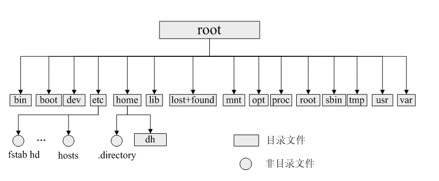

<!-- TOC -->

   * [Linux文件系统](#linux文件系统)
      * [Inode](#inode)
         * [Inode是什么?有什么作用?](#inode是什么有什么作用)
      * [文件类型](#文件类型)
         * [普通文件](#普通文件)
         * [目录文件](#目录文件)
         * [链接文件](#链接文件)
         * [设备文件](#设备文件)
         * [管道文件](#管道文件)
         * [Socket套接字文件](#socket套接字文件)
      * [Linux目录树](#linux目录树)
         * [Linux常见目录说明](#linux常见目录说明)

<!-- /TOC -->

# Linux文件系统
Linux/Unix的设计哲学是一切皆文件，Linux以文件的形式对计算机中的资源和数据进行管理。
反应在Linux上的文件类型就是: 普通文件,目录文件(文件夹),设备文件，链接文件(软链接和硬链接)，
管道文件，Socket套接字文件等等。而这些种类繁多的文件被Linux使用目录树进行管理。
所谓的目录树就是以根目录 / 为主，向下呈现分支状的一种数据结构。

### Inode
inode是linux/unix文件系统和硬盘存储的基础，如果理解了inode，
将会对我们学习如何将复杂的概念抽象成简单概念有重大帮助。

#### Inode是什么?有什么作用?
文件存储在硬盘上，硬盘的最小存储单位是扇区(Sector),每个扇区存储512字节(0.5kb)。
操作系统读取硬盘的数据时，不会一个扇区一个扇区的读取，这样做效率较低，而是**一次读取多个扇区，
即一次读取一个块(block)。块由多个扇区组成，是文件读取的最小单位，块的最常见的大小是4kb，
约为8个连续的扇区组成。文件数据存储在块中，**
但还需要一个空间来存储文件的元信息metadata，如文件拥有者，创建时间，权限，大小等。
这种**存储文件元信息的区域就叫inode，译为索引节点。 每个文件都有一个inode，存储文件的元信息。
使用 stat 命令可以查看文件的inode信息。每个inode都有一个号码，
Linux/Unix操作系统不使用文件名来区分文件，而是使用inode号码区分不同的文件。**

**inode也需要消耗硬盘空间，所以在格式化硬盘的时候，操作系统会将硬盘分为2个区域，
一个区域存放文件数据，另一个区域存放inode所包含的信息，
存放inode的区域被称为inode table。**

文件的inode信息:

### 文件类型

#### 普通文件
普通文件是指txt,html,pdf等等的这样应用层面的文件类型，
用户可以根据访问权限对普通文件进行访问，修改和删除。

#### 目录文件
目录也是一种文件，打开目录实际上是打开目录文件。
目录文件包含了它目录下的所有文件名以及指向这些文件的指针。

#### 链接文件
链接文件分为符号链接(软链接)文件和硬链接文件

- 硬链接(Hard Link):硬链接的文件拥有相同的inode，因为操作系统是靠inode来区分文件的，
2个inode相同的文件，就代表它们是一个文件。
删除一个文件并不会对其他拥有相同inode的文件产生影响，只有当inode相同的所有文件被删除了，
这个文件才会被删除。换言之，你建立一个文件的硬链接，这个文件和硬链接它们的inode是相同的,
无论你删除的是硬链接还是源文件，都不会对彼此造成影响,除非你把硬链接和源文件都删除，
这个文件才被删除。

- 符号链接(软链接)(Symbolic Link): 符号链接类似于Windows上的快捷方式，它保存了源文件的路径。
当符号链接被删除时，并不会影响源文件。但是当源文件被删除时，符号链接就找不到源文件了。

软链接和硬链接:

#### 设备文件
设备文件分为块设备文件和字符设备文件,设备文件一般存于/dev目录下。

- 字符设备文件: **字符设备是依照先后顺序被存取数据的设备，通常不支持随机存取，
此类设备可以按字节/字符来读取数据，** 如键盘，串口等等。

- 块设备文件: **块设备是可以被随机存取数据的设备，应用程序可以访问块设备上任何一块位置。
块设备以块的方式读取数据，在windows下也称为簇，块设备不支持字符的方式寻址。**
如硬盘，软盘，光碟等等。

**字符设备与块设备最根本的区别就是它们是否可以被随机访问。**
如键盘，当我们在键盘上敲下一个单词: "word"的时候，
那么系统肯定是需要按照顺序来进行读取word的字节流(字符流)的，随机访问在此时是没有意义的。

#### 管道文件
管道文件一般用于进程间通信，使用mkfifo命令可以创建一个管道文件。

#### Socket套接字文件
套接字文件被用于网络进程之间的通信，既可以使2台不同的机器进行通信，也可以用于本机的Socket网络程序。

### Linux目录树
所有可操作的计算机资源都存在于目录树这个结构中，对计算资源的访问，可以看做是对这棵目录树的访问。

linux目录树:

#### Linux常见目录说明

- boot: boot目录存放系统启动引导时的文件。

- bin: bin目录存放可执行的二进制命令文件，这些命令一般是普通的基本程序，主要用于具体应用，如: ls , ln , less , more , cp , cat等等。

- sbin: sbin目录存放的也是可执行的二进制文件，这些目录是系统的基本命令，主要用于系统的基本管理，如: shutdown , reboot等等。

- etc: etc目录存放了系统所需的配置文件，如/etc/passwd记录了系统的用户，/etc/group记录了用户组等等，非常重要。

- proc: proc是一个虚拟目录，它是当前系统内存的映射，可以通过这个目录获取正在系统当前的一些信息。

- opt: opt目录存放可选的应用程序包。

- dev: dev目录存放设备文件。

- mnt: mnt目录一般是系统用户或管理员临时挂载设备的目录。

- media: 当有设备插入计算机后，会自动挂载到media目录。

- sys: sys目录存放系统硬件设备的驱动程序的信息。

- usr: usr目录存放了系统的所有的共享文件，库文件等等，是最终要的目录之一。

- lib: lib目录存放了系统所需的库文件。

- lib64: lib64一般是64位系统才会有的目录，存放的也是系统所需的库文件。

- tmp: tmp目录存放了系统或程序产生的临时文件。

- var: var目录存放了系统运行时需要改变数据的文件。

- run: run目录存放了系统启动以来的信息，当系统被重启后，这个目录会被清空。

- srv: srv目录存放了某些服务启动后需要提取的文件。

- home:  home目录是普通用户的目录。

- root: root目录是系统超级管理的目录。

- lost+found: 这个目录一般是空的，当系统被非法关闭或操作后，这里可能就会生成一些文件。