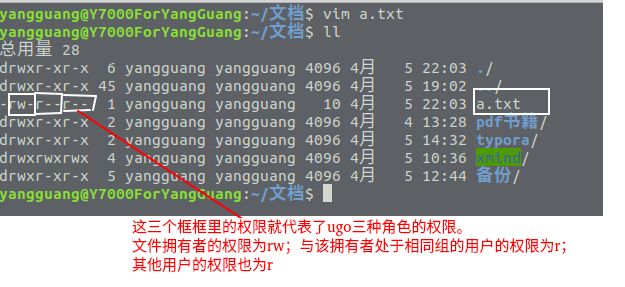
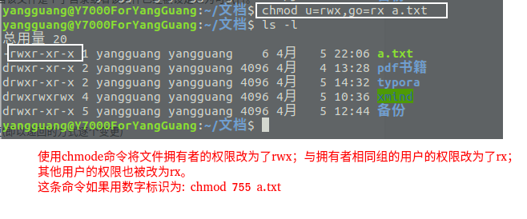

# Linux用户权限

Linux用户的权限也就是用户对文件的访问权限。**Linux下文件的权限一般包括读，写，执行三种，对应字母:r,w,x。 Linux的权限角色有 拥有者，群组，其他三种。每个文件可以根据这三种粒度设置不同的权限。** 通常情况下，一个文件只能归属一个用户和用户组。如果一个用户想要拥有对某个文件的权限，可以把这个用户添加到具备权限的用户组，一个用户可以拥有多个用户组。Linux系统可以使用chmod命令进行权限操作,使用chown可以更改文件拥有者。

### chmod权限模式
chmod的权限模式为: [ugoa...][+-=][rwx...][files]

- u代表文件拥有者，g代表与该文件拥有者属于同一个用户组的用户，o代表其他人，a表示ugo的缩写。

- +代表给指定的角色增加权限 , -代表取消指定的角色的权限 , =代表给指定的角色赋予指定的权限

- rwx代表权限 ， 可以使用数字标识 r  = 4 , w = 2 , x = 1， 所以rwx=7 , rw = 6 , rx=5 , wx=3。

#### 使用chmod更改文件权限
我们先创建一个名叫a.txt的文件,它刚被创建后的权限如下:

当使用chmod更改a.txt的权限后如下:

