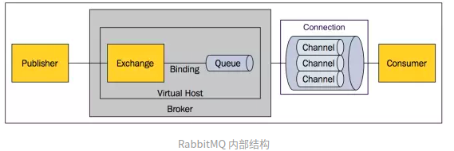

## RabbitMQ学习
>RabbitMQ是由Erlang语言开发的支持AMQP的消息队列.

#### AMQP
>Advanced Message Queue Protocol,高级消息队列协议.它与Http一样,同为应用层协议,是面向消息的中间件设计协议.
>基于此协议的客户端与消息中间件可传递消息,并不受平台和语言的限制.

#### RabbitMQ概述
>RabbitMQ最初起源于金融系统,被用于在分布式系统中存储和转发消息,具有较好的易用性,可扩展性,并发性等优点.

##### RabbitMQ消息模型

1. P(Producer):生产者.
2. C(Consumer):消费者.
>消费则生产者创建消息,发布到消息队列,然后订阅了此消息队列的消费者就可以从消息队列中获取消息.

##### RabbitMQ概念

1. Message:消息.消息由消息头和消息体组成.消息体(信息)是不透明的;消息头由一系列可选的属性组成,包括:routing-key(路由键),
priority(相对于其他消息的优先级)等.
2. Publisher:消息发布者,也是消息的生产者.它是向交换器发送消息的客户端程序.
3. Consumer:消息的消费者.它是从消息队列中获取消息的客户端程序.
4. Exchange:交换器(交换机).用来接受生产者发送的消息,并将消息发送路由给服务中的队列.
5. Binding:用于交换机和消息队列之间的绑定.一个绑定就是基于路由键将交换器和消息队列关联起来的路由规则。所以可以将交换器理解成由绑定组成的路由规则表.
6. Queue:消息队列.用来保存消息,直到消息被消费者取出.他是存储消息的容器.一个消息可以发布到多个队列.
7. Connection: 网络连接.如TCP连接.
8. Channel:管道(信道).发布消息,订阅队列,消费消息都是由Channel完成的.由于Connection带来的网络开销是比较昂贵的,所以可以由多个Channel复用一个Connection.
9. Virtual Host:虚拟主机.它包含了一批交换器,消息队列及相关对象。每个虚拟主机都可以看做是一个mini的RabbiMQ服务器,拥有自己的交换器,消息队列,绑定和权限机制等.
vHost是AMQP的基本概念,必须在连接RabbitMQ的时候就要指定vHost
10. Broker:指消息队列实体.
