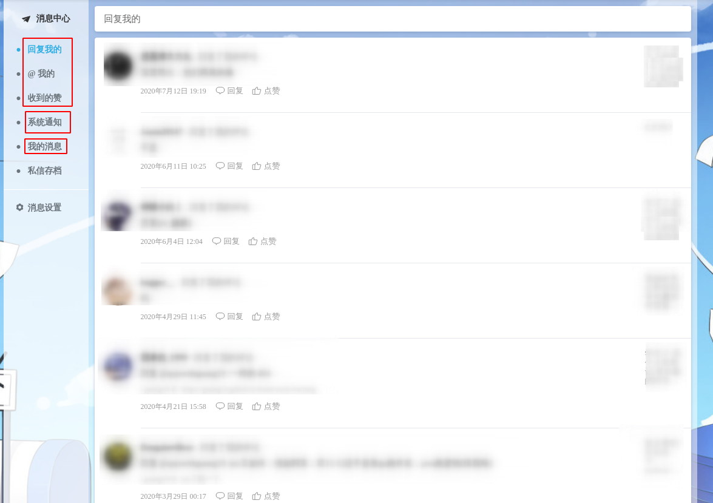
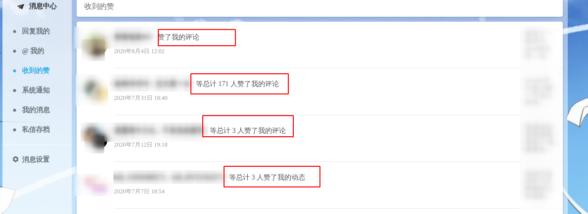

# 站内消息系统的设计

各位使用过简书，知乎或b站的同学应该都有这样的使用体验：当有其他用户关注我们或者私信我们的行为时，
我们会收到相关的消息。 虽然看上去这些功能看上去简单，但其实它是自成
一个系统的，可以称之为站内消息系统。 

我以b站举例（个人认为b站的消息系统是我见过的非常完美的，UI也最为人性化的消息系统）：

可以看到b站把消息大致分为了三类：
1. 系统推送的通知(System Notice)；
2. 回复，at，点赞等用户行为产生的提醒(Remind)；
3. 用户之间的私信(Chat)。

这样设计不仅分类明确，且处于同一个主体的事件提醒还会做一个聚合，极大的提高了用户体验，
不让用户收到太多分散的消息。 

举个例子：比如你在某个视频或某篇文章下发表了评论，有100个人给你的评论点了赞，
那么你希望消息页面呈现的是一个一个用户给你点赞的提醒，还是像以下聚合之后的提醒：

我相信你大概率会选择后者。

我认为对于很多应用来说，这样的设计都是非常合理的，接下来我写写我对于消息系统的设计。

## 系统通知(System Notice)
系统通知一般是由后台管理员发出，然后指定某一类（全体，个人等）用户接收。
基于此设想，可以把系统通知大致分为两张表：

1. 一张记录管理员发出的通知，称之为 t_manager_system_notice 管理员系统通知表；
2. 一张存储用户接受的通知，称之为 t_user_system_notice 用户系统通知表。

t_manager_system_notice结构如下：

|       字段名         |       类型       |       描述            |
|       :---:         |      :---:      |      :---:           |
|   system_notice_id  |     LONG        |    主键ID，系统通知ID |
|   title             |     VARCHAR     |    标题             |
|   content           |     TEXT        |    内容             |
|   type              |     VARCHAR     |    发给哪些用户：单用户single；全体用户all，vip用户，具体类型各位同学可以根据自己的需求选择 |
|   state             |     BOOLEAN     |    是否已被拉取过，如果已经拉取过，就无需再次拉取      |
|   recipient_id      |     LONG        |    接受通知的用户的ID，如果type为单用户，那么recipient为该用户的ID;否则recipient为0     |
|   manager_id        |     LONG        |    发布通知的管理员ID     |
|   publish_time      |     TIMESTAMP   |    发布时间             |

t_user_system_notice结构如下：

|       字段名         |       类型       |       描述            |
|       :---:         |      :---:      |      :---:           |
|   user_notice_id    |     LONG        |     主键ID            |
|   state             |     BOOLEAN     |     是否已读          |
|   system_notice_id  |     LONG        |     系统通知的ID       |
|   recipient_id      |     LONG        |     接受通知的用户的ID   |
|   pull_time         |     TIMESTAMP   |     拉取通知的时间      |

**当管理员发布一条通知后，将通知插入t_manager_system_notice表中，然后系统定时的从
t_manager_system_notice表中拉取通知，然后根据通知的type将通知插入t_user_system_notice表中。**
如果通知的type是single的，那就只需要插入一条记录到t_user_system_notice中。如果是全体用户，
那么就需要将一个通知批量根据不同的用户ID插入到t_user_system_notice中，
这个数据量就需要根据平台的用户量来计算。

举个例子：
管理员A发布了一个活动的通知，他需要将这个通知发布给全体用户，
当拉取时间到来时，系统会将这一条通知取出。
随后系统到用户表中查询选取所有用户的ID，
然后将这一条通知的信息根据所有用户的ID，批量插入t_user_system_notice中。
用户需要查看系统通知时，从t_user_system_notice表中查询就行了。

注意： 
1. 因为一次拉取的数据量可能很大，所以两次拉取的时间间隔可以设置的长一些。
2. **拉取t_manager_system_notice表中的通知时，需要判断state，如果已经拉取过，就不需要重复拉取，
否则会造成重复消费。**
3. 当一条通知需要发布给全体用户时，我们应该考虑到用户的活跃度。因为如果有些用户长期不活跃，
我们还将通知推送给他（她），这显然会造成空间的浪费。 所以在选取用户ID时，我们可以将用户上次
登录的时间与推送时间做一个比较，如果用户一年未登陆或几个月未登录，我们就不选取其ID，进而避免
无谓的推送。
4. 有的同学可能有疑问： 某条通知已经被拉取过的话，在其后注册的用户是不是不能再接收到这条通知？
是的。但如果你想将已拉取过的通知推送给那些后注册的用户，
只需要再写一个定时任务，这个**定时任务可以将通知的push_time与用户的注册时间比较一下，重新推送**即可。
5. 千万不要删除t_manager_system_notice表中已经发布过的系统通知，否则从
t_user_system_notice表中查询用户的系统通知时无法获取通知的title和content等具体信息。

以上就是系统通知的设计了，接下来再看看较难的提醒类型的消息。

## 事件提醒(EventRemind)
之所以称提醒类型的消息为事件提醒，是因为此类消息均是通过用户的行为产生的，如下：
- xxx 在某个评论中@了你；
- xxx 点赞了你的文章；
- xxx 点赞了你的评论；
- xxx 回复了你的文章；
- xxx 回复了你的评论。

诸如此类事件，我们以单词action形容不同的事件（点赞，回复，at）。
可以看到除了事件之外，我们还需要了解用户是在哪个地方产生的事件，以便当我们收到提醒时，
点击这条消息就可以去到事件现场，从而增强用户体验，我以事件源 source 来形容事件发生的地方。

- 当action为点赞，source为文章时，我就知道：有用户点赞了我的某篇文章；
- 当action为点赞，source为评论时，我就知道：有用户点赞了我的某条评论；
- 当action为at， source为评论时，我就知道：有用户在某条评论里at了我；
- 当action为回复，source为文章时，我就知道：有用户回复了我的某篇文章；
- 当action为回复，source为评论时，我就知道：有用户回复了我的某条评论；

由此可以设计出事件提醒表 t_event_remind，其结构如下：

|       字段名         |       类型       |       描述                         |
|       :---:         |      :---:      |      :---:                        |
|   event_remind_id   |     LONG        |     主键ID                         |
|   action            |     VARCHAR     |     动作类型，如点赞、at、回复等       |
|   source_id         |     LONG        |     事件源ID，如评论ID、文章ID等      |
|   source_type       |     VARCHAR     |     事件源类型："Comment"、"Post"等  |
|   source_content    |     VARCHAR     |     事件源的内容，比如回复你的内容，给你点赞的文章标题等等  |
|   state             |     BOOLEAN     |     是否已读                        |
|   sender_id         |     LONG        |     操作者的ID，即谁关注了你，at了你    |
|   recipient_id      |     LONG        |     接受通知的用户的ID               |
|   remind_time       |     TIMESTAMP   |     提醒的时间                   |

### 消息聚合
消息聚合只适用于事件提醒，以下列聚合之后的消息来说：

- 100人 {点赞} 了你的 {文章} ：《系统架构设计》；
- 100人 {评论} 了你的 {文章} ：《系统架构设计》；
- 100人 {回复} 了你的 {评论} ： “我想做我自己”；
- 100人 {点赞} 了你的 {评论} ： “我想做我自己”；

这些聚合之后的消息明显有两个特征，即： action和source type，这是系统消息和私信都不具备的，
所以我个人认为事件提醒的设计要稍微比系统消息和私信复杂。