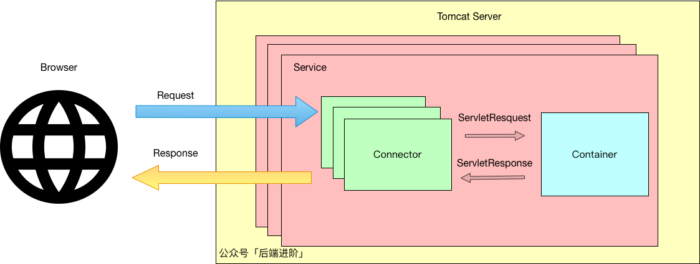
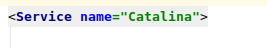
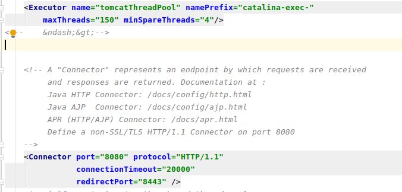

## Tomcat复习与架构解析

>Tomcat是apache开源的一款优秀的Servlet容器,也是我初学JavaEE时学的第一个容器,如果对他的架构和原理有比较清楚的认识,那么会使我们对整个Java网络编程方面的能力有很大提升.

### Http协议
>首先复习一下Http协议(Hypertext Transfer Protocol),因为都知道无论是Servlet容器,还是其他服务应用,都是属于网络中的应用,而应用层协议有很多,如:FTP,DNS,SMTP,HTTP,HTTPS,SSH,SFTP,TELNET等等.
>而客户端与服务端的通信,大部分都采用的是Http协议,所以在说Tomcat架构之前,必须补一下Http协议.

1. 非常重要的一点:Http是基于TCP/IP通信协议来传递数据的,换言之,Http协议的底层是TCP/IP协议.
2. HTTP是无状态的协议.无状态就是指协议对事务没有记忆能力,即:HTTP不会记录一次连接的具体信息或结果,所以诞生了Cookie和Session这种客户端与服务端有状态的产物.
3. HTTP是无连接的协议.无连接指的就是HTTP每次只限制一次请求,即:服务端处理完客户端的请求,并成功收到了客户端的应答后,连接就断开了.
 
当然,Http还有很多其他的特点,但我认为比较重要就是以上几点了..

Tomcat作为一款JavaWeb服务器,自然少不Http方面的内容.

### Tomcat架构
>Java网络编程逃不过Socket,所以Tomcat中有一个Connector连接器(coyote)用于处Socket的请求.
>Connector把Socket请求Request转换为ServletRequest对象,把这个ServletRequest对象交由Container容器(Catalina).
>容器选择对应的Servlet处理,返回ServletResponse,最后由Connector解析为Response,返回给客户端.

>
  
##### Connector连接器
>Tomcat中的连接器叫Coyote,因为连接器更多的是处理Socket协议和Socket流方面的功能,所以与Servlet的关系不大,Catalina作为Servlet容器,才是处理任务的关键.
>
>Coyote支持的应用层协议有:Http1.1,Http2,AJP(Tomcat与其他Web服务器通信的协议).
>
>它的IO模型由最初的阻塞式IO模型,发展成如今的NIO模型(非阻塞),也支持NIO2(异步非阻塞),还支持APR这种移植的第三方IO模型.
>
>Coyote由2部分组成:ProtocolHandler和Adapter.

>1. ProtocolHandler使用EndPoint监听Socket请求,然后将Socket请求通过Processor转为Request.
>2. Adapter将Request转为ServletRequest对象,交由Catalina处理

#### Servlet容器
>Catalina为Tomcat的Servlet容器,它包含了安全,会话,集群,Servlet实现等各歌方面的组件,同时也是Tomcat 的启动入口(Bootstrap),它是Tomcat的核心,其模块都是为Catalina模块
>服务的

#### 其他模块
>除了连接器和Servlet容器部分,Tomcat还包含了Naming提供JNDI命名模块,Juli日志模块

##### Container容器结构
>因为Container是Tomcat的核心,所以需要对它的结构有一个清晰的认知.
>在Container之下,有一个Engine,它表示Servlet的引擎,它管理着多个Host容器,一个Host容器代表一个虚拟主机,也可以说是Host是一个站点.
>Host之下又可以包含多个Context容器,一个Context容器代表一个Web程序,在Context里,就是若干的Wrapper(Servlet)

##### JSP解析引擎
>Tomcat中的JSP解析引擎是Jasper,所谓的JSP(JavaServer Page)经常被人说成可以写Java代码的Html,我觉得这话说反了,应该说是可以写Html的Java类(Servlet).
>最终JSP是会被引擎解析成相应的Servlet的,这些生成的Servlet都是继承自HttpJspBase,最终Servlet是会调用_jspService方法把编译好的Html等字符串刷回去.
>所以只要不是前后端分离项目,那么像Thymeleaf,Freemarker,Jsp这类模板引擎,都是通过Java的代码使用Response流(Socket流)把Html写出去的.

#### Tomcat的启动
>在Tomcat中,所有模块都实现了Lifecycle接口,这个接口管理每个组件的生命周期,因为Catalina的架构是层级架构,也就是父子关系,所以当启动Tomcat的时候,Catalina会调用init方法来初始化它自身以及子组件.
>随后也是使用start方法,最终Endpoint就会监听指定端口.

#### Tomcat请求执行流程
>当客户端发送一个请求到Tomcat的时候,负责监听端口的Endpoint就会调用Processor将请求转为Request对象,然后通过Coyote Adapter将请求转为Catalina所需的ServletRequest.
>随后Engine将请求分发到对应的Host主机,Host主机会根据请求的路径匹配对应的Context,从而调用Wrapper处理.

#### 解读 server.xml
>server.xml是Tomcat的配置文件,它的最外层标签为Server,这个标签只有一个,它代表的就是Tomcat,是最顶级的接口,包含了
>所有的容器和组件。

>可以看到在Server下面有写监听器,这些监听器发挥不同的作用，有监控版本日志,监控各个组件的生命周期等等.

>Server标签的下一个标签是Service标签,这个标签虽然名字叫Catalina,但是它可不是Container.Service包含了Coyote,Catalina(包含了Engine)等容器组件.

>在Service标签下,配置了Executor和Connector标签,Connector就不用说了,上面解释过,Executor就是Tomcat作为处理连接的线程池,默认的,Http,Ajp等协议都会默认使用这一个线程池.

>其他的如:Engine,Host等都是Catalina之下的容器.

