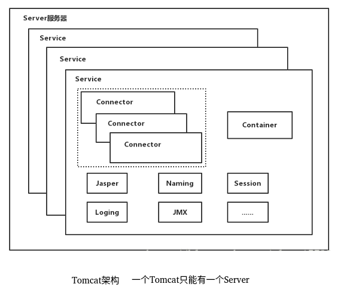
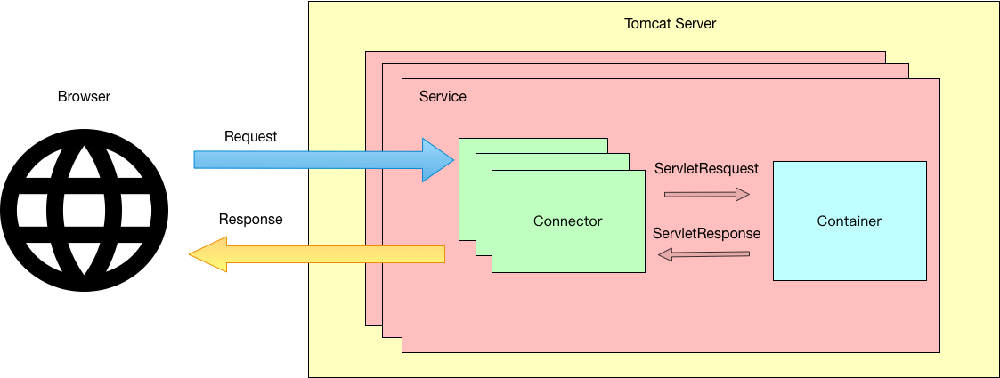
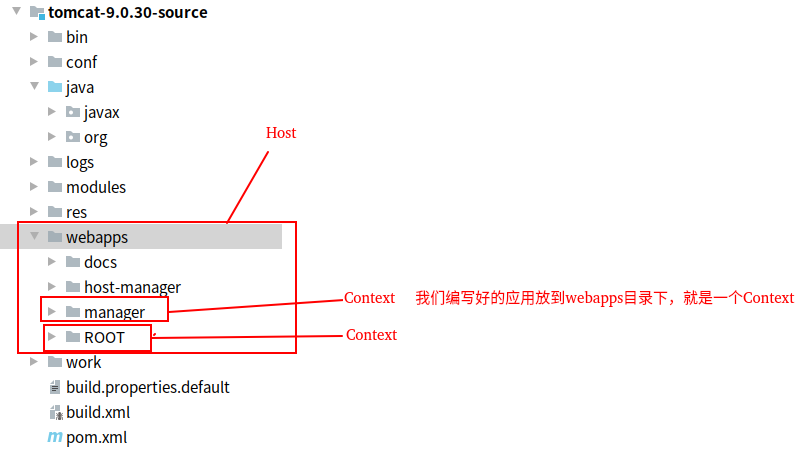

<!-- TOC -->

  * [Tomcat常见知识点](#tomcat常见知识点)
      * [什么是Tomcat?](#什么是tomcat)
      * [Tomcat运行模式有几种?](#tomcat运行模式有几种)
      * [Tomcat架构](#tomcat架构)
      * [Connector连接器](#connector连接器)
      * [Container容器结构](#container容器结构)
      * [JSP解析引擎](#jsp解析引擎)
      
<!-- /TOC -->

# Tomcat常见知识点

#### 什么是Tomcat?
Tomcat是apache开源的一款优秀的Servlet容器,
如果对他的架构和原理有比较清楚的认识,那么会使我们对Java网络编程方面的能力有很大提升.

#### Tomcat运行模式有几种?

1. BIO模式
2. NIO模式
3. APR模式

关于BIO和NIO我已经在[IO](https://qsjzwithguang19forever.gitee.io/framework-learning/gitbook_doc/jdk-jvm-juc/IO.html)
中讲到过了,不熟悉或忘了的同学可以去看一下，这里比较陌生的就是APR模式了。

APR(Apache Portable Runtime)模式是异步IO模式。
我们知道AIO是我们的用户进程向内核发起系统调用后，直接返回，
不用阻塞在对内核的系统调用上，等内核有数据后才会通知用户进程，这种IO性能是非常高的，
APR也是Tomcat应对高并发的首选模式。
但是AIO是需要依赖于操作系统的，Tomcat的APR模式也是需要依赖于它自己的JNI库，
即操作系统必须安装了APR库，Tomcat才能使用APR模式。
至于如何安装APR，这个在网上是由很多文章有写的，各位同学可以自行搜索。

#### Tomcat架构
在Tomcat中，最顶级的容器是Server，一个Tomcat只有一个Server，它代表着整个Tomcat容器。
一个Server至少包含一个Service，可以包含多个Service，有了Service就可以向外提供服务了。
Service的核心是Container和Connector，每个Service只有一个Container，但可以包含多个Connector。

Tomcat架构图:

Tomcat中的Connector连接器叫做Coyote,Container容器叫做Catalina。
连接器的作用是把Socket请求Request转换为ServletRequest对象,
并把这个ServletRequest对象交由Container容器(Catalina)。
Container容器选择对应的Servlet处理,然后返回ServletResponse,
最后由Connector解析为Response,返回给客户端。

Container是Tomcat的Servlet容器,它包含了安全,会话,集群,Servlet实现等各方面的组件,
同时也是Tomcat 的启动入口(Bootstrap),它是Tomcat的核心,其模块都是为Catalina模块
服务的。

一下是Tomcat的执行流程:

除了连接器和Servlet容器部分,Service还包含了Naming提供JNDI命名模块,Juli日志模块
  
#### Connector连接器
Tomcat中的连接器叫Coyote,因为连接器更多的是处理Socket协议和Socket流方面的功能,
所以与Servlet的关系不大,Catalina作为Servlet容器,才是处理任务的关键。

Coyote支持的应用层协议有:Http1.1,Http2,AJP(Tomcat与其他Web服务器通信的协议).

它支持的IO模型有:BIO,NIO,APR等。

Coyote由**ProtocolHandler和Adapter**这2部分组成

1. ProtocolHandler使用EndPoint监听Socket请求,然后将Socket请求通过Processor转为Request。
2. Adapter将Request转为ServletRequest对象,交由Catalina处理。

#### Container容器结构
因为Container是Tomcat的核心,所以需要对它的结构有一个清晰的认知。
在Container之下,有一个Engine,它表示Servlet的引擎,它管理着多个Host容器,
一个Host容器代表一个虚拟主机,也可以说是Host是一个站点。
Host之下又可以包含多个Context容器,一个Context容器代表一个Web程序,
在Context里,就是若干的Wrapper(Servlet)

#### JSP解析引擎
Tomcat中的JSP解析引擎是Jasper,所谓的JSP(JavaServer Page)经常被人说成可以写Java代码的Html,
我觉得这话说反了,应该说是可以写Html的Java类(Servlet)。
最终JSP是会被引擎解析成相应的Servlet类的,这些生成的Servlet都是继承自HttpJspBase,
最终Servlet是会调用_jspService方法把编译好的Html等字符串刷回浏览器。
所以只要不是前后端分离项目,那么像Thymeleaf,Freemarker,Jsp这类模板引擎,
都是通过Java的代码使用Response流(Socket流)把Html写回客户端浏览器的。

